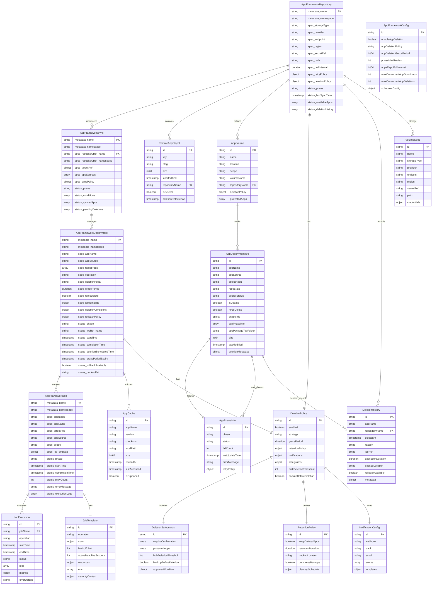

# App Framework Controller - Entity Relationship Diagram

## Overview

This document describes the data model and relationships for the enhanced App Framework Controller that supports comprehensive app lifecycle management including installation, updates, and deletion operations using Kubernetes Jobs.

## Entity Relationship Diagram



## Entity Descriptions

### Core Custom Resources

#### AppFrameworkRepository
- **Purpose**: Defines remote storage repositories (S3, Azure Blob, GCS)
- **Key Features**: 
  - Storage configuration and credentials
  - Polling intervals and retry policies
  - Repository-level deletion policies
  - Available apps tracking and deletion history

#### AppFrameworkSync
- **Purpose**: Links repositories to Splunk CRs and manages synchronization
- **Key Features**:
  - References to repositories and target Splunk instances
  - App source definitions with scopes
  - Sync policies and status tracking
  - Pending deletion management

#### AppFrameworkDeployment
- **Purpose**: Represents individual app deployment/deletion operations
- **Key Features**:
  - Supports install, update, and uninstall operations
  - Deletion policies with grace periods
  - Rollback capabilities with backup references
  - Job template specifications

### Job Management

#### AppFrameworkJob
- **Purpose**: Kubernetes Job wrapper for app operations
- **Key Features**:
  - Operation type (download, install, uninstall)
  - Target pod and scope information
  - Retry logic and error tracking
  - Execution logs and metrics

#### JobTemplate
- **Purpose**: Reusable job specifications for different operations
- **Key Features**:
  - Operation-specific configurations
  - Resource limits and security contexts
  - Environment variables and volumes

### App State Management

#### AppDeploymentInfo
- **Purpose**: Tracks individual app deployment state
- **Key Features**:
  - Repository state (Active, Deleted, Passive)
  - Deployment status and phase information
  - Update and deletion flags
  - Package metadata and sizing

#### AppPhaseInfo
- **Purpose**: Tracks phase-specific execution state
- **Key Features**:
  - Phase type (Download, Install, Uninstall)
  - Status and retry counts
  - Error messages and timestamps

### Deletion Management

#### DeletionPolicy
- **Purpose**: Defines how app deletions are handled
- **Key Features**:
  - Deletion strategies (immediate, graceful, manual)
  - Grace periods and retention policies
  - Notification configurations
  - Safety mechanisms

#### DeletionSafeguards
- **Purpose**: Prevents accidental or harmful deletions
- **Key Features**:
  - Protected app lists
  - Confirmation requirements
  - Bulk deletion thresholds
  - Approval workflows

#### DeletionHistory
- **Purpose**: Audit trail for all app deletions
- **Key Features**:
  - Deletion timestamps and reasons
  - Job references and execution metrics
  - Backup locations and rollback availability

### Storage and Caching

#### VolumeSpec
- **Purpose**: Remote storage volume configurations
- **Key Features**:
  - Provider-specific settings
  - Credentials and access configuration
  - Regional and endpoint specifications

#### AppCache
- **Purpose**: Local operator storage for downloaded apps
- **Key Features**:
  - Checksum verification
  - Size and access tracking
  - Orphan detection for cleanup

## Key Relationships

### 1. Repository → Apps Flow
```
AppFrameworkRepository → RemoteAppObject → AppDeploymentInfo → AppPhaseInfo
```

### 2. Deletion Workflow
```
AppFrameworkRepository (missing app) → AppFrameworkDeployment (uninstall) → AppFrameworkJob → DeletionHistory
```

### 3. Policy Enforcement
```
DeletionPolicy → DeletionSafeguards → AppFrameworkDeployment → JobExecution
```

### 4. Backup and Rollback
```
AppFrameworkDeployment → AppCache → RetentionPolicy → DeletionHistory
```

## Data Flow Examples

### App Installation Flow
1. `AppFrameworkRepository` polls remote storage
2. New `RemoteAppObject` detected
3. `AppDeploymentInfo` created with Download phase
4. `AppFrameworkJob` created for download operation
5. Subsequent jobs for install operation
6. `AppPhaseInfo` updated throughout process

### App Deletion Flow
1. `AppFrameworkRepository` detects missing `RemoteAppObject`
2. `AppDeploymentInfo` marked for deletion
3. `DeletionPolicy` evaluated for strategy
4. `DeletionSafeguards` checked for protection
5. `AppFrameworkDeployment` created for uninstall
6. `AppFrameworkJob` executes deletion
7. `DeletionHistory` records completion
8. `AppCache` cleaned up

### Rollback Flow
1. `DeletionHistory` provides backup reference
2. New `AppFrameworkDeployment` created for reinstall
3. `AppCache` restored from backup location
4. Standard installation flow executed

## Configuration Examples

### Repository with Deletion Policy
```yaml
apiVersion: appframework.splunk.com/v1
kind: AppFrameworkRepository
spec:
  deletionPolicy:
    enabled: true
    strategy: graceful
    gracePeriod: 300s
    safeguards:
      protectedApps: ["splunk_app_aws", "enterprise_security"]
      bulkDeletionThreshold: 5
    retentionPolicy:
      keepDeletedApps: true
      retentionDuration: 72h
```

### Deployment with Rollback
```yaml
apiVersion: appframework.splunk.com/v1
kind: AppFrameworkDeployment
spec:
  operation: uninstall
  rollbackPolicy:
    enabled: true
    retentionPeriod: 72h
    backupLocation: "s3://app-backups/"
```

This ERD provides a comprehensive view of the enhanced App Framework Controller data model, supporting full app lifecycle management with robust deletion capabilities, safety mechanisms, and audit trails.
