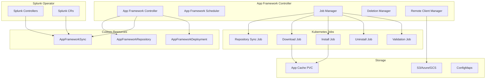

# App Framework Controller

## Overview

The App Framework Controller is a separate, dedicated controller for managing Splunk app lifecycle operations using Kubernetes-native patterns. It extracts app management functionality from the main Splunk Operator into a specialized controller that leverages Kubernetes Jobs for improved isolation, scalability, and observability.

## Key Features

### 🚀 **Job-Based Architecture**
- **Isolated Operations**: Each app operation runs in dedicated Kubernetes Jobs
- **Parallel Processing**: Multiple apps can be processed simultaneously
- **Resource Management**: Jobs consume resources only when needed
- **Failure Isolation**: Job failures don't impact the main controller

### 🔒 **Advanced Deletion Safety**
- **Protected Apps**: Prevent deletion of critical system apps
- **Confirmation Requirements**: Manual confirmation for sensitive apps
- **Approval Workflows**: Multi-user approval for high-risk deletions
- **Bulk Deletion Protection**: Prevent accidental mass deletions
- **Grace Periods**: Configurable wait times before deletion
- **Backup Creation**: Automatic backups before deletion

### 📊 **Enhanced Observability**
- **Granular Status Tracking**: Per-app, per-operation status
- **Rich Events**: Comprehensive Kubernetes events for all operations
- **Progress Tracking**: Real-time progress updates with estimates
- **Audit Trails**: Complete history of all app operations
- **Metrics Integration**: Prometheus-compatible metrics

### 🔄 **Flexible Policies**
- **Deletion Strategies**: Immediate, graceful, or manual deletion
- **Retention Policies**: Configurable backup retention and cleanup
- **Notification Systems**: Webhook, Slack, and email notifications
- **Rollback Support**: Automatic backup and rollback capabilities

## Architecture



## Custom Resource Definitions

### AppFrameworkRepository

Defines remote storage repositories with comprehensive deletion policies:

```yaml
apiVersion: appframework.splunk.com/v1
kind: AppFrameworkRepository
metadata:
  name: s3-app-repo
spec:
  storageType: s3
  provider: aws
  endpoint: https://s3-us-west-2.amazonaws.com
  region: us-west-2
  secretRef: s3-credentials
  path: splunk-apps/
  deletionPolicy:
    enabled: true
    strategy: graceful
    gracePeriod: 300s
    safeguards:
      protectedApps:
        - "splunk_app_aws"
        - "enterprise_security"
      bulkDeletionThreshold: 5
      backupBeforeDeletion: true
    retentionPolicy:
      keepDeletedApps: true
      retentionDuration: 72h
      backupLocation: "s3://app-backups/"
```

### AppFrameworkSync

Links repositories to Splunk CRs with sync policies:

```yaml
apiVersion: appframework.splunk.com/v1
kind: AppFrameworkSync
metadata:
  name: standalone-apps-sync
spec:
  repositoryRef:
    name: s3-app-repo
  targetRef:
    apiVersion: enterprise.splunk.com/v4
    kind: Standalone
    name: my-standalone
  appSources:
    - name: networkApps
      location: network/
      scope: local
  syncPolicy:
    automatic: true
    prune: true  # Enable app deletion
```

### AppFrameworkDeployment

Represents individual app operations with advanced deletion controls:

```yaml
apiVersion: appframework.splunk.com/v1
kind: AppFrameworkDeployment
metadata:
  name: uninstall-old-app
  annotations:
    appframework.splunk.com/deletion-confirmed: "true"
    appframework.splunk.com/deletion-approved: "true"
    appframework.splunk.com/deletion-approved-by: "admin@company.com"
spec:
  appName: old-legacy-app.tgz
  operation: uninstall
  targetPods:
    - splunk-my-standalone-0
  deletionPolicy:
    strategy: graceful
    gracePeriod: 300s
    safeguards:
      requireConfirmation:
        - "old-legacy-app.tgz"
      backupBeforeDeletion: true
  deletionConditions:
    - type: AppNotUsed
      checkCommand: ["/bin/check-app-usage.sh"]
      expectedResult: "empty"
```

## Deletion Safety Mechanisms

### 1. Protected Apps
Prevent deletion of critical system apps:

```yaml
safeguards:
  protectedApps:
    - "splunk_app_aws"
    - "enterprise_security"
    - "splunk_*"  # Wildcard patterns supported
```

### 2. Confirmation Requirements
Require manual confirmation for sensitive apps:

```yaml
safeguards:
  requireConfirmation:
    - "critical_*"
    - "production_*"
```

Add confirmation via annotation:
```bash
kubectl annotate appframeworkdeployment my-deployment \
  appframework.splunk.com/deletion-confirmed=true \
  appframework.splunk.com/deletion-confirmed-at=$(date -u +"%Y-%m-%dT%H:%M:%SZ")
```

### 3. Approval Workflows
Multi-user approval for high-risk operations:

```yaml
safeguards:
  approvalWorkflow:
    required: true
    approvers:
      - "admin@company.com"
      - "splunk-ops-team"
    timeout: 24h
```

Grant approval via annotation:
```bash
kubectl annotate appframeworkdeployment my-deployment \
  appframework.splunk.com/deletion-approved=true \
  appframework.splunk.com/deletion-approved-by=admin@company.com \
  appframework.splunk.com/deletion-approved-at=$(date -u +"%Y-%m-%dT%H:%M:%SZ")
```

### 4. Bulk Deletion Protection
Prevent accidental mass deletions:

```yaml
safeguards:
  bulkDeletionThreshold: 5  # Max concurrent deletions
```

### 5. Deletion Conditions
Validate conditions before deletion:

```yaml
deletionConditions:
  - type: AppNotUsed
    checkCommand: 
      - "/opt/splunk/bin/splunk"
      - "search"
      - "index=_internal app=myapp earliest=-7d | head 1"
    expectedResult: "empty"
  - type: NoActiveDashboards
    checkCommand:
      - "find"
      - "/opt/splunk/etc/apps/myapp"
      - "-name"
      - "*.xml"
    expectedResult: "empty"
```

## Deletion Strategies

### Immediate Deletion
Apps are deleted as soon as they're missing from the repository:

```yaml
deletionPolicy:
  strategy: immediate
```

### Graceful Deletion
Apps are scheduled for deletion with a configurable grace period:

```yaml
deletionPolicy:
  strategy: graceful
  gracePeriod: 300s  # 5 minutes
```

### Manual Deletion
Apps require explicit approval before deletion:

```yaml
deletionPolicy:
  strategy: manual
```

## Job-Based Operations

### Repository Sync Job
```yaml
apiVersion: batch/v1
kind: Job
metadata:
  name: repo-sync-s3-app-repo-123
spec:
  template:
    spec:
      containers:
      - name: repository-sync
        image: splunk/app-framework-worker:latest
        command: ["/bin/app-framework-worker"]
        args: ["sync-repository", "--repository=s3-app-repo"]
```

### App Uninstall Job
```yaml
apiVersion: batch/v1
kind: Job
metadata:
  name: uninstall-app1-pod0-def456
spec:
  template:
    spec:
      containers:
      - name: app-uninstall
        image: splunk/app-framework-worker:latest
        command: ["/bin/app-framework-worker"]
        args: ["uninstall-app", "--app=app1.tgz", "--target-pod=splunk-my-standalone-0"]
        env:
        - name: DELETION_POLICY
          value: "graceful"
```

## Monitoring and Observability

### Status Tracking
Monitor app operations through CRD status:

```bash
kubectl get appframeworkdeployments -o wide
kubectl describe appframeworkdeployment uninstall-old-app
```

### Events
Rich Kubernetes events for all operations:

```bash
kubectl get events --field-selector involvedObject.kind=AppFrameworkDeployment
```

### Logs
Detailed logs from worker jobs:

```bash
kubectl logs job/uninstall-app1-pod0-def456
```

### Metrics
Prometheus-compatible metrics:
- `app_framework_deployments_total`
- `app_framework_deployment_duration_seconds`
- `app_framework_deletion_safeguard_violations_total`

## Migration from Current Implementation

### Phase 1: Parallel Operation
1. Deploy App Framework Controller alongside existing operator
2. Create AppFrameworkRepository and AppFrameworkSync resources
3. Validate functionality with test apps

### Phase 2: Gradual Migration
1. Update Splunk CRs to reference AppFrameworkSync resources
2. Migrate app sources one by one
3. Monitor and validate operations

### Phase 3: Full Migration
1. Remove old app framework code from main operator
2. Update documentation and examples
3. Cleanup legacy configurations

### Phase 4: Enhanced Features
1. Enable advanced deletion policies
2. Configure monitoring and alerting
3. Implement custom deletion conditions

## Security Considerations

### RBAC Requirements
```yaml
apiVersion: rbac.authorization.k8s.io/v1
kind: ClusterRole
metadata:
  name: app-framework-controller
rules:
- apiGroups: ["appframework.splunk.com"]
  resources: ["*"]
  verbs: ["*"]
- apiGroups: ["batch"]
  resources: ["jobs"]
  verbs: ["*"]
- apiGroups: [""]
  resources: ["pods", "secrets", "configmaps"]
  verbs: ["get", "list", "watch"]
- apiGroups: [""]
  resources: ["pods/exec"]
  verbs: ["create"]
```

### Service Account for Jobs
```yaml
apiVersion: v1
kind: ServiceAccount
metadata:
  name: app-framework-worker
---
apiVersion: rbac.authorization.k8s.io/v1
kind: Role
metadata:
  name: app-framework-worker
rules:
- apiGroups: [""]
  resources: ["pods", "pods/exec"]
  verbs: ["get", "list", "create"]
```

### Network Policies
Restrict job pod network access:

```yaml
apiVersion: networking.k8s.io/v1
kind: NetworkPolicy
metadata:
  name: app-framework-jobs
spec:
  podSelector:
    matchLabels:
      app.kubernetes.io/name: app-framework
  policyTypes:
  - Egress
  egress:
  - to:
    - namespaceSelector:
        matchLabels:
          name: splunk-operator
  - to: []
    ports:
    - protocol: TCP
      port: 443  # HTTPS for S3/Azure/GCS
```

## Troubleshooting

### Common Issues

#### 1. App Deletion Blocked by Safeguards
```bash
# Check deployment status
kubectl describe appframeworkdeployment my-deployment

# Add required confirmation
kubectl annotate appframeworkdeployment my-deployment \
  appframework.splunk.com/deletion-confirmed=true
```

#### 2. Job Failures
```bash
# Check job status
kubectl get jobs -l app.kubernetes.io/name=app-framework

# View job logs
kubectl logs job/uninstall-app-job-123
```

#### 3. Repository Connectivity Issues
```bash
# Check repository status
kubectl describe appframeworkrepository my-repo

# Validate credentials
kubectl get secret s3-credentials -o yaml
```

### Debug Mode
Enable debug logging:

```yaml
env:
- name: LOG_LEVEL
  value: "debug"
- name: ENABLE_DEBUG_LOGS
  value: "true"
```

## Best Practices

### 1. Deletion Policy Configuration
- Start with `strategy: manual` for production environments
- Use `graceful` strategy with appropriate grace periods
- Configure comprehensive safeguards for critical environments

### 2. Backup Strategy
- Always enable `backupBeforeDeletion` for production
- Configure appropriate retention periods
- Use separate backup storage from app repository

### 3. Monitoring
- Set up alerts for deletion events
- Monitor job failure rates
- Track safeguard violations

### 4. Testing
- Test deletion policies in non-production environments
- Validate rollback procedures
- Practice emergency app restoration

## Contributing

### Development Setup
1. Clone the repository
2. Install dependencies: `go mod download`
3. Run tests: `make test`
4. Build controller: `make build`

### Testing
```bash
# Run unit tests
make test

# Run integration tests
make test-integration

# Run end-to-end tests
make test-e2e
```

### Code Quality
- Follow Go best practices
- Add comprehensive unit tests
- Update documentation for new features
- Ensure backward compatibility

## Support

For issues and questions:
- GitHub Issues: [splunk/splunk-operator/issues](https://github.com/splunk/splunk-operator/issues)
- Documentation: [splunk.github.io/splunk-operator](https://splunk.github.io/splunk-operator)
- Community: [Splunk Community](https://community.splunk.com)
