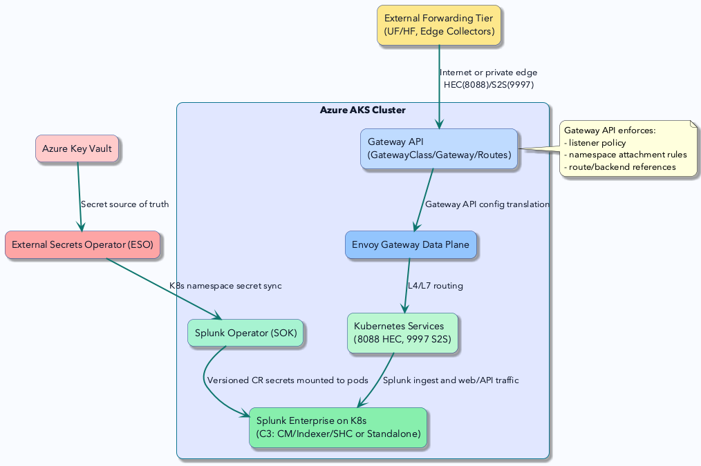
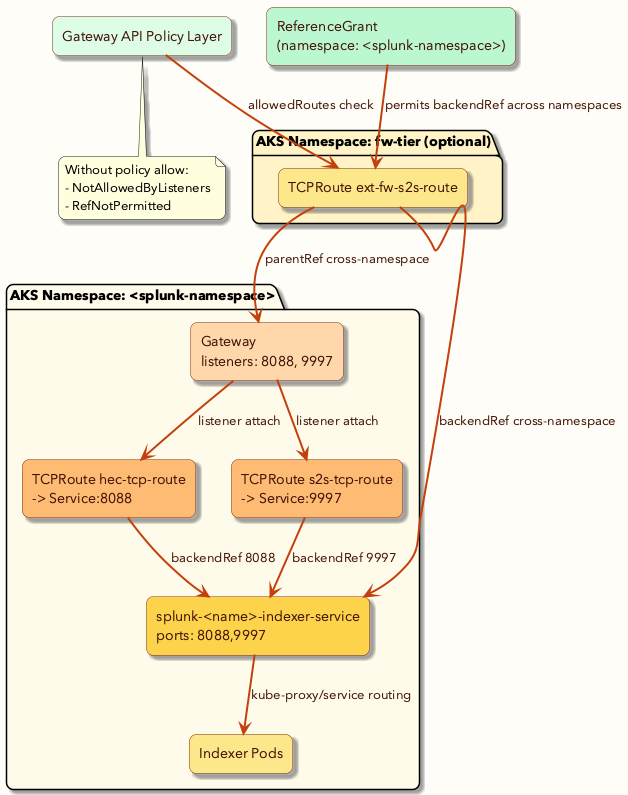
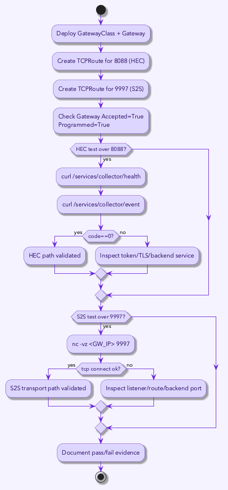
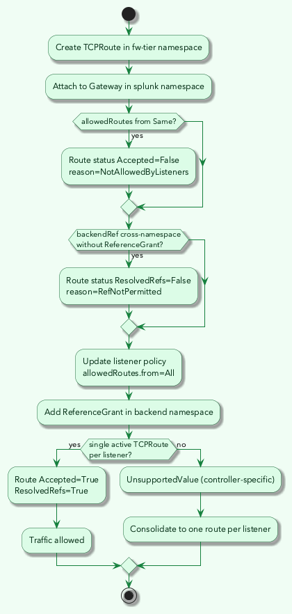

# Configuring Ingress Using Gateway API

This guide explains how to expose Splunk services managed by Splunk Operator using the Kubernetes [Gateway API](https://gateway-api.sigs.k8s.io/).

## Who this guide is for

Use this document if you are:

1. Running Splunk Enterprise on Kubernetes with Splunk Operator.
2. Receiving data from an external forwarding tier.
3. Planning to use Gateway API instead of legacy Ingress patterns.

## What problem this solves

Splunk data ingestion commonly needs two externally reachable data paths:

1. `8088` for HEC (HTTP Event Collector).
2. `9997` for Splunk-to-Splunk (S2S) forwarding.

Gateway API gives you a clear model to expose these paths safely:

1. `GatewayClass` defines which controller implements Gateway API.
2. `Gateway` defines listeners and exposure policy.
3. `TCPRoute`/`HTTPRoute`/`TLSRoute` define backend routing behavior.
4. `ReferenceGrant` controls cross-namespace backend references.

## Before you start

### Required cluster state

1. Splunk Operator deployment is healthy.
2. Splunk Enterprise custom resources are in `Ready` phase.
3. Splunk services exist for the target deployment.
4. A Gateway API implementation is installed.

Check services in your Splunk namespace:

```bash
kubectl get svc -n <splunk-namespace>
```

For indexer ingest, verify service ports include:

1. `8088`
2. `9997`

### Required tools

1. `kubectl`
2. `helm`
3. `curl`
4. `nc` (netcat)

## Quick implementation flow

This guide follows four phases:

1. Install Gateway API implementation.
2. Create Gateway resources for Splunk services.
3. Validate object status and endpoint reachability.
4. Validate HEC and S2S traffic.

## Phase 1: Install Gateway API implementation

Example: Envoy Gateway

```bash
helm upgrade --install eg oci://docker.io/envoyproxy/gateway-helm \
  --version 1.7.0 \
  --namespace envoy-gateway-system \
  --create-namespace
```

Note: Gateway API resources are portable, but controller behavior can vary by implementation. Validate behavior with your selected controller.

## Phase 2: Create same-namespace Gateway and routes (recommended starting point)

Keep `Gateway` and routes in the same namespace as Splunk services first. This minimizes policy complexity.

```yaml
apiVersion: gateway.networking.k8s.io/v1
kind: GatewayClass
metadata:
  name: eg
spec:
  controllerName: gateway.envoyproxy.io/gatewayclass-controller
---
apiVersion: gateway.networking.k8s.io/v1
kind: Gateway
metadata:
  name: splunk-edge-gw
  namespace: <splunk-namespace>
spec:
  gatewayClassName: eg
  listeners:
    - name: hec-tcp
      protocol: TCP
      port: 8088
      allowedRoutes:
        namespaces:
          from: Same
    - name: s2s-tcp
      protocol: TCP
      port: 9997
      allowedRoutes:
        namespaces:
          from: Same
---
apiVersion: gateway.networking.k8s.io/v1alpha2
kind: TCPRoute
metadata:
  name: hec-tcp-route
  namespace: <splunk-namespace>
spec:
  parentRefs:
    - name: splunk-edge-gw
      sectionName: hec-tcp
  rules:
    - backendRefs:
        - name: splunk-<name>-indexer-service
          port: 8088
---
apiVersion: gateway.networking.k8s.io/v1alpha2
kind: TCPRoute
metadata:
  name: s2s-tcp-route
  namespace: <splunk-namespace>
spec:
  parentRefs:
    - name: splunk-edge-gw
      sectionName: s2s-tcp
  rules:
    - backendRefs:
        - name: splunk-<name>-indexer-service
          port: 9997
```

## Phase 3: Validate Gateway and route status

```bash
kubectl -n <splunk-namespace> get gateway splunk-edge-gw -o yaml
kubectl -n <splunk-namespace> get tcproute hec-tcp-route s2s-tcp-route -o yaml
```

Expected status:

1. `Gateway`: `Accepted=True`, `Programmed=True`
2. `TCPRoute`: `Accepted=True`, `ResolvedRefs=True`

## Phase 4: Validate external traffic paths

Get gateway address:

```bash
GW_IP=$(kubectl -n <splunk-namespace> get gateway splunk-edge-gw -o jsonpath='{.status.addresses[0].value}')
```

### Validate HEC on `8088`

```bash
HEC_TOKEN=$(kubectl -n <splunk-namespace> get secret splunk-<splunk-namespace>-secret -o jsonpath='{.data.hec_token}' | base64 --decode)

curl -sk "https://$GW_IP:8088/services/collector/health"
curl -sk "https://$GW_IP:8088/services/collector/event" \
  -H "Authorization: Splunk $HEC_TOKEN" \
  -H "Content-Type: application/json" \
  -d '{"event":"gateway-api-hec-test","source":"gateway-api","sourcetype":"gwtest"}'
```

Expected:

1. Health endpoint returns `HEC is healthy`.
2. Event endpoint returns `{"text":"Success","code":0}`.

### Validate S2S on `9997`

```bash
nc -vz -w 5 "$GW_IP" 9997
```

Expected: TCP connection succeeds.

## External forwarding tier in a separate namespace

If your forwarding tier route objects are created outside the Splunk namespace (for example in `fw-tier`), two controls must both allow traffic:

1. Listener attachment policy: `allowedRoutes`.
2. Cross-namespace backend reference permission: `ReferenceGrant`.

### Default secure-deny behavior

Cross-namespace route attachments can fail with:

1. `Accepted=False` + `NotAllowedByListeners`.
2. `ResolvedRefs=False` + `RefNotPermitted`.

### Explicit allow-list behavior

To allow external forwarding tier routes safely:

1. Update listener policy to permit route namespace attachment.
2. Add `ReferenceGrant` in the backend namespace.

Example `ReferenceGrant`:

```yaml
apiVersion: gateway.networking.k8s.io/v1beta1
kind: ReferenceGrant
metadata:
  name: allow-fw-tier-to-splunk-idxc
  namespace: <splunk-namespace>
spec:
  from:
    - group: gateway.networking.k8s.io
      kind: TCPRoute
      namespace: fw-tier
  to:
    - group: ""
      kind: Service
      name: splunk-<name>-indexer-service
```

Implementation note: some controllers effectively allow one active `TCPRoute` per listener. If multiple routes target the same listener, you may see `UnsupportedValue`.

## Architecture and flow diagrams

These diagrams support the operational flow above.

### C4 context view



PlantUML source: [`pictures/gateway-api/src/c4-context-gateway-api-splunk.puml`](pictures/gateway-api/src/c4-context-gateway-api-splunk.puml)

### C4 container view



PlantUML source: [`pictures/gateway-api/src/c4-container-gateway-api-splunk.puml`](pictures/gateway-api/src/c4-container-gateway-api-splunk.puml)

### Flowchart: HEC and S2S validation path



PlantUML source: [`pictures/gateway-api/src/flow-hec-s2s-test-path.puml`](pictures/gateway-api/src/flow-hec-s2s-test-path.puml)

### Flowchart: cross-namespace policy behavior



PlantUML source: [`pictures/gateway-api/src/flow-cross-namespace-policy.puml`](pictures/gateway-api/src/flow-cross-namespace-policy.puml)

Regenerate PNG files:

```bash
plantuml -tpng -o ../png ./docs/pictures/gateway-api/src/*.puml
```

## Troubleshooting checklist

1. Gateway has no external address:
   - Check Gateway controller pods and generated LoadBalancer service.
2. Route rejected (`Accepted=False`):
   - Verify `parentRefs`, `sectionName`, and listener `allowedRoutes` policy.
3. Route unresolved (`ResolvedRefs=False`):
   - Verify backend service exists and cross-namespace access is allowed via `ReferenceGrant`.
4. HEC returns auth errors:
   - Verify token from `splunk-<namespace>-secret` and endpoint path `/services/collector/event`.

## See also

1. [Ingress](Ingress.md)
2. [Custom Resources](CustomResources.md)
3. [Install](Install.md)
