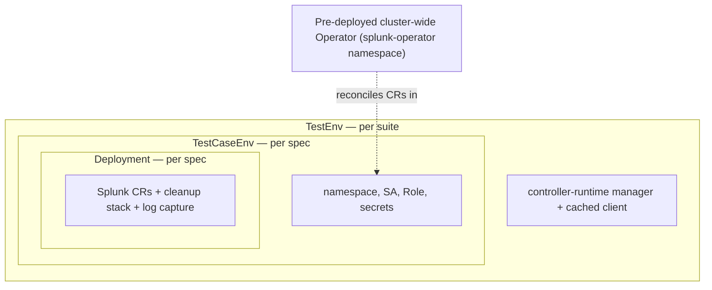
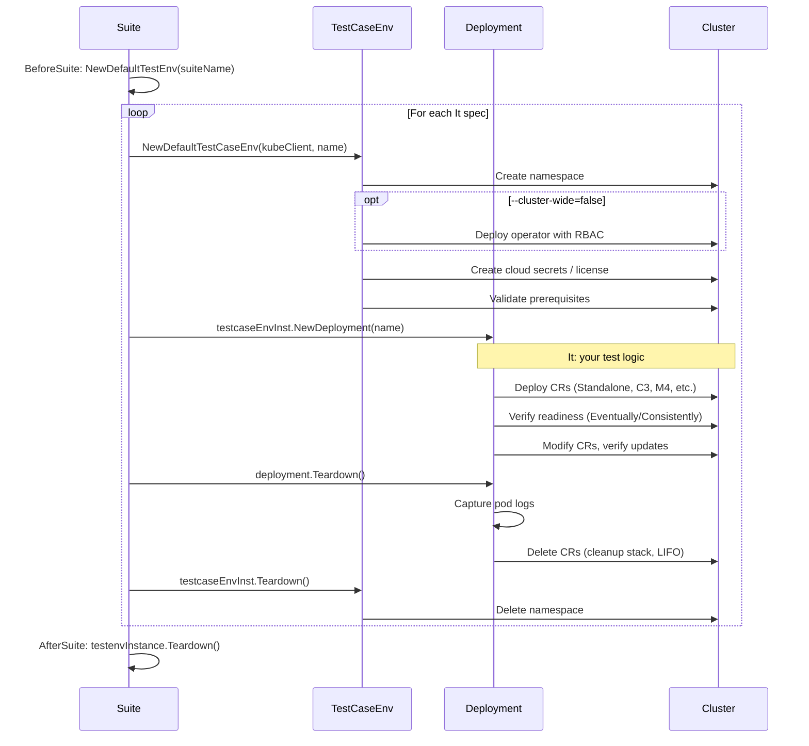

# Integration & E2E Test Writing Guide

This guide helps newcomers understand the Splunk Operator integration test framework, write new tests, execute them, and debug failures.

> **Assumed:** You have a Kubernetes cluster with the Splunk Operator deployed cluster-wide (the default). If you set `--cluster-wide=false`, the test framework will deploy a namespace-scoped operator per test case instead.

---

## What Tests Exist

### Test Suites (Ginkgo-based)

Each directory under `test/` is a separate Ginkgo test suite (Go package) with its own namespace and lifecycle:

| Directory | What It Tests |
|-----------|---------------|
| `test/smoke/` | Basic topology deployments: S1, C3, M4, M1, service accounts |
| `test/custom_resource_crud/` | CR create/update/delete, PVC behavior, v3+v4 matrix |
| `test/licensemanager/` | License Manager functionality + app framework variants |
| `test/licensemaster/` | Legacy License Master (v3) tests |
| `test/monitoring_console/` | Monitoring Console CR tests |
| `test/smartstore/` | SmartStore configuration and functionality |
| `test/secret/` | Secret management |
| `test/ingest_search/` | Data ingest and search verification |
| `test/index_and_ingestion_separation/` | Index vs ingestion separation |
| `test/delete_cr/` | CR deletion behavior |
| `test/appframework_aws/` | App Framework with AWS S3 (`s1/`, `c3/`, `m4/` sub-suites) |
| `test/appframework_az/` | App Framework with Azure Blob (`s1/`, `c3/`, `m4/`) |
| `test/appframework_gcp/` | App Framework with GCP Storage (`s1/`, `c3/`, `m4/`) |
| `test/example/` | **Template** — copy this to start a new suite |

### KUTTL Tests

Declarative end-to-end tests under `kuttl/tests/` using [KUTTL](https://kuttl.dev/). These are primarily used for Helm chart validation and SVA (Splunk Validated Architectures).

### Unit Tests

Located alongside source files in `pkg/`, `internal/`, and `api/` directories. Run with `make test`. Not covered in this guide.

---

## Test Architecture

### Framework Overview

The integration tests use [Ginkgo v2](https://onsi.github.io/ginkgo/) with [Gomega](https://onsi.github.io/gomega/) matchers. The framework has three main abstractions:



### Key Concepts

**TestEnv** (`test/testenv/testenv.go`)
- Created once per suite in `BeforeSuite`
- Builds a controller-runtime manager with a cached Kubernetes client
- Configures the client to work with Splunk CRD types (v3 and v4)
- Does **not** create namespaces or deploy the operator — that happens per-spec

**TestCaseEnv** (`test/testenv/testcaseenv.go`)
- Created per `It` block via `testenv.NewDefaultTestCaseEnv(kubeClient, name)` followed by `testcaseEnvInst.NewDeployment(name)`
- Creates a unique namespace and sets up all required resources:
  - Namespace-scoped operator with RBAC (only when `--cluster-wide=false`; the default is `true`, which expects a pre-deployed cluster-wide operator)
  - Cloud provider index secrets (EKS/Azure/GCP), created from environment variables
  - License ConfigMap (only when `--license-file` is provided; without it, Splunk instances use trial license)
- Torn down manually: `deployment.Teardown()` then `testcaseEnvInst.Teardown()`

**Deployment** (`test/testenv/deployment.go`)
- Wraps the Splunk Custom Resources deployed in a test
- Maintains a cleanup stack — each CR creation pushes a delete function
- On teardown: captures pod logs to files, then runs cleanup functions in LIFO order

### Test Lifecycle



---

## How to Write a New Test

### Option A: Add a Spec to an Existing Suite

The simplest approach — add a new `It` block to an existing test file:

```go
It("smoke, basic, s1: can deploy standalone with custom ports", func() {
    // 1. Deploy a CR
    standalone, err := deployment.DeployStandalone(ctx, deployment.GetName(), "", "")
    Expect(err).To(Succeed(), "Unable to deploy standalone")

    // 2. Verify it reaches Ready
    testenv.StandaloneReady(ctx, deployment, deployment.GetName(), standalone, testcaseEnvInst)

    // 3. Your custom assertions
    // ...
})
```

### Option B: Create a New Test Suite

For tests that need their own isolated namespace or a different setup:

**Step 1: Copy the example template**

```bash
cp -r test/example test/my_feature
```

**Step 2: Update the suite file**

Rename and update `test/my_feature/example_suite_test.go`:

```go
package my_feature

import (
    "testing"

    . "github.com/onsi/ginkgo/v2"
    . "github.com/onsi/gomega"

    "github.com/splunk/splunk-operator/test/testenv"
)

var (
    testenvInstance *testenv.TestEnv
    testSuiteName  = "myfeature-" + testenv.RandomDNSName(3)
)

func TestMyFeature(t *testing.T) {
    RegisterFailHandler(Fail)
    RunSpecs(t, "Running "+testSuiteName)
}

var _ = BeforeSuite(func() {
    var err error
    testenvInstance, err = testenv.NewDefaultTestEnv(testSuiteName)
    Expect(err).ToNot(HaveOccurred())
})

var _ = AfterSuite(func() {
    if testenvInstance != nil {
        Expect(testenvInstance.Teardown()).ToNot(HaveOccurred())
    }
})
```

**Step 3: Write your test spec file**

Create `test/my_feature/my_feature_test.go`:

```go
package my_feature

import (
    "context"
    "fmt"

    . "github.com/onsi/ginkgo/v2"
    "github.com/onsi/ginkgo/v2/types"
    . "github.com/onsi/gomega"

    "github.com/splunk/splunk-operator/test/testenv"
)

var _ = Describe("My Feature", func() {

    var testcaseEnvInst *testenv.TestCaseEnv
    var deployment *testenv.Deployment
    ctx := context.TODO()

    BeforeEach(func() {
        var err error
        name := fmt.Sprintf("%s-%s", testenvInstance.GetName(), testenv.RandomDNSName(3))
        testcaseEnvInst, err = testenv.NewDefaultTestCaseEnv(testenvInstance.GetKubeClient(), name)
        Expect(err).To(Succeed(), "Unable to create testcaseenv")
        deployment, err = testcaseEnvInst.NewDeployment(testenv.RandomDNSName(3))
        Expect(err).To(Succeed(), "Unable to create deployment")
    })

    AfterEach(func() {
        if types.SpecState(CurrentSpecReport().State) == types.SpecStateFailed {
            testcaseEnvInst.SkipTeardown = true
        }
        if deployment != nil {
            deployment.Teardown()
        }
        if testcaseEnvInst != nil {
            Expect(testcaseEnvInst.Teardown()).ToNot(HaveOccurred())
        }
    })

    Context("Standalone deployment (S1)", func() {
        It("myfeature, integration, s1: can do something new", func() {
            standalone, err := deployment.DeployStandalone(ctx, deployment.GetName(), "", "")
            Expect(err).To(Succeed(), "Unable to deploy standalone")

            testenv.StandaloneReady(ctx, deployment, deployment.GetName(), standalone, testcaseEnvInst)

            // Your test logic here
        })
    })
})
```

### Naming Convention for `It` Labels

Test names follow a tag-based convention used for `--focus` / `--skip` filtering:

```
"<tags>, <topology>: <human description>"
```

Examples:
- `"smoke, basic, s1: can deploy a standalone instance"`
- `"managercrcrud, integration, c3: can deploy Indexer and Search Head Cluster"`
- `"myfeature, integration, s1: can do something new"`

Tags used in CI filtering:
- `smoke` — basic deployment checks (run on PRs)
- `integration` — full integration tests (run on push to develop/main)
- Topology: `s1` (standalone), `c3` (clustered indexer + SHC), `m4` (multisite + SHC), `m1` (multisite indexer only)

### Common Test Patterns

#### Deploy and Verify a Standalone

```go
standalone, err := deployment.DeployStandalone(ctx, deployment.GetName(), "", "")
Expect(err).To(Succeed(), "Unable to deploy standalone instance")

testenv.StandaloneReady(ctx, deployment, deployment.GetName(), standalone, testcaseEnvInst)
```

#### Deploy and Verify a C3 Cluster

```go
err := deployment.DeploySingleSiteCluster(ctx, deployment.GetName(), 3, true /*shc*/, "")
Expect(err).To(Succeed(), "Unable to deploy cluster")

testenv.ClusterManagerReady(ctx, deployment, testcaseEnvInst)
testenv.SearchHeadClusterReady(ctx, deployment, testcaseEnvInst)
testenv.SingleSiteIndexersReady(ctx, deployment, testcaseEnvInst)
testenv.VerifyRFSFMet(ctx, deployment, testcaseEnvInst)
```

#### Deploy and Verify a Multisite M4 Cluster

```go
siteCount := 3
err := deployment.DeployMultisiteClusterWithSearchHead(ctx, deployment.GetName(), 1, siteCount, "")
Expect(err).To(Succeed(), "Unable to deploy cluster")

testenv.ClusterManagerReady(ctx, deployment, testcaseEnvInst)
testenv.IndexersReady(ctx, deployment, testcaseEnvInst, siteCount)
testenv.IndexerClusterMultisiteStatus(ctx, deployment, testcaseEnvInst, siteCount)
testenv.SearchHeadClusterReady(ctx, deployment, testcaseEnvInst)
testenv.VerifyRFSFMet(ctx, deployment, testcaseEnvInst)
```

#### Deploy with a Custom Spec

```go
spec := enterpriseApi.StandaloneSpec{
    CommonSplunkSpec: enterpriseApi.CommonSplunkSpec{
        Spec: enterpriseApi.Spec{
            ImagePullPolicy: "IfNotPresent",
            Image:           testcaseEnvInst.GetSplunkImage(),
        },
        Volumes: []corev1.Volume{},
    },
}
standalone, err := deployment.DeployStandaloneWithGivenSpec(ctx, deployment.GetName(), spec)
Expect(err).To(Succeed())

testenv.StandaloneReady(ctx, deployment, deployment.GetName(), standalone, testcaseEnvInst)
```

#### Verify a CR is in a Specific Phase

```go
testenv.VerifyStandalonePhase(ctx, deployment, testcaseEnvInst, crName, enterpriseApi.PhaseReady)
testenv.VerifyClusterManagerPhase(ctx, deployment, testcaseEnvInst, enterpriseApi.PhaseReady)
testenv.VerifySearchHeadClusterPhase(ctx, deployment, testcaseEnvInst, enterpriseApi.PhaseReady)
testenv.VerifyIndexerClusterPhase(ctx, deployment, testcaseEnvInst, enterpriseApi.PhaseReady, idxcName)
```

#### Update a CR

```go
standalone.Spec.Resources.Limits = corev1.ResourceList{
    corev1.ResourceCPU: resource.MustParse("2"),
}
err := deployment.UpdateCR(ctx, standalone)
Expect(err).To(Succeed())
```

#### Verify a Service Account on a Pod

```go
standalonePodName := fmt.Sprintf(testenv.StandalonePod, deployment.GetName(), 0)
testenv.VerifyServiceAccountConfiguredOnPod(deployment, testcaseEnvInst.GetName(), standalonePodName, serviceAccountName)
```

### Available Test Helpers (`test/testenv/`)

| Category | Key Files |
|----------|-----------|
| Test lifecycle (suite + per-spec setup/teardown) | `testenv.go`, `testcaseenv.go` |
| CR deployment (create, update, delete, exec) | `deployment.go`, `util.go` |
| Readiness and phase verification | `verificationutils.go` |
| Component-specific utilities (CM, LM, MC, SHC) | `cmutil.go`, `lmutil.go`, `mcutil.go`, `search_head_cluster_utils.go` |
| App Framework verification | `appframework_utils.go` |
| Cloud storage (S3, Azure Blob, GCS) | `s3utils.go`, `azureutils.go`, `gcputils.go` |
| Data ingestion and search | `ingest_utils.go`, `search_utils.go` |
| Secrets and credentials | `secretutil.go` |

---

## How to Execute Tests

### Prerequisites

- Go installed (see `GO_VERSION` in `.env`)
- A Kubernetes cluster with `kubectl` configured
- Ginkgo v2 CLI — `make setup/ginkgo`
- Operator and Splunk Enterprise images pushed to a registry your cluster can pull from (see below)
- Operator deployed cluster-wide — `make deploy IMG=<image> NAMESPACE=splunk-operator`. With `--cluster-wide=false`, the framework deploys a namespace-scoped operator per test case using the `--operator-image` flag instead
- _(Optional)_ Splunk Enterprise license file via `--license-file=<path>` — without it, instances use trial license

> **Splunk employees:** For internal instructions on provisioning test clusters and obtaining Enterprise license files, see [go/sok-test-setup](http://go/sok-test-setup).

**Build and push the operator image:**

```bash
# Single-platform build
make docker-build IMG=<registry>/splunk-operator:latest
make docker-push  IMG=<registry>/splunk-operator:latest

# Multi-platform build (linux/amd64 + linux/arm64, pushes automatically)
make docker-buildx IMG=<registry>/splunk-operator:latest
```

**Quick setup using `make` targets:**

> Deploys to the cluster/context in your active kubeconfig (`~/.kube/config`).

```bash
make setup/ginkgo                    # Install Ginkgo v2 CLI + Gomega
make deploy IMG=<registry>/splunk-operator:latest NAMESPACE=splunk-operator  # Deploy the operator
```

### Run All Integration Tests via Makefile

```bash
make int-test
```

This runs `test/run-tests.sh`, which deploys the operator and invokes Ginkgo with the settings from `test/env.sh`.

### Run a Specific Suite Directly

```bash
cd test/smoke
ginkgo -v \
  --operator-image=<registry>/splunk/splunk-operator:latest \
  --splunk-image=<registry>/splunk/splunk:latest
```

### Run a Specific Test by Name

Use `--focus` with a regex matching the `It` label:

```bash
ginkgo -v -r \
  --focus="smoke, basic, s1" \
  --operator-image=<registry>/splunk/splunk-operator:latest \
  --splunk-image=<registry>/splunk/splunk:latest \
  ./test/
```

### Skip Specific Tests

```bash
ginkgo -v -r \
  --focus="smoke" \
  --skip="m4" \
  --operator-image=<registry>/splunk/splunk-operator:latest \
  --splunk-image=<registry>/splunk/splunk:latest \
  ./test/
```

### Run Tests in Parallel

```bash
ginkgo -v -r -nodes=3 \
  --focus="smoke" \
  --operator-image=<registry>/splunk/splunk-operator:latest \
  --splunk-image=<registry>/splunk/splunk:latest \
  ./test/
```

### Using the Script Directly

The `test/trigger-tests.sh` script wraps Ginkgo with environment variable support:

```bash
export TEST_FOCUS="smoke"
export CLUSTER_WIDE="false"
export TEST_TIMEOUT="120m"
./test/trigger-tests.sh <operator-image> <enterprise-image>
```

### In CI (GitHub Actions)

Tests run automatically on:
- **PRs to main/develop:** Smoke tests (`build-test-push-workflow.yml`)
- **Push to develop/main/feature branches:** Full integration tests (`int-test-workflow.yml`)
- **Weekly schedule:** Nightly integration suite (`nightly-int-test-workflow.yml`)
- **Manual trigger:** `manual-int-test-workflow.yml` with `workflow_dispatch`

CI provisions an EKS cluster, builds and pushes operator images to ECR, then runs `make int-test`.

---

## How to Debug Tests

### Preserve Resources on Failure

By default, the `AfterEach` block sets `testcaseEnvInst.SkipTeardown = true` when a spec fails, preserving the namespace and resources for investigation. To also enable this for the deployment teardown:

```bash
export DEBUG=True
```

This prevents cleanup of CRs and namespaces so you can inspect the cluster state after a failure.

### Read Pod Logs from Test Output

On teardown, the `Deployment` object automatically captures pod logs to files. After a test run, look for log files in the test output directory. In CI, these are uploaded as GitHub Actions artifacts under `pod_logs`.

### Inspect the Cluster During/After a Test

```bash
# List namespaces created by tests (names contain the suite name + random suffix)
kubectl get ns | grep smoke

# Check operator pod in the test namespace
kubectl get pods -n <test-namespace>

# Check operator logs
kubectl logs -n <test-namespace> deployment/splunk-op-<test-namespace>

# Describe a failing CR
kubectl describe standalone -n <test-namespace>

# Check events
kubectl get events -n <test-namespace> --sort-by='.lastTimestamp'
```

### Run a Single Failing Test in Isolation

```bash
cd test/smoke
ginkgo -v --focus="can deploy a standalone instance" \
  --operator-image=<registry>/splunk/splunk-operator:latest \
  --splunk-image=<registry>/splunk/splunk:latest
```

### Use Ginkgo's Built-in Debugging

**Verbose output with trace:**

```bash
ginkgo -v --trace -r --focus="my test" ./test/
```

**Use `GinkgoWriter` for debug output in tests:**

```go
GinkgoWriter.Printf("Current CR status: %+v\n", standalone.Status)
```

**Use the testenv logger:**

```go
testcaseEnvInst.Log.Info("Debug info", "key", value)
```

### Increase Timeouts for Slow Environments

If tests fail due to timeouts on slow clusters:

```bash
ginkgo -v --timeout=300m \
  --operator-image=... --splunk-image=... \
  ./test/
```

### Common Failure Patterns

| Symptom | Likely Cause | Fix |
|---------|-------------|-----|
| `context deadline exceeded` | CR never reached `PhaseReady` | Check operator logs, node resources, image pull errors |
| `namespace not found` | Previous test cleanup failed | Manually delete leftover namespaces |
| `image pull backoff` | Registry not accessible from cluster | Verify `PRIVATE_REGISTRY` and image push |
| `prerequisites validation failed` | Cluster-wide operator not running | Deploy operator to `splunk-operator` namespace or set `--cluster-wide=false` |
| Test hangs indefinitely | `Eventually` polling a condition that never becomes true | Check operator logs for reconciliation errors |

---

## Environment Variables Reference

### Core Variables

| Variable | Default | Description |
|----------|---------|-------------|
| `SPLUNK_OPERATOR_IMAGE` | `splunk/splunk-operator:latest` | Operator image used in tests |
| `SPLUNK_ENTERPRISE_IMAGE` | `splunk/splunk:latest` | Splunk Enterprise image |
| `CLUSTER_PROVIDER` | `eks` | Cluster type: `kind`, `eks`, `azure`, `gcp` |
| `PRIVATE_REGISTRY` | `localhost:5000` (kind) | Registry the cluster pulls images from |
| `CLUSTER_WIDE` | `true` | If `true` (default), use pre-deployed cluster-wide operator; if `false`, deploy operator per test namespace |
| `DEPLOYMENT_TYPE` | `manifest` | `manifest` or `helm` |

### Test Selection

| Variable | Default | Description |
|----------|---------|-------------|
| `TEST_FOCUS` / `TEST_REGEX` | `smoke` | Regex to select tests by name |
| `TEST_TO_SKIP` / `SKIP_REGEX` | _(empty)_ | Regex to exclude tests |
| `TEST_TIMEOUT` | `225m` | Ginkgo suite timeout |
| `NUM_NODES` | `2` | Ginkgo parallel nodes |
| `DEBUG` / `DEBUG_RUN` | `False` | If `True`, skip teardown on failure |

### Cloud Provider Credentials

Cloud provider variables below are used to create Kubernetes Secrets in each test namespace for SmartStore, App Framework, and index tests. In CI, these are populated from GitHub Actions secrets. For local runs, export them in your shell or source them from a `.env` file. If you're only running smoke tests without cloud storage features, these can be left unset.

### AWS/EKS

| Variable | Description |
|----------|-------------|
| `ECR_REGISTRY` | ECR registry URL |
| `TEST_S3_ACCESS_KEY_ID` | S3 access key for test buckets |
| `TEST_S3_SECRET_ACCESS_KEY` | S3 secret key |
| `TEST_BUCKET` / `TEST_S3_BUCKET` | S3 bucket for test data |
| `TEST_INDEXES_S3_BUCKET` | S3 bucket for index tests |
| `S3_REGION` | AWS region (default: `us-west-2`) |

### Azure

| Variable | Description |
|----------|-------------|
| `STORAGE_ACCOUNT` | Azure Storage account name |
| `STORAGE_ACCOUNT_KEY` | Azure Storage account key |
| `TEST_CONTAINER` | Azure Blob container for test data |
| `INDEXES_CONTAINER` | Azure Blob container for index tests |

### GCP

| Variable | Description |
|----------|-------------|
| `GCP_SERVICE_ACCOUNT_KEY` | Base64-encoded GCP service account JSON |
| `GCP_CONTAINER_REGISTRY_LOGIN_SERVER` | GCP Artifact Registry URL |

---

## Quick Reference: Creating Your First Test

1. Decide if your test fits in an existing suite or needs a new one
2. If new suite: `cp -r test/example test/your_feature`
3. Update the package name and suite name
4. Write your spec using `BeforeEach` (with `NewDefaultTestCaseEnv` + `NewDeployment`) and `AfterEach` (with `deployment.Teardown()` + `testcaseEnvInst.Teardown()`)
5. Use `deployment.Deploy*` methods to create CRs
6. Use `testenv.*Ready` functions (e.g., `testenv.StandaloneReady`, `testenv.ClusterManagerReady`) to assert readiness
7. Name your `It` blocks with tags for CI filtering: `"mytag, integration, s1: description"`
8. Run locally: `cd test/your_feature && ginkgo -v --operator-image=... --splunk-image=...`
9. Verify in CI: push your branch and check GitHub Actions
