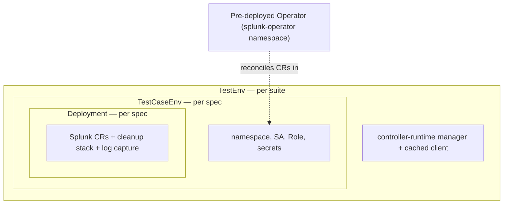
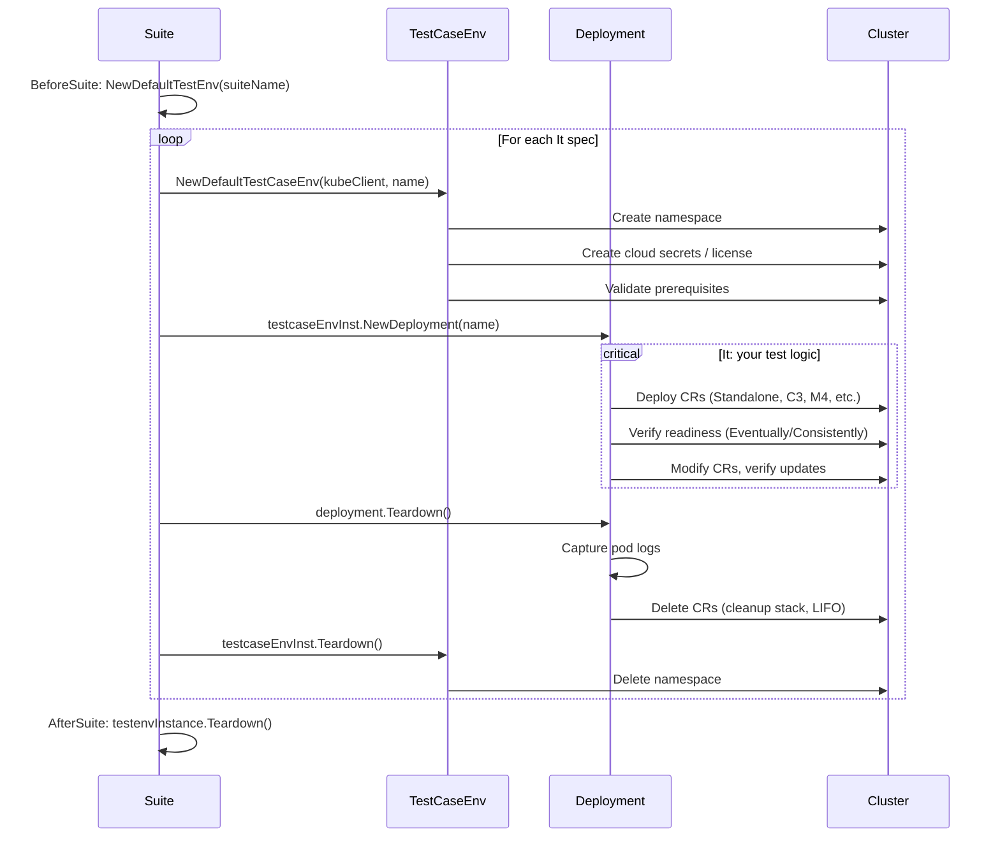

# Integration & E2E Test Writing Guide

This guide helps newcomers understand the Splunk Operator integration test framework, write new tests, execute them, and debug failures.

> **Assumed:** You have a Kubernetes cluster with the Splunk Operator deployed cluster-wide

---

## What Tests Exist

### Test Suites (Ginkgo-based)

Each directory under `test/` is a separate Ginkgo test suite (Go package) with its own namespace and lifecycle:

| Directory | What It Tests |
|-----------|---------------|
| `test/smoke/` | Basic topology deployments: S1, C3, M4, M1, service accounts |
| `test/custom_resource_crud/` | CR create/update/delete, PVC behavior, v3+v4 matrix |
| `test/licensemanager/` | License Manager functionality + app framework variants |
| `test/licensemaster/` | Legacy License Master (v3) tests |
| `test/monitoring_console/` | Monitoring Console CR tests |
| `test/smartstore/` | SmartStore configuration and functionality |
| `test/secret/` | Secret management |
| `test/ingest_search/` | Data ingest and search verification |
| `test/index_and_ingestion_separation/` | Index vs ingestion separation |
| `test/delete_cr/` | CR deletion behavior |
| `test/appframework_aws/` | App Framework with AWS S3 (`s1/`, `c3/`, `m4/` sub-suites) |
| `test/appframework_az/` | App Framework with Azure Blob (`s1/`, `c3/`, `m4/`) |
| `test/appframework_gcp/` | App Framework with GCP Storage (`s1/`, `c3/`, `m4/`) |
| `test/example/` | **Template** — copy this to start a new suite |

### KUTTL Tests

Declarative end-to-end tests under `kuttl/tests/` using [KUTTL](https://kuttl.dev/). These are primarily used for Helm chart validation and SVA (Splunk Validated Architectures).

### Unit Tests

Located alongside source files in `pkg/`, `internal/`, and `api/` directories. Run with `make test`. Not covered in this guide.

---

## What to Test (and What Not To)

Integration tests should focus on **operator mechanics** — proving that the controller reconciles CRs into the correct Kubernetes state. They should not re-validate Splunk Enterprise behavior that is already tested upstream.

### In scope: Operator mechanics

Test behaviors the operator owns. If they break, it's an operator bug:

- CR lifecycle and phase transitions (`Pending → Updating → Ready`)
- Spec-driven workload changes — resource limits, image, replicas trigger correct rolling updates
- PVC management — claims created, retained, or deleted per reclaim policy
- RBAC and service accounts on pods
- Cleanup and finalizers — deleting a CR tears down child resources correctly
- Multi-CR coordination — CM + IndexerCluster + SHC all reach `Ready` together
- App Framework staging — operator downloads and stages packages (the _delivery_, not Splunk's app install)

### Out of scope: Splunk Enterprise features

Don't test behaviors that belong to Splunk itself — it couples CI to Splunk internals and duplicates upstream coverage:

- Search correctness and indexing pipeline internals
- RF/SF replication health (reported by splunkd, not implemented by the operator)
- App enablement and versioning inside Splunk
- License enforcement and splunkd authentication

### Splunk-side status checks

Lightweight Splunk-side status checks are fine as a **secondary** check — for example, a single REST call like `VerifyRFSFMet` to confirm an indexer cluster is healthy after the operator finishes reconciling. Every such check must be paired with a primary operator-level assertion (CR phase, pod count, StatefulSet readiness).

Guidelines for Splunk-side checks:

1. Keep them lightweight — a single REST call, not a multi-step search pipeline
2. Always pair with an operator-level assertion; a Splunk-side check must never be the sole assertion in a test
3. Prefer them when no Kubernetes-native signal exists for the same thing

If a test _only_ asserts Splunk-internal state with no operator-level assertion, it belongs in Splunk's test suite, not here.

### Practical checklist for new tests

| Question | If yes | If no |
|----------|--------|-------|
| Does the test break if only operator code changes? | In scope | Probably out of scope |
| Can the assertion be made against CR status or Kubernetes objects? | Prefer that | Consider if a Splunk-side check is truly needed |
| Would this test still be meaningful with a different backing application (not Splunk)? | Strong signal it's operator mechanics | Likely Splunk-specific |
| Does the test exercise a code path in `pkg/splunk/` or `internal/controller/`? | In scope | Out of scope |

---

## Test Architecture

### Framework Overview

The integration tests use [Ginkgo v2](https://onsi.github.io/ginkgo/) with [Gomega](https://onsi.github.io/gomega/) matchers. The framework has three main abstractions:



### Key Concepts

**TestEnv** (`test/testenv/testenv.go`)
- Created once per suite in `BeforeSuite`
- Builds a controller-runtime manager with a cached Kubernetes client
- Configures the client to work with Splunk CRD types (v3 and v4)
- Does **not** create namespaces — that happens per-spec in `TestCaseEnv`

**TestCaseEnv** (`test/testenv/testcaseenv.go`)
- Created per `It` block via `testenv.NewDefaultTestCaseEnv(kubeClient, name)` followed by `testcaseEnvInst.NewDeployment(name)`
- Creates a unique namespace and sets up all required resources:
  - Cloud provider index secrets (EKS/Azure/GCP), created from environment variables
  - License ConfigMap (only when `--license-file` is provided; without it, Splunk instances use trial license)
- Torn down manually: `deployment.Teardown()` then `testcaseEnvInst.Teardown()`

**Deployment** (`test/testenv/deployment.go`)
- Wraps the Splunk Custom Resources deployed in a test
- Maintains a cleanup stack — each CR creation pushes a delete function
- On teardown: captures pod logs to files, then runs cleanup functions in LIFO order

### Test Lifecycle



---

## How to Write a New Test

### Option A: Add a Spec to an Existing Suite

The simplest approach — add a new `It` block to an existing test file:

```go
It("<mysuite>, <mytag>, <topology>: <human description>", func() {
    // 1. Deploy a CR
    standalone, err := deployment.DeployStandalone(ctx, deployment.GetName(), "", "")
    Expect(err).To(Succeed(), "Unable to deploy standalone")

    // 2. Verify it reaches Ready
    testenv.StandaloneReady(ctx, deployment, deployment.GetName(), standalone, testcaseEnvInst)

    // 3. Your custom assertions
    // ...
})
```

### Option B: Create a New Test Suite

For tests that need their own isolated namespace or a different setup:

**Step 1: Copy the example template**

```bash
cp -r test/example test/my_feature
```

**Step 2: Update the suite file**

Rename and update `test/my_feature/example_suite_test.go`:

```go
package my_feature

import (
    "testing"

    . "github.com/onsi/ginkgo/v2"
    . "github.com/onsi/gomega"

    "github.com/splunk/splunk-operator/test/testenv"
)

var (
    testenvInstance *testenv.TestEnv
    testSuiteName  = "myfeature-" + testenv.RandomDNSName(3)
)

func TestMyFeature(t *testing.T) {
    RegisterFailHandler(Fail)
    RunSpecs(t, "Running "+testSuiteName)
}

var _ = BeforeSuite(func() {
    var err error
    testenvInstance, err = testenv.NewDefaultTestEnv(testSuiteName)
    Expect(err).ToNot(HaveOccurred())
})

var _ = AfterSuite(func() {
    if testenvInstance != nil {
        Expect(testenvInstance.Teardown()).ToNot(HaveOccurred())
    }
})
```

**Step 3: Write your test spec file**

Create `test/my_feature/my_feature_test.go`:

```go
package my_feature

import (
    "context"
    "fmt"

    . "github.com/onsi/ginkgo/v2"
    "github.com/onsi/ginkgo/v2/types"
    . "github.com/onsi/gomega"

    "github.com/splunk/splunk-operator/test/testenv"
)

var _ = Describe("My Feature", func() {

    var testcaseEnvInst *testenv.TestCaseEnv
    var deployment *testenv.Deployment
    ctx := context.TODO()

    BeforeEach(func() {
        var err error
        name := fmt.Sprintf("%s-%s", testenvInstance.GetName(), testenv.RandomDNSName(3))
        testcaseEnvInst, err = testenv.NewDefaultTestCaseEnv(testenvInstance.GetKubeClient(), name)
        Expect(err).To(Succeed(), "Unable to create testcaseenv")
        deployment, err = testcaseEnvInst.NewDeployment(testenv.RandomDNSName(3))
        Expect(err).To(Succeed(), "Unable to create deployment")
    })

    AfterEach(func() {
        if types.SpecState(CurrentSpecReport().State) == types.SpecStateFailed {
            testcaseEnvInst.SkipTeardown = true
        }
        if deployment != nil {
            deployment.Teardown()
        }
        if testcaseEnvInst != nil {
            Expect(testcaseEnvInst.Teardown()).ToNot(HaveOccurred())
        }
    })

    Context("Standalone deployment (S1)", func() {
        It("<mysuite>, <mytag>, <topology>: <human description>", func() {
            standalone, err := deployment.DeployStandalone(ctx, deployment.GetName(), "", "")
            Expect(err).To(Succeed(), "Unable to deploy standalone")

            testenv.StandaloneReady(ctx, deployment, deployment.GetName(), standalone, testcaseEnvInst)

            // Your test logic here
        })
    })
})
```

### Naming Convention for `It` Labels

Test names follow a tag-based convention used for `--focus` / `--skip` filtering:

```
"<mysuite>, <mytag>, <topology>: <human description>"
```

Examples:
- `"smoke, basic, s1: can deploy a standalone instance"`
- `"managercrcrud, integration, c3: can deploy Indexer and Search Head Cluster"`

Tags used in CI filtering:
- `smoke` — basic deployment checks (run on PRs)
- `integration` — full integration tests (run on push to develop/main and on PRs from `feature*` branches)
- Topology: `s1` (standalone), `c3` (clustered indexer + SHC), `m4` (multisite + SHC), `m1` (multisite indexer only)

### Common Test Patterns

#### Deploy and Verify a Standalone

```go
standalone, err := deployment.DeployStandalone(ctx, deployment.GetName(), "", "")
Expect(err).To(Succeed(), "Unable to deploy standalone instance")

testenv.StandaloneReady(ctx, deployment, deployment.GetName(), standalone, testcaseEnvInst)
```

#### Deploy and Verify a C3 Cluster

```go
err := deployment.DeploySingleSiteCluster(ctx, deployment.GetName(), 3, true /*shc*/, "")
Expect(err).To(Succeed(), "Unable to deploy cluster")

testenv.ClusterManagerReady(ctx, deployment, testcaseEnvInst)
testenv.SearchHeadClusterReady(ctx, deployment, testcaseEnvInst)
testenv.SingleSiteIndexersReady(ctx, deployment, testcaseEnvInst)
testenv.VerifyRFSFMet(ctx, deployment, testcaseEnvInst)
```

#### Deploy and Verify a Multisite M4 Cluster

```go
siteCount := 3
err := deployment.DeployMultisiteClusterWithSearchHead(ctx, deployment.GetName(), 1, siteCount, "")
Expect(err).To(Succeed(), "Unable to deploy cluster")

testenv.ClusterManagerReady(ctx, deployment, testcaseEnvInst)
testenv.IndexersReady(ctx, deployment, testcaseEnvInst, siteCount)
testenv.IndexerClusterMultisiteStatus(ctx, deployment, testcaseEnvInst, siteCount)
testenv.SearchHeadClusterReady(ctx, deployment, testcaseEnvInst)
testenv.VerifyRFSFMet(ctx, deployment, testcaseEnvInst)
```

#### Deploy with a Custom Spec

```go
spec := enterpriseApi.StandaloneSpec{
    CommonSplunkSpec: enterpriseApi.CommonSplunkSpec{
        Spec: enterpriseApi.Spec{
            ImagePullPolicy: "IfNotPresent",
            Image:           testcaseEnvInst.GetSplunkImage(),
        },
        Volumes: []corev1.Volume{},
    },
}
standalone, err := deployment.DeployStandaloneWithGivenSpec(ctx, deployment.GetName(), spec)
Expect(err).To(Succeed())

testenv.StandaloneReady(ctx, deployment, deployment.GetName(), standalone, testcaseEnvInst)
```

#### Verify a CR is in a Specific Phase

```go
testenv.VerifyStandalonePhase(ctx, deployment, testcaseEnvInst, crName, enterpriseApi.PhaseReady)
testenv.VerifyClusterManagerPhase(ctx, deployment, testcaseEnvInst, enterpriseApi.PhaseReady)
testenv.VerifySearchHeadClusterPhase(ctx, deployment, testcaseEnvInst, enterpriseApi.PhaseReady)
testenv.VerifyIndexerClusterPhase(ctx, deployment, testcaseEnvInst, enterpriseApi.PhaseReady, idxcName)
```

#### Update a CR

```go
standalone.Spec.Resources.Limits = corev1.ResourceList{
    corev1.ResourceCPU: resource.MustParse("2"),
}
err := deployment.UpdateCR(ctx, standalone)
Expect(err).To(Succeed())
```

#### Verify a Service Account on a Pod

```go
standalonePodName := fmt.Sprintf(testenv.StandalonePod, deployment.GetName(), 0)
testenv.VerifyServiceAccountConfiguredOnPod(deployment, testcaseEnvInst.GetName(), standalonePodName, serviceAccountName)
```

### Available Test Helpers (`test/testenv/`)

| Category | Key Files |
|----------|-----------|
| Test lifecycle (suite + per-spec setup/teardown) | `testenv.go`, `testcaseenv.go` |
| CR deployment (create, update, delete, exec) | `deployment.go`, `util.go` |
| Readiness and phase verification | `verificationutils.go` |
| Component-specific utilities (CM, LM, MC, SHC) | `cmutil.go`, `lmutil.go`, `mcutil.go`, `search_head_cluster_utils.go` |
| App Framework verification | `appframework_utils.go` |
| Cloud storage (S3, Azure Blob, GCS) | `s3utils.go`, `azureutils.go`, `gcputils.go` |
| Data ingestion and search | `ingest_utils.go`, `search_utils.go` |
| Secrets and credentials | `secretutil.go` |

---

## How to Execute Tests

### Setup

Follow these steps in order to prepare your environment for running integration tests.

**1. Install Go**

Install the version specified by `GO_VERSION` in `.env`.

**2. Set up a Kubernetes cluster**

You need a cluster with `kubectl` configured and a default StorageClass backed by a CSI driver for dynamic PVC provisioning (Splunk CRs create StatefulSets with PVCs).

**Splunk employees:** see [go/sok-test-setup](http://go/sok-test-setup) for internal instructions on provisioning test clusters.

**3. Install the Ginkgo CLI**

```bash
make setup/ginkgo
```

**4. Set your image variables**

Export these once. All subsequent commands reference them.

```bash
export REGISTRY=<your-registry>   # e.g. 123456789.dkr.ecr.us-west-2.amazonaws.com
export OPERATOR_IMG=$REGISTRY/splunk-operator:latest
export SPLUNK_IMG=$REGISTRY/splunk/splunk:latest
```

If your cluster can pull from Docker Hub directly, you can use the public image instead:

```bash
export SPLUNK_IMG=splunk/splunk:latest
```

**5. Build and push the operator image**

```bash
# Multi-platform build (linux/amd64 + linux/arm64 by default, pushes automatically)
make docker-buildx IMG=$OPERATOR_IMG

# Single-platform build
make docker-buildx IMG=$OPERATOR_IMG PLATFORMS=linux/amd64
```

**6. Make the Splunk Enterprise image available**

Tests deploy Splunk Enterprise pods using the image passed via `-splunk-image`. The public image on Docker Hub is `splunk/splunk` (see `SPLUNK_ENTERPRISE_RELEASE_IMAGE` in `.env` for the version used in CI). If your cluster can pull from Docker Hub directly, no action is needed — you already set `SPLUNK_IMG` to the public image in step 4.

If your cluster uses a private registry (common for EKS, air-gapped environments), pull and push it:

```bash
docker pull splunk/splunk:latest
docker tag splunk/splunk:latest $SPLUNK_IMG
docker push $SPLUNK_IMG
```

**7. Deploy the operator cluster-wide**

> Deploys to the cluster/context in your active kubeconfig (`~/.kube/config`).

See [Splunk General Terms Acceptance](README.md#splunk-general-terms-acceptance) for the required `SPLUNK_GENERAL_TERMS` value.

```bash
make deploy IMG=$OPERATOR_IMG NAMESPACE=splunk-operator SPLUNK_GENERAL_TERMS=<value>
```

**8. _(Optional)_ Provide a Splunk Enterprise license file**

Pass `--license-file=<path>` when running tests. Without it, instances use a trial license. **Required** for License Manager / License Master test suites.

**Splunk employees:** see [go/sok-test-setup](http://go/sok-test-setup) for obtaining Enterprise license files.

**9. _(App Framework / SmartStore tests only)_ Configure cloud storage**

These tests require pre-populated cloud storage buckets with Splunk app tarballs and valid provider credentials. The bucket names and app paths are currently hardcoded to SOK-team–owned resources, so **only contributors with access to the SOK team's cloud accounts can run these suites**.

Environment variables are defined in `test/env.sh`.

**10. _(Index/ingestion separation tests only)_ Provision AWS resources**

These tests require dedicated SQS queues and an S3 bucket in `us-west-2`. Resource names are hardcoded in the test suite file and the S3 bucket name is globally unique, so these tests can only be run by the SOK team against the team's AWS account.

### Run All Integration Tests via Makefile

> **Warning:** Running the full integration suite takes several hours. Tests are not all parallelized, and many suites deploy resource-heavy topologies (multi-site clusters, SHC). Running all suites on a single small cluster can exhaust its resources. In CI, different suites are distributed across separate clusters. For local development, prefer running a specific suite or test with `--focus` instead.

```bash
make int-test
```

This runs `test/run-tests.sh`, which deploys the operator and invokes Ginkgo with the settings from `test/env.sh`.

### Run a Specific Suite Directly

Pass the suite directory as an argument to ginkgo. The `smoke` suite is a good starting point — it only requires a running operator and does not need cloud storage credentials or a license file.

```bash
ginkgo -v ./test/smoke -- \
  -operator-image=$OPERATOR_IMG \
  -splunk-image=$SPLUNK_IMG
```

Suites under `test/appframework_*`, `test/smartstore/`, and `test/index_and_ingestion_separation/` require cloud storage setup (steps 9–10 above).

### Run a Specific Test by Name

Use `--focus` with a regex matching the `It` label. Always target a **specific suite directory** — using `-r ./test/` recurses into all suites, which triggers their `BeforeSuite` blocks (including cloud setup) even when focus filters out their tests.

```bash
ginkgo -v \
  --focus="can deploy a standalone instance$" \
  ./test/smoke -- \
  -operator-image=$OPERATOR_IMG \
  -splunk-image=$SPLUNK_IMG
```

Tags in `It` labels (e.g. `smoke, basic, s1: can deploy ...`) also work as focus patterns — `--focus="smoke, basic, s1"` matches all tests tagged with those labels.

### Skip Specific Tests

```bash
ginkgo -v \
  --skip="m4" \
  ./test/smoke -- \
  -operator-image=$OPERATOR_IMG \
  -splunk-image=$SPLUNK_IMG
```

### Run Tests in Parallel

```bash
ginkgo -v -nodes=3 ./test/smoke -- \
  -operator-image=$OPERATOR_IMG \
  -splunk-image=$SPLUNK_IMG
```

### Using the Script Directly

The `test/trigger-tests.sh` script wraps Ginkgo with environment variable support:

```bash
export TEST_FOCUS="smoke"
export TEST_TIMEOUT="120m"
./test/trigger-tests.sh <operator-image> <enterprise-image>
```

### In CI (GitHub Actions)

Tests run automatically on:
- **PRs to main/develop:** Smoke tests (`build-test-push-workflow.yml`)
- **Push to develop/main/feature branches:** Full integration tests (`int-test-workflow.yml`)
- **Weekly schedule:** Nightly integration suite (`nightly-int-test-workflow.yml`)
- **Manual trigger:** `manual-int-test-workflow.yml` with `workflow_dispatch`

For integration test workflows, CI provisions an EKS cluster, builds and pushes operator images to ECR, then runs `make int-test`. Smoke tests run on the existing CI infrastructure without provisioning a dedicated cluster.

---

## How to Debug Tests

### Preserve Resources on Failure

By default, the `AfterEach` block sets `testcaseEnvInst.SkipTeardown = true` when a spec fails, preserving the namespace and resources for investigation. To also enable this for the deployment teardown:

```bash
export DEBUG=True
```

This prevents cleanup of CRs and namespaces so you can inspect the cluster state after a failure.

### Read Pod Logs from Test Output

On teardown, the `Deployment` object automatically captures pod logs to files. After a test run, look for log files in the test output directory. In CI, these are uploaded as GitHub Actions artifacts under `pod_logs`.

### Inspect the Cluster During/After a Test

```bash
# Find namespaces that contain Splunk CRs (these are test namespaces)
kubectl get standalone,searchheadcluster,indexercluster,clustermanager,clustermaster,\
monitoringconsole,licensemanager,licensemaster --all-namespaces

# Check pods in a test namespace
kubectl get pods -n <test-namespace>

# Check operator logs (cluster-wide operator runs in splunk-operator namespace)
kubectl logs -n splunk-operator deployment/splunk-operator-controller-manager

# Describe a failing CR
kubectl describe standalone -n <test-namespace>

# Check events
kubectl get events -n <test-namespace> --sort-by='.lastTimestamp'
```

### Check for Leftovers After Tests

```bash
# Find any Splunk CRs still running across all namespaces
kubectl get standalone,searchheadcluster,indexercluster,clustermanager,clustermaster,\
monitoringconsole,licensemanager,licensemaster --all-namespaces

# Find PVCs left behind
kubectl get pvc --all-namespaces | grep -E 'splunk-|pvc-'

# Find test namespaces (test names include random suffixes like smoke-abc-xyz-def)
kubectl get ns --no-headers -o custom-columns=':metadata.name' | \
  grep -vE '^(default|kube-|splunk-operator)'

# Clean up a specific test namespace (deletes all resources in it)
kubectl delete ns <test-namespace>

# Automated cleanup: remove all Splunk CRs, patch finalizers, and delete test namespaces
./tools/cleanup.sh

# Undeploy the operator when done testing (cleans up the splunk-operator namespace)
make undeploy
```

If a namespace is stuck in `Terminating`, check for resources with finalizers (see [Common Failure Patterns](#common-failure-patterns) below).

### Run a Single Failing Test in Isolation

```bash
ginkgo -v --focus="smoke, basic, s1: can deploy a standalone instance$" \
  ./test/smoke -- \
  -operator-image=$OPERATOR_IMG \
  -splunk-image=$SPLUNK_IMG
```

### Use Ginkgo's Built-in Debugging

**Verbose output with trace:**

```bash
ginkgo -v --trace -r --focus="my test" ./test/
```

**Add debug output to your test code:**

Use `GinkgoWriter` or the testenv logger inside `It`/`BeforeEach` blocks — output appears in the ginkgo console when running with `-v`:

```go
GinkgoWriter.Printf("Current CR status: %+v\n", standalone.Status)
testcaseEnvInst.Log.Info("Debug info", "key", value)
```

### Increase Timeouts for Slow Environments

If tests fail due to timeouts on slow clusters:

```bash
ginkgo -v --timeout=300m \
  ./test/ -- \
  -operator-image=... -splunk-image=...
```

### Common Failure Patterns

| Symptom | Likely Cause | Fix |
|---------|-------------|-----|
| `context deadline exceeded` | CR never reached `PhaseReady` | Check operator logs, node resources, image pull errors |
| `namespace not found` | Previous test cleanup failed | Manually delete leftover namespaces |
| `image pull backoff` | Registry not accessible from cluster | Verify `PRIVATE_REGISTRY` and image push |
| `prerequisites validation failed` | Operator not running | Deploy operator to `splunk-operator` namespace |
| Test hangs indefinitely | `Eventually` polling a condition that never becomes true | Check operator logs for reconciliation errors |
| CR or namespace stuck in `Terminating` | Finalizer on a resource that can't be reconciled (e.g. CR in `Error` phase with no PVC) | Remove the finalizer manually (see below) |

**Removing a stuck finalizer:**

When a CR (e.g. MonitoringConsole) or PVC is stuck in `Terminating` because the operator can't reconcile the finalizer, patch it out:

```bash
# Remove finalizer from a CR
kubectl patch monitoringconsole <name> -n <namespace> \
  --type=merge -p '{"metadata":{"finalizers":null}}'

# Remove finalizer from a PVC
kubectl patch pvc <name> -n <namespace> \
  --type=merge -p '{"metadata":{"finalizers":null}}'
```

Test namespaces use the suite name with random suffixes (e.g. `smoke-abc-xyz-def`, `s1appfw-abc-xyz-def`). To find leftover test namespaces:

```bash
kubectl get ns --no-headers -o custom-columns=':metadata.name' | \
  grep -vE '^(default|kube-|splunk-operator)'
```

To find resources with finalizers across all namespaces:

```bash
kubectl get all,pvc --all-namespaces -o json | \
  jq '.items[] | select(.metadata.finalizers != null) | {namespace: .metadata.namespace, kind: .kind, name: .metadata.name, finalizers: .metadata.finalizers}'
```

---

## Environment Variables Reference

### Core Variables

| Variable | Default | Description |
|----------|---------|-------------|
| `SPLUNK_OPERATOR_IMAGE` | `splunk/splunk-operator:latest` | Operator image used in tests |
| `SPLUNK_ENTERPRISE_IMAGE` | `splunk/splunk:latest` | Splunk Enterprise image |
| `CLUSTER_PROVIDER` | `eks` | Cluster type: `kind`, `eks`, `azure`, `gcp` |
| `PRIVATE_REGISTRY` | `localhost:5000` (kind) | Registry the cluster pulls images from |
| `DEPLOYMENT_TYPE` | `manifest` | `manifest` or `helm` |

### Test Selection

| Variable | Default | Description |
|----------|---------|-------------|
| `TEST_FOCUS` / `TEST_REGEX` | `smoke` | Regex to select tests by name |
| `TEST_TO_SKIP` / `SKIP_REGEX` | _(empty)_ | Regex to exclude tests |
| `TEST_TIMEOUT` | `225m` | Ginkgo suite timeout |
| `NUM_NODES` | `2` | Ginkgo parallel nodes |
| `DEBUG` / `DEBUG_RUN` | `False` | If `True`, skip teardown on failure |

### Cloud Provider Credentials

Cloud provider variables below are used to create Kubernetes Secrets in each test namespace for SmartStore, App Framework, and index tests. In CI, these are populated from GitHub Actions secrets. For local runs, export them in your shell or source them from a `.env` file. If you're only running smoke tests without cloud storage features, these can be left unset.

> **Caution:** If you modify `test/env.sh` with local values or secrets, do **not** commit or push it. Changes to `env.sh` affect CI runs for all contributors and risk disclosing confidential data such as credentials and access keys. Consider using a local `.env` file (which is `.gitignore`d) or exporting variables in your shell session instead.

### AWS/EKS

| Variable | Description |
|----------|-------------|
| `ECR_REGISTRY` | ECR registry URL |
| `TEST_S3_ACCESS_KEY_ID` | S3 access key for test buckets |
| `TEST_S3_SECRET_ACCESS_KEY` | S3 secret key |
| `TEST_BUCKET` / `TEST_S3_BUCKET` | S3 bucket for test data |
| `TEST_INDEXES_S3_BUCKET` | S3 bucket for index tests |
| `S3_REGION` | AWS region (default: `us-west-2`) |

### Azure

| Variable | Description |
|----------|-------------|
| `STORAGE_ACCOUNT` | Azure Storage account name |
| `STORAGE_ACCOUNT_KEY` | Azure Storage account key |
| `TEST_CONTAINER` | Azure Blob container for test data |
| `INDEXES_CONTAINER` | Azure Blob container for index tests |

### GCP

| Variable | Description |
|----------|-------------|
| `GCP_SERVICE_ACCOUNT_KEY` | Base64-encoded GCP service account JSON |
| `GCP_CONTAINER_REGISTRY_LOGIN_SERVER` | GCP Artifact Registry URL |

---

## Quick Reference: Creating Your First Test

1. Decide if your test fits in an existing suite or needs a new one
2. If new suite: `cp -r test/example test/your_feature`
3. Update the package name and suite name
4. Write your spec using `BeforeEach` (with `NewDefaultTestCaseEnv` + `NewDeployment`) and `AfterEach` (with `deployment.Teardown()` + `testcaseEnvInst.Teardown()`)
5. Use `deployment.Deploy*` methods to create CRs
6. Use `testenv.*Ready` functions (e.g., `testenv.StandaloneReady`, `testenv.ClusterManagerReady`) to assert readiness
7. Name your `It` blocks with tags for CI filtering: `"<mysuite>, <mytag>, <topology>: <human description>"`
8. Run locally: `ginkgo -v ./test/your_feature -- -operator-image=... -splunk-image=...`
9. Verify in CI: push your branch and check GitHub Actions
