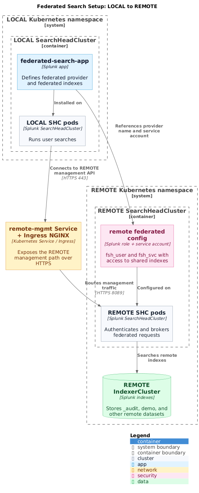

# Federated Search Setup Guide: LOCAL to REMOTE

This guide documents a validated SVA-C3 setup path where a LOCAL SearchHeadCluster searches indexes on a REMOTE SearchHeadCluster. The concrete examples in this document assume Azure Blob Storage for App Framework distribution and Ingress NGINX for the management path between clusters.

If you are not on Azure, use the manual deployment path or adapt the App Framework configuration to your object store. If you are not using Ingress NGINX, translate the ingress example and annotations to the equivalent configuration for your controller.

This guide covers standard mode federated search only. It does not cover transparent mode or mixed VM/Kubernetes federated-search topologies.

## Table of Contents
1. [Architecture Overview](#architecture-overview)
2. [Prerequisites](#prerequisites)
3. [REMOTE Cluster Setup](#remote-cluster-setup)
4. [LOCAL Cluster Setup](#local-cluster-setup)
5. [Testing and Validation](#testing-and-validation)
6. [Troubleshooting](#troubleshooting)

---

## Architecture Overview



Diagram source: [pictures/federated-search-setup-architecture.puml](../pictures/federated-search-setup-architecture.puml)

### Key Concepts

- **LOCAL SHC**: The search head cluster where users run searches
- **REMOTE SHC**: The search head cluster that provides access to remote data
- **Federated Provider**: Configuration defining how to connect to the remote cluster
- **Federated Index**: Virtual index that maps to a real index on the remote cluster
- **Service Account**: Dedicated user (`fsh_svc`) for federated search authentication

---

## Prerequisites

### Infrastructure Requirements
- Kubernetes cluster with Splunk Operator deployed
- Two separate SearchHeadClusters (LOCAL and REMOTE)
- IndexerClusters connected to both SHCs
- Azure Blob Storage plus the required identity or secret configuration if you use the App Framework path
- Direct access to the LOCAL SHC pods if you use the manual deployment path

### Network Requirements
- HTTPS connectivity between LOCAL and REMOTE SHCs
- A Kubernetes service that exposes the REMOTE management endpoint inside the cluster
- Ingress NGINX if you want to use the ingress manifests below without modification

### Splunk Requirements
- A Splunk Enterprise version supported by your Splunk Operator release
- Federated search enabled on both clusters
- Administrative access to both clusters

---

## REMOTE Cluster Setup

The REMOTE cluster is the data source. We need to:
1. Select a target SHC pod and admin credentials
2. Create a role with appropriate index permissions
3. Create a service account for federated search
4. Expose the management API endpoint

### Step 1: Select a REMOTE SHC Pod and Credentials

Do not assume `search-head-0` is the captain. Captainship is dynamic and can change over time, so select a healthy pod at runtime instead of hardcoding an ordinal.

```bash
NAMESPACE="stos-auto"
REMOTE_POD=$(kubectl -n $NAMESPACE get pods \
  -l app.kubernetes.io/instance=splunk-remote-shc-search-head \
  -o jsonpath='{.items[0].metadata.name}')
REMOTE_ADMIN=$(kubectl -n $NAMESPACE get secret splunk-remote-shc-search-head-secret-v1 \
  -o jsonpath='{.data.password}' | base64 -d)
```

Replace `stos-auto` and `remote-shc` with the namespace and CR name from your environment before running the remaining commands.

### Step 2: Create Federated Search Role

Create a role with access to the indexes you want to share:

```bash
# Create fsh_user role with access to every remote index you want to expose
kubectl -n $NAMESPACE exec $REMOTE_POD -c splunk -- curl -sk \
  -u "admin:$REMOTE_ADMIN" \
  -X POST "https://localhost:8089/services/authorization/roles/fsh_user" \
  -d "srchIndexesAllowed=_audit,demo" \
  -d "srchIndexesDefault=_audit" \
  -d "imported_roles=user"
```

**Important Index Permissions:**
- `srchIndexesAllowed`: Set this to the full comma-separated list of remote indexes the federated user can access
- `srchIndexesDefault`: Default index for searches
- When you update `srchIndexesAllowed` later, include the complete desired list again

### Step 3: Create Service Account

Create a dedicated service account for federated authentication:

```bash
# Create fsh_svc service account with fsh_user role
kubectl -n $NAMESPACE exec $REMOTE_POD -c splunk -- \
  /opt/splunk/bin/splunk add user fsh_svc \
  -password 'SvcP@ssw0rd' \
  -role fsh_user \
  -auth "admin:$REMOTE_ADMIN"
```

**Security Best Practices:**
- Use a strong, unique password
- Store credentials securely (consider using Kubernetes secrets)
- Rotate credentials regularly
- Grant minimum required permissions

### Step 4: Create Management API Service

Create an ExternalName service to expose the REMOTE SHC management endpoint:

```yaml
# remote-mgmt-service.yaml
apiVersion: v1
kind: Service
metadata:
  name: remote-mgmt
  namespace: stos-auto
spec:
  type: ExternalName
  externalName: ingress-nginx-controller.ingress-nginx.svc.cluster.local
  ports:
  - port: 443
    targetPort: 443
    protocol: TCP
```

Apply the service:

```bash
kubectl apply -f remote-mgmt-service.yaml
```

### Step 5: Configure NGINX Ingress

Create an Ingress resource to route traffic to the REMOTE SHC:

```yaml
# remote-mgmt-ingress.yaml
apiVersion: networking.k8s.io/v1
kind: Ingress
metadata:
  name: remote-mgmt-ingress
  namespace: stos-auto
  annotations:
    nginx.ingress.kubernetes.io/backend-protocol: "HTTPS"
    nginx.ingress.kubernetes.io/ssl-passthrough: "true"
spec:
  ingressClassName: nginx
  rules:
  - host: remote-mgmt.stos-auto.svc.cluster.local
    http:
      paths:
      - path: /
        pathType: Prefix
        backend:
          service:
            name: splunk-remote-shc-search-head-service
            port:
              number: 8089
```

Apply the ingress:

```bash
kubectl apply -f remote-mgmt-ingress.yaml
```

### Step 6: Verify REMOTE Setup

Test connectivity and authentication:

```bash
# Test service account authentication
kubectl -n $NAMESPACE exec $REMOTE_POD -c splunk -- curl -sk \
  -u "fsh_svc:SvcP@ssw0rd" \
  "https://localhost:8089/services/server/info?output_mode=json" | \
  grep -o '"federated_search_enabled":[^,]*'

# Expected output: "federated_search_enabled":true

# Test search capability
kubectl -n $NAMESPACE exec $REMOTE_POD -c splunk -- curl -sk \
  -u "fsh_svc:SvcP@ssw0rd" \
  -X POST "https://localhost:8089/services/search/jobs?output_mode=json" \
  -d "search=search index=_audit | head 1" \
  -d "exec_mode=oneshot"

# Should return search results without permission errors
```

---

## LOCAL Cluster Setup

The LOCAL cluster is where searches are executed. We need to:
1. Create the federated provider configuration
2. Create federated index mappings
3. Select a target SHC pod and credentials
4. Deploy the configuration via AppFramework or manually

### Step 1: Create Federated Search App Structure

```bash
mkdir -p federated-search-app/default
mkdir -p federated-search-app/metadata
```

### Step 2: Create app.conf

```bash
cat > federated-search-app/default/app.conf << 'EOF'
[install]
is_configured = 1
state = enabled

[ui]
is_visible = 0
label = Federated Search Configuration

[launcher]
author = Splunk Admin
description = Federated search provider and index configurations
version = 1.0.0
EOF
```

### Step 3: Create federated.conf

This defines the connection to the REMOTE cluster:

```bash
cat > federated-search-app/default/federated.conf << 'EOF'
# Federated Provider Configuration
[provider://remote_thru_nginx]
appContext = search
hostPort = remote-mgmt.stos-auto.svc.cluster.local:443
mode = standard
password = SvcP@ssw0rd
serviceAccount = fsh_svc
type = splunk
useFSHKnowledgeObjects = 0
EOF
```

**Configuration Parameters:**
- `appContext`: The app context on the remote cluster (usually `search`)
- `hostPort`: Remote cluster management endpoint (FQDN:port)
- `mode`: `standard` (S2S) or `transparent` (forwarding)
- `password`: Service account password
- `serviceAccount`: Username on remote cluster
- `type`: Always `splunk` for Splunk-to-Splunk federation
- `useFSHKnowledgeObjects`: Use remote knowledge objects (0=false, 1=true)

### Step 4: Create indexes.conf

This creates virtual federated indexes:

```bash
cat > federated-search-app/default/indexes.conf << 'EOF'
# Federated Index Configuration - Maps to REMOTE _audit index
[federated:r_audit]
federated.provider = remote_thru_nginx
federated.dataset = index:_audit

# Federated Index Configuration - Maps to REMOTE demo index
[federated:r_demo]
federated.provider = remote_thru_nginx
federated.dataset = index:demo
EOF
```

**Configuration Parameters:**
- `[federated:r_audit]`: Local federated index name (use `r_` prefix for remote)
- `federated.provider`: References the provider name from federated.conf
- `federated.dataset`: Specifies the remote index (`index:<remote_index_name>`)

**Naming Convention:**
- Use `federated:r_<indexname>` for federated indexes
- The `r_` prefix indicates "remote"
- Makes it clear which indexes are federated vs local

### Step 5: Create default.meta

```bash
cat > federated-search-app/metadata/default.meta << 'EOF'
[]
access = read : [ * ], write : [ admin ]
export = system
EOF
```

### Step 6: Set LOCAL Pod and Credentials

```bash
LOCAL_POD=$(kubectl -n $NAMESPACE get pods \
  -l app.kubernetes.io/instance=splunk-local-shc-search-head \
  -o jsonpath='{.items[0].metadata.name}')
LOCAL_ADMIN=$(kubectl -n $NAMESPACE get secret splunk-local-shc-search-head-secret-v1 \
  -o jsonpath='{.data.password}' | base64 -d)
```

The built-in `admin` role already includes the `search` capability. If you validate with a custom local role, verify that it has `search` plus access to the federated indexes defined in this app.

### Step 7: Package and Deploy App

#### Option A: AppFramework on Azure (Validated path)

This is the Azure-specific path used for the validated SVA-C3 flow. If you use S3 or GCS instead, adapt the `appRepo` storage settings as described in [App Framework](../operate/AppFramework.md). If you do not want to use a remote app repository, use Option B.

Package the app and upload to Azure Storage:

```bash
# Package the app
cd federated-search-app
tar czf ../federated-search-app_1.0.0.tgz .
cd ..

# Upload to Azure Storage (localApps path for LOCAL SHC)
az storage blob upload \
  --account-name splunkapps95484 \
  --container-name splunk-apps \
  --name "localApps/federated-search-app_1.0.0.tgz" \
  --file federated-search-app_1.0.0.tgz \
  --overwrite
```

Create or update LOCAL SHC with AppFramework configuration:

```yaml
# local-shc-appframework.yaml
apiVersion: enterprise.splunk.com/v4
kind: SearchHeadCluster
metadata:
  name: local-shc
  namespace: stos-auto
spec:
  replicas: 3
  clusterManagerRef:
    name: local-cm
  serviceAccount: splunk-operator-sa
  appRepo:
    appsRepoPollInterval: 300
    defaults:
      volumeName: volume_app_repo
      scope: cluster
    appSources:
      - name: localApps
        location: localApps/
    volumes:
      - name: volume_app_repo
        storageType: azure
        provider: azure
        azureSecretRef: azure-blob-secret
        path: splunkapps95484/splunk-apps/
```

Apply the configuration:

```bash
kubectl apply -f local-shc-appframework.yaml
```

#### Option B: Manual Deployment

Copy the app directly to all LOCAL SHC pods:

```bash
for pod in $(kubectl -n $NAMESPACE get pods \
  -l app.kubernetes.io/instance=splunk-local-shc-search-head \
  -o jsonpath='{range .items[*]}{.metadata.name}{"\n"}{end}'); do
  kubectl -n $NAMESPACE cp -c splunk federated-search-app \
    "$pod:/opt/splunk/etc/apps/"
done

# Restart Splunk on all pods
kubectl -n $NAMESPACE delete pod -l app.kubernetes.io/instance=splunk-local-shc-search-head
```

### Step 8: Wait for Deployment

If using AppFramework:

```bash
# AppFramework polls every 5 minutes by default
# Monitor the operator logs
kubectl -n splunk-operator logs -l control-plane=controller-manager -f | \
  grep -i "appframework\|download"

# Wait for SHC to stabilize
kubectl -n $NAMESPACE wait --for=condition=Ready --timeout=600s \
  pod -l app.kubernetes.io/instance=splunk-local-shc-search-head
```

### Step 9: Verify LOCAL Configuration

```bash
# Check federated provider configuration
kubectl -n $NAMESPACE exec $LOCAL_POD -c splunk -- \
  /opt/splunk/bin/splunk btool federated list provider://remote_thru_nginx

# Expected output should show all provider settings

# Check federated index configuration
kubectl -n $NAMESPACE exec $LOCAL_POD -c splunk -- \
  /opt/splunk/bin/splunk btool indexes list federated:r_audit

# Expected output:
# [federated:r_audit]
# federated.dataset = index:_audit
# federated.provider = remote_thru_nginx
```

---

## Testing and Validation

### Test 1: Connectivity Test

Verify LOCAL can reach REMOTE management API:

```bash
kubectl -n $NAMESPACE exec $LOCAL_POD -c splunk -- curl -sk \
  -u "fsh_svc:SvcP@ssw0rd" \
  "https://remote-mgmt.stos-auto.svc.cluster.local:443/services/server/info?output_mode=json" | \
  grep -o '"federated_search_enabled":[^,]*'

# Expected: "federated_search_enabled":true
```

### Test 2: Direct Search on REMOTE

Verify data exists on the REMOTE cluster:

```bash
kubectl -n $NAMESPACE exec $REMOTE_POD -c splunk -- curl -sk \
  -u "fsh_svc:SvcP@ssw0rd" \
  -X POST "https://localhost:8089/services/search/jobs?output_mode=json" \
  -d "search=search index=_audit | stats count" \
  -d "exec_mode=oneshot"

# Should return count > 0
```

### Test 3: Federated Search from LOCAL

Execute a federated search:

```bash
kubectl -n $NAMESPACE exec $LOCAL_POD -c splunk -- curl -sk \
  -u "admin:$LOCAL_ADMIN" \
  -X POST "https://localhost:8089/services/search/jobs?output_mode=json" \
  -d "search=search index=federated:r_audit | head 10" \
  -d "exec_mode=oneshot"
```

**Verify Results:**
- Results should contain data from REMOTE cluster
- Look for the field: `"splunk_federated_provider": "remote_thru_nginx"`
- The `splunk_server` field will show the REMOTE indexer names

### Test 4: Statistics Across Federated Indexes

```bash
kubectl -n $NAMESPACE exec $LOCAL_POD -c splunk -- curl -sk \
  -u "admin:$LOCAL_ADMIN" \
  -X POST "https://localhost:8089/services/search/jobs?output_mode=json" \
  -d "search=search index=federated:r_audit | stats count by sourcetype" \
  -d "exec_mode=oneshot"
```

### Test 5: Splunk Web UI Test

```bash
# Port-forward to LOCAL SHC
kubectl -n $NAMESPACE port-forward svc/splunk-local-shc-search-head-service 8000:8000

# Get admin password
kubectl -n $NAMESPACE get secret splunk-local-shc-search-head-secret-v1 \
  -o jsonpath='{.data.password}' | base64 -d

# Open browser: http://localhost:8000
# Login with admin credentials
# Run search: index=federated:r_audit | stats count
```

---

## Troubleshooting

### Issue 1: "insufficient permission to access this resource"

**Symptom:** Search queries return permission errors

**Cause:** The federated service account role or the local user role is missing required search or index permissions. The built-in `admin` role already includes the `search` capability, so avoid editing the default admin role just to enable federated search.

**Solution:**
```bash
# Check the remote service-account role
kubectl -n $NAMESPACE exec $REMOTE_POD -c splunk -- curl -sk \
  -u "admin:$REMOTE_ADMIN" \
  "https://localhost:8089/services/authorization/roles/fsh_user?output_mode=json" | \
  grep -E '"imported_roles"|"srchIndexesAllowed"'

# If you need to update remote index permissions, send the full allowed-index list
kubectl -n $NAMESPACE exec $REMOTE_POD -c splunk -- curl -sk \
  -u "admin:$REMOTE_ADMIN" \
  -X POST "https://localhost:8089/services/authorization/roles/fsh_user" \
  -d "srchIndexesAllowed=_audit,demo" \
  -d "srchIndexesDefault=_audit" \
  -d "imported_roles=user"
```

### Issue 2: Federated Provider Not Found

**Symptom:** `{"messages":[{"type":"ERROR","text":"Not Found"}]}`

**Cause:** App not deployed or Splunk not restarted

**Solution:**
```bash
# Check if app exists
kubectl -n $NAMESPACE exec $LOCAL_POD -c splunk -- \
  ls /opt/splunk/etc/apps/federated-search-app

# Restart Splunk
kubectl -n $NAMESPACE delete pod -l app.kubernetes.io/instance=splunk-local-shc-search-head
```

### Issue 3: Cannot Reach Remote SHC

**Symptom:** Connection timeouts or "Cannot reach remote SHC"

**Cause:** Service or ingress misconfiguration

**Solution:**
```bash
# Verify service exists
kubectl -n $NAMESPACE get svc remote-mgmt

# Verify ingress
kubectl -n $NAMESPACE get ingress

# Test connectivity from LOCAL pod
kubectl -n $NAMESPACE exec $LOCAL_POD -c splunk -- \
  curl -sk "https://remote-mgmt.stos-auto.svc.cluster.local:443"
```

### Issue 4: Authentication Failures

**Symptom:** "401 Unauthorized" or "Authentication failed"

**Cause:** Incorrect service account credentials

**Solution:**
```bash
# Verify service account exists on REMOTE
kubectl -n $NAMESPACE exec $REMOTE_POD -c splunk -- \
  /opt/splunk/bin/splunk list user -auth admin:<password> | grep fsh_svc

# Test authentication
kubectl -n $NAMESPACE exec $REMOTE_POD -c splunk -- curl -sk \
  -u "fsh_svc:SvcP@ssw0rd" \
  "https://localhost:8089/services/authentication/current-context?output_mode=json"
```

### Issue 5: No Data Returned

**Symptom:** Federated search returns 0 results

**Possible Causes:**
1. Index doesn't exist on REMOTE cluster
2. No data in the remote index
3. fsh_user role doesn't have permission to the index

**Solution:**
```bash
# Check if index exists on REMOTE
kubectl -n $NAMESPACE exec $REMOTE_POD -c splunk -- \
  /opt/splunk/bin/splunk list index -auth admin:<password> | grep _audit

# Verify fsh_user permissions
kubectl -n $NAMESPACE exec $REMOTE_POD -c splunk -- curl -sk \
  -u "admin:<password>" \
  "https://localhost:8089/services/authorization/roles/fsh_user?output_mode=json" | \
  grep srchIndexesAllowed

# Test direct search on REMOTE as fsh_svc
kubectl -n $NAMESPACE exec $REMOTE_POD -c splunk -- curl -sk \
  -u "fsh_svc:SvcP@ssw0rd" \
  -X POST "https://localhost:8089/services/search/jobs?output_mode=json" \
  -d "search=search index=_audit | stats count" \
  -d "exec_mode=oneshot"
```

### Issue 6: AppFramework Not Deploying Apps

**Symptom:** Apps not appearing on LOCAL SHC after upload to Azure

**Cause:** Incorrect Azure permissions or path configuration

**Solution:**
```bash
# Check operator logs
kubectl -n splunk-operator logs -l control-plane=controller-manager --tail=100 | \
  grep -i "azure\|error"

# Verify SHC appSources configuration
kubectl -n $NAMESPACE get shc local-shc -o jsonpath='{.spec.appRepo.appSources[0].location}'

# Verify Azure blob exists
az storage blob list \
  --account-name splunkapps95484 \
  --container-name splunk-apps \
  --prefix localApps/
```

---

## Performance Considerations

### Search Performance
- Federated searches are typically slower than local searches
- Network latency affects performance
- Consider using `| stats` and aggregations on the remote side

### Optimization Tips
1. **Use filters early**: Apply index and time filters to reduce data transfer
   ```
   index=federated:r_audit earliest=-1h | stats count by sourcetype
   ```

2. **Leverage remote processing**: Use streaming commands that execute on remote
   ```
   index=federated:r_audit | stats count by host | sort -count
   ```

3. **Avoid these commands**: Some commands don't work well with federated search
   - `transaction` (runs locally)
   - `join` (can be expensive)
   - `append` with multiple federated sources

### Connection Pooling
- Splunk maintains connection pools to remote providers
- Default pool size: 5 connections per provider
- Configure in limits.conf if needed:
  ```
  [federated_search]
  max_concurrent_searches_per_provider = 5
  ```

---

## Security Best Practices

### Authentication
1. Use dedicated service accounts for federated search
2. Rotate passwords regularly
3. Consider using certificate-based authentication
4. Store credentials in Kubernetes secrets, not in plain text

### Authorization
1. Grant minimum required index permissions
2. Use role-based access control (RBAC)
3. Audit federated search access logs
4. Restrict federated providers to specific roles

### Network Security
1. Use HTTPS for all connections
2. Implement network policies in Kubernetes
3. Use private endpoints when possible
4. Enable SSL certificate validation in production

### Monitoring
1. Monitor federated search performance
2. Track authentication failures
3. Alert on unusual access patterns
4. Review audit logs regularly

---

## Maintenance

### Updating Federated Configuration

To update the federated search configuration:

```bash
# Update the app files
cd federated-search-app

# Make changes to federated.conf or indexes.conf

# Re-package and upload
tar czf ../federated-search-app_1.0.1.tgz .
az storage blob upload \
  --account-name splunkapps95484 \
  --container-name splunk-apps \
  --name "localApps/federated-search-app_1.0.1.tgz" \
  --file ../federated-search-app_1.0.1.tgz \
  --overwrite

# AppFramework will auto-deploy within 5 minutes (default poll interval)
```

### Password Rotation

```bash
# Update password on REMOTE cluster
kubectl -n $NAMESPACE exec $REMOTE_POD -c splunk -- \
  /opt/splunk/bin/splunk edit user fsh_svc \
  -password 'NewSecureP@ssw0rd' \
  -auth admin:<password>

# Update password in federated.conf on LOCAL cluster
# Re-deploy the app with new password
```

### Adding New Federated Indexes

```bash
# 1. Update permissions on REMOTE with the full allowed-index list
kubectl -n $NAMESPACE exec $REMOTE_POD -c splunk -- curl -sk \
  -u "admin:<password>" \
  "https://localhost:8089/services/authorization/roles/fsh_user" \
  -d "srchIndexesAllowed=_audit,demo,new_index"

# 2. Add to indexes.conf on LOCAL
cat >> federated-search-app/default/indexes.conf << 'EOF'

[federated:r_new_index]
federated.provider = remote_thru_nginx
federated.dataset = index:new_index
EOF

# 3. Re-deploy the app
```

Include every remote index that the service account should keep, not just the new one.

---

## Quick Reference Commands

### Set Helper Variables
```bash
NAMESPACE="stos-auto"
LOCAL_POD=$(kubectl -n $NAMESPACE get pods \
  -l app.kubernetes.io/instance=splunk-local-shc-search-head \
  -o jsonpath='{.items[0].metadata.name}')
```

### Get Admin Password
```bash
kubectl -n $NAMESPACE get secret splunk-local-shc-search-head-secret-v1 \
  -o jsonpath='{.data.password}' | base64 -d
```

### Test Federated Search
```bash
kubectl -n $NAMESPACE exec $LOCAL_POD -c splunk -- curl -sk \
  -u admin:<password> -X POST "https://localhost:8089/services/search/jobs?output_mode=json" \
  -d "search=search index=federated:r_audit | stats count" -d "exec_mode=oneshot"
```

### Check Provider Config
```bash
kubectl -n $NAMESPACE exec $LOCAL_POD -c splunk -- \
  /opt/splunk/bin/splunk btool federated list
```

### Check Index Config
```bash
kubectl -n $NAMESPACE exec $LOCAL_POD -c splunk -- \
  /opt/splunk/bin/splunk btool indexes list | grep federated
```

### Restart SHC Pods
```bash
kubectl -n $NAMESPACE delete pod -l app.kubernetes.io/instance=splunk-local-shc-search-head
```

---

## Additional Resources

- [About Federated Search for Splunk](https://help.splunk.com/en/splunk-enterprise/search/federated-search/10.2/run-federated-searches-across-other-splunk-deployments/about-federated-search-for-splunk)
- [Define a Splunk platform federated provider](https://help.splunk.com/en/splunk-enterprise/search/federated-search/10.2/run-federated-searches-across-other-splunk-deployments/define-a-splunk-platform-federated-provider)
- [Define roles on the Splunk platform with capabilities](https://help.splunk.com/en/splunk-enterprise/administer/manage-users-and-security/10.2/manage-splunk-platform-users-and-roles/define-roles-on-the-splunk-platform-with-capabilities)
- [App Framework](https://splunk.github.io/splunk-operator/AppFramework.html)
- [Ingress](https://splunk.github.io/splunk-operator/Ingress.html)
- [Azure Workload Identity](https://azure.github.io/azure-workload-identity/)

---

## Support

For issues or questions:
1. Check the [Troubleshooting](#troubleshooting) section
2. Review Splunk logs: `/opt/splunk/var/log/splunk/`
3. Check operator logs: `kubectl -n splunk-operator logs -l control-plane=controller-manager`
4. Consult the Splunk community forums
