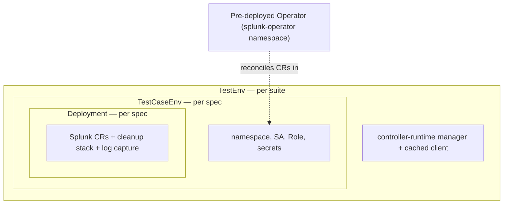
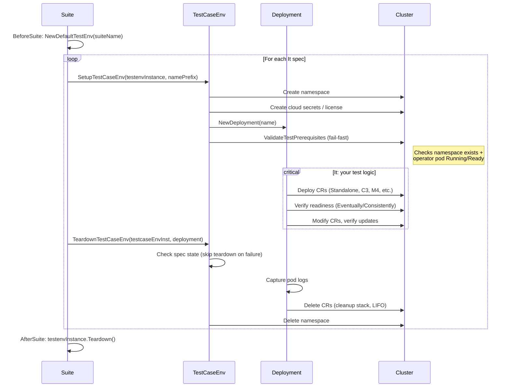

# Integration & E2E Test Writing Guide

This guide helps newcomers understand the Splunk Operator integration test framework, write new tests, execute them, and debug failures.

> **Assumed:** You have a Kubernetes cluster with the Splunk Operator deployed cluster-wide

---

## What Tests Exist

### Test Suites (Ginkgo-based)

Each directory under `test/` is a separate Ginkgo test suite (Go package) with its own namespace and lifecycle:

| Directory | What It Tests |
|-----------|---------------|
| `test/smoke/` | Basic topology deployments: S1, C3, M4, M1, service accounts |
| `test/custom_resource_crud/` | CR create/update/delete, PVC behavior, v3+v4 matrix |
| `test/licensemanager/` | License Manager functionality + app framework variants |
| `test/licensemaster/` | Legacy License Master (v3) tests |
| `test/monitoring_console/` | Monitoring Console CR tests |
| `test/smartstore/` | SmartStore configuration and functionality |
| `test/secret/` | Secret management |
| `test/ingest_search/` | Data ingest and search verification |
| `test/indexing_clustering/` | Indexer cluster deployment, RF/SF, peer health, restart, and search-head-cluster scenarios |
| `test/index_and_ingestion_separation/` | Index vs ingestion separation |
| `test/delete_cr/` | CR deletion behavior |
| `test/appframework_aws/` | App Framework with AWS S3 (`s1/`, `c3/`, `m4/` sub-suites) |
| `test/appframework_az/` | App Framework with Azure Blob (`s1/`, `c3/`, `m4/`) |
| `test/appframework_gcp/` | App Framework with GCP Storage (`s1/`, `c3/`, `m4/`) |
| `test/shc_detention/` | SHC rolling update detention timeout: normal drain, forced timeout (CSPL-4966), no regression |
| `test/example/` | **Template** — copy this to start a new suite |

### KUTTL Tests

Declarative end-to-end tests under `kuttl/tests/` using [KUTTL](https://kuttl.dev/). These are primarily used for Helm chart validation and SVA (Splunk Validated Architectures).

### Unit Tests

Located alongside source files in `pkg/`, `internal/`, and `api/` directories. Run with `make test`. Not covered in this guide.

---

## What to Test (and What Not To)

Integration tests should focus on **operator mechanics** — proving that the controller reconciles CRs into the correct Kubernetes state. They should not re-validate Splunk Enterprise behavior that is already tested upstream.

### In scope: Operator mechanics

Test behaviors the operator owns. If they break, it's an operator bug:

- CR lifecycle and phase transitions (`Pending → Updating → Ready`)
- Spec-driven workload changes — resource limits, image, replicas trigger correct rolling updates
- PVC management — claims created, retained, or deleted per reclaim policy
- RBAC and service accounts on pods
- Cleanup and finalizers — deleting a CR tears down child resources correctly
- Multi-CR coordination — CM + IndexerCluster + SHC all reach `Ready` together
- App Framework staging — operator downloads and stages packages (the _delivery_, not Splunk's app install)

### Out of scope: Splunk Enterprise features

Don't test behaviors that belong to Splunk itself — it couples CI to Splunk internals and duplicates upstream coverage:

- Search correctness and indexing pipeline internals
- RF/SF replication health (reported by splunkd, not implemented by the operator)
- App enablement and versioning inside Splunk
- License enforcement and splunkd authentication

### Splunk-side status checks

Lightweight Splunk-side status checks are fine as a **secondary** check — for example, a single REST call like `VerifyRFSFMet` to confirm an indexer cluster is healthy after the operator finishes reconciling. Every such check must be paired with a primary operator-level assertion (CR phase, pod count, StatefulSet readiness).

Guidelines for Splunk-side checks:

1. Keep them lightweight — a single REST call, not a multi-step search pipeline
2. Always pair with an operator-level assertion; a Splunk-side check must never be the sole assertion in a test
3. Prefer them when no Kubernetes-native signal exists for the same thing

If a test _only_ asserts Splunk-internal state with no operator-level assertion, it belongs in Splunk's test suite, not here.

### Practical checklist for new tests

| Question | If yes | If no |
|----------|--------|-------|
| Does the test break if only operator code changes? | In scope | Probably out of scope |
| Can the assertion be made against CR status or Kubernetes objects? | Prefer that | Consider if a Splunk-side check is truly needed |
| Would this test still be meaningful with a different backing application (not Splunk)? | Strong signal it's operator mechanics | Likely Splunk-specific |
| Does the test exercise a code path in `pkg/splunk/` or `internal/controller/`? | In scope | Out of scope |

---

## Test Architecture

### Framework Overview

The integration tests use [Ginkgo v2](https://onsi.github.io/ginkgo/) with [Gomega](https://onsi.github.io/gomega/) matchers. The framework has three main abstractions:



### Key Concepts

**TestEnv** (`test/testenv/testenv.go`)
- Created once per suite in `BeforeSuite`
- Builds a controller-runtime manager with a cached Kubernetes client
- Configures the client to work with Splunk CRD types (v3 and v4)
- Does **not** create namespaces — that happens per-spec in `TestCaseEnv`

**TestCaseEnv** (`test/testenv/testcaseenv.go`)
- Created per `It` block — use `testenv.SetupTestCaseEnv(testenvInstance, namePrefix)` which returns `(testcaseEnvInst, deployment, error)` and handles namespace creation, deployment setup, **and** prerequisites validation in one call
- Creates a unique namespace and sets up all required resources:
  - Cloud provider index secrets (EKS/Azure/GCP), created from environment variables
  - License ConfigMap (only when `--license-file` is provided; without it, Splunk instances use trial license)
  - App download PVC wiring on the operator deployment; the helper retries update conflicts and skips duplicate `app-staging` volume and mount entries
- **Prerequisites validation (fail-fast):** `SetupTestCaseEnv` calls `ValidateTestPrerequisites` immediately after creating the namespace and deployment. This checks that (a) the test namespace exists and (b) the operator pod is `Running` and `Ready` in the correct namespace (`splunk-operator` for cluster-wide, or the test namespace otherwise). If either check fails, the test fails fast with a clear error before any long-running operations begin
- Torn down via `testenv.TeardownTestCaseEnv(testcaseEnvInst, deployment)` — which handles failure detection, skip-teardown on failure, deployment cleanup, and namespace deletion in one call
- **Cloud credential validation (fail-fast):** when `CLUSTER_PROVIDER` is `eks`, `azure`, or `gcp`, `TestCaseEnv` rejects missing provider credentials before creating an incomplete Kubernetes Secret. The setup error names the missing variable, so the spec stops before cloud API operations begin

**Deployment** (`test/testenv/deployment.go`)
- Wraps the Splunk Custom Resources deployed in a test
- Maintains a cleanup stack — each CR creation pushes a delete function
- On teardown: captures pod logs to files, then runs cleanup functions in LIFO order

### Test Lifecycle



---

## How to Write a New Test

### Option A: Add a Spec to an Existing Suite

The simplest approach — add a new `It` block to an existing test file. Use `NodeTimeout` to set a per-spec deadline from `testenv/timeouts.go`:

```go
It("<mysuite>, <mytag>, <topology>: <human description>", NodeTimeout(testenv.ShortTimeout), func(ctx SpecContext) {
    // 1. Deploy and verify in one call
    standalone, err := testcaseEnvInst.DeployAndVerifyStandalone(ctx, deployment, "", "")
    Expect(err).To(Succeed(), "Unable to deploy standalone")

    // 2. Your custom assertions
    // ...
})
```

### Option B: Create a New Test Suite

For tests that need their own isolated namespace or a different setup:

**Step 1: Copy the example template**

```bash
cp -r test/example test/my_feature
```

**Step 2: Update the suite file**

Rename and update `test/my_feature/example_suite_test.go`. Set the suite-level timeout using `GinkgoConfiguration` and a tier from `testenv/timeouts.go`:

```go
package my_feature

import (
    "testing"

    . "github.com/onsi/ginkgo/v2"
    . "github.com/onsi/gomega"

    "github.com/splunk/splunk-operator/test/testenv"
)

var (
    testenvInstance *testenv.TestEnv
    testSuiteName   = "myfeature-" + testenv.RandomDNSName(3)
)

func TestMyFeature(t *testing.T) {
    RegisterFailHandler(Fail)

    sc, _ := GinkgoConfiguration()
    sc.Timeout = testenv.MediumSuiteTimeout

    RunSpecs(t, "Running "+testSuiteName, sc)
}

var _ = BeforeSuite(func() {
    var err error
    testenvInstance, err = testenv.NewDefaultTestEnv(testSuiteName)
    Expect(err).To(Succeed(), "Failed to initialize test environment")
})

var _ = AfterSuite(func() {
    if testenvInstance != nil {
        Expect(testenvInstance.Teardown()).To(Succeed(), "Failed to teardown test environment")
    }
})
```

**Step 3: Write your test spec file**

Create `test/my_feature/my_feature_test.go`. Use `SetupTestCaseEnv` and `TeardownTestCaseEnv` for setup/teardown, and `NodeTimeout` with tiers from `testenv/timeouts.go` for per-spec deadlines:

```go
package my_feature

import (
    . "github.com/onsi/ginkgo/v2"
    . "github.com/onsi/gomega"

    "github.com/splunk/splunk-operator/test/testenv"
)

var _ = Describe("My Feature", func() {

    var testcaseEnvInst *testenv.TestCaseEnv
    var deployment *testenv.Deployment

    BeforeEach(NodeTimeout(testenv.SetupTeardownTimeout), func(ctx SpecContext) {
        var err error
        testcaseEnvInst, deployment, err = testenv.SetupTestCaseEnv(testenvInstance, "")
        Expect(err).To(Succeed(), "Failed to setup test case environment")
    })

    AfterEach(NodeTimeout(testenv.SetupTeardownTimeout), func(ctx SpecContext) {
        Expect(testenv.TeardownTestCaseEnv(testcaseEnvInst, deployment)).To(Succeed(),
            "Failed to teardown test case environment")
    })

    Context("Standalone deployment (S1)", func() {
        It("<mysuite>, <mytag>, <topology>: <human description>",
            NodeTimeout(testenv.ShortTimeout), func(ctx SpecContext) {
            _, err := testcaseEnvInst.RunStandaloneDeploymentWorkflow(ctx, deployment)
            Expect(err).To(Succeed(), "Unable to deploy standalone instance")
        })
    })
})
```

### Ginkgo Labels on `It` Blocks

Test selection is driven by Ginkgo `Label(...)` arguments on `It` blocks and filtered via `--label-filter`. Labels are orthogonal tokens — combine them instead of using compound names. All labels use a `key:value` form. The canonical order is **tier → sva → cloud → variant → feature → extra**.

- A **tier** label: `tier:e2e-pr` (PR gate, fast subset) or `tier:e2e-full` (full validation).
- An **sva** (topology) label: `sva:s1`, `sva:c3`, `sva:m4`, `sva:m1`, `sva:shc`.
- A **cloud** provider label: `cloud:aws`, `cloud:gcp`, `cloud:azure` (or `cloud:any` for cloud-agnostic tests).
- A **variant** label (where a CR has V3/V4 variants): `variant:manager` (ClusterManager / V4) or `variant:master` (ClusterMaster / V3).
- A **feature** label — exactly one, matching the test's directory:
  `feature:appframework` (under `test/appframework_*`), `feature:smartstore`, `feature:monitoringconsole`,
  `feature:secret`, `feature:crcrud`, `feature:deletecr`, `feature:licensemanager`, `feature:ingestsearch`, `feature:indingsep`, `feature:basic`, `feature:idxclustering`, `feature:detention` (under `test/shc_detention/`).
- **Extra / scenario** labels when they carry meaning orthogonal to the above:
  `suite:mc1` / `suite:mc2` (CI parallelization groups),
  `feature:scaling` (added in addition to the test's primary `feature:*` label on scale-up/scale-down scenarios so the `managerscaling` CI job can target them).

Example:

```go
It("can deploy a C3 with App Framework",
    Label("tier:e2e-pr", "sva:c3", "cloud:aws", "variant:manager", "feature:appframework"),
    func() { /* ... */ })
```

CI jobs select tests via `JOB_*_LABELS`, passed verbatim to `ginkgo --label-filter`. Examples:

- `"tier:e2e-full && sva:c3 && cloud:gcp && variant:manager"` — GCP C3 manager validation
- `"tier:e2e-full && variant:manager && feature:smartstore"` — SmartStore manager fanout on EKS
- `"tier:e2e-full && sva:s1 && feature:appframework"` — S1 App Framework suite

### Common Test Patterns

#### Workflow Helpers (Preferred for Standard Deployments)

For common topologies, use the workflow methods on `TestCaseEnv` (`test/testenv/test_workflows.go`). These combine deployment + verification and return a `WorkflowResult`:

```go
// Standalone
result, err := testcaseEnvInst.RunStandaloneDeploymentWorkflow(ctx, deployment)
Expect(err).To(Succeed(), "Unable to deploy standalone instance")

// C3 cluster (CM + IDXC + SHC)
_, err := testcaseEnvInst.RunC3DeploymentWorkflow(ctx, deployment, 3, "")
Expect(err).To(Succeed(), "Unable to deploy C3 cluster")

// M4 multisite cluster (CM + multisite IDXC + SHC)
_, err := testcaseEnvInst.RunM4DeploymentWorkflow(ctx, deployment, 1, 3, "")
Expect(err).To(Succeed(), "Unable to deploy M4 cluster")

// M1 multisite indexer cluster (no SHC)
_, err := testcaseEnvInst.RunM1DeploymentWorkflow(ctx, deployment, 1, 3)
Expect(err).To(Succeed(), "Unable to deploy M1 cluster")

// Standalone with service account
_, err := testcaseEnvInst.RunStandaloneWithServiceAccountWorkflow(ctx, deployment, "my-sa")
Expect(err).To(Succeed(), "Unable to deploy standalone with service account")
```

#### Deploy and Verify (Granular Control)

When you need more control than the workflow helpers provide:

```go
// Standalone
standalone, err := testcaseEnvInst.DeployAndVerifyStandalone(ctx, deployment, "", "")
Expect(err).To(Succeed(), "Unable to deploy standalone instance")

// C3 cluster
err := deployment.DeploySingleSiteCluster(ctx, deployment.GetName(), 3, true /*shc*/, "")
Expect(err).To(Succeed(), "Unable to deploy cluster")
Expect(testcaseEnvInst.VerifyClusterReadyAndRFSF(ctx, deployment)).To(Succeed())

// M4 multisite cluster
siteCount := 3
err := deployment.DeployMultisiteClusterWithSearchHead(ctx, deployment.GetName(), 1, siteCount, "")
Expect(err).To(Succeed(), "Unable to deploy cluster")
Expect(testcaseEnvInst.VerifyM4ClusterReady(ctx, deployment, siteCount,
    testcaseEnvInst.VerifyClusterManagerReady)).To(Succeed())
Expect(testcaseEnvInst.VerifyRFSFMet(ctx, deployment)).To(Succeed())
```

#### Deploy with a Custom Spec

```go
spec := enterpriseApi.StandaloneSpec{
    CommonSplunkSpec: enterpriseApi.CommonSplunkSpec{
        Spec: enterpriseApi.Spec{
            ImagePullPolicy: "IfNotPresent",
            Image:           testcaseEnvInst.GetSplunkImage(),
        },
        Volumes: []corev1.Volume{},
    },
}
standalone, err := deployment.DeployStandaloneWithGivenSpec(ctx, deployment.GetName(), spec)
Expect(err).To(Succeed())
Expect(testcaseEnvInst.VerifyStandaloneReady(ctx, deployment, deployment.GetName(), standalone)).To(Succeed())
```

#### Watch for a CR Phase (Poll-Based)

The watch helpers in `watch_utils.go` provide typed, poll-based phase waits:

```go
err := testcaseEnvInst.WatchForStandalonePhase(ctx, deployment, namespace, crName, enterpriseApi.PhaseReady, testenv.DefaultTimeout)
err := testcaseEnvInst.WatchForClusterManagerPhase(ctx, deployment, namespace, crName, enterpriseApi.PhaseReady, testenv.DefaultTimeout)
err := testcaseEnvInst.WatchForSearchHeadClusterPhase(ctx, deployment, namespace, crName, enterpriseApi.PhaseReady, testenv.DefaultTimeout)
err := testcaseEnvInst.WatchForIndexerClusterPhase(ctx, deployment, namespace, crName, enterpriseApi.PhaseReady, testenv.DefaultTimeout)
```

For SearchHeadCluster, `WatchForSearchHeadClusterPhase` requires **both** `Status.Phase` and `Status.DeployerPhase` to match the expected phase before succeeding.

Transient phases such as `ScalingUp`, `ScalingDown`, and App Framework download/copy phases can complete between polling intervals. When the test needs to prove an operation completed, prefer a durable result: for example, `WaitForSearchHeadClusterScaleComplete` and `WaitForIndexerClusterScaleComplete` check the observed generation and desired/ready replica counts, while `GetAppObjectHashes` plus `WaitForAppObjectHashChange` proves that replacement app content was observed. For multi-app manual polls, use `WaitForAllAppObjectHashesChange` so one updated object cannot mask a missed replacement. Use phase watches only when entering that particular phase is itself the behavior under test.

Test-data ingestion is also asynchronous. Check the error returned by `IngestDataOnIndexers`, then poll `CountSearchResults` until the expected host-scoped count is nonzero. Kubernetes pod readiness and Splunk cluster readiness do not guarantee that a newly monitored file has already been indexed and is visible to distributed search. `IngestFileViaMonitor` copies relative log paths beneath `/opt/splunk` and uses that canonical pod path when adding and validating the monitor.

Specs that intentionally restart the cluster-wide operator must use Ginkgo's `Serial` decorator. The operator is shared by all parallel specs in a suite, so deleting it from one process can otherwise interrupt another process's setup or reconciliation.

#### Watch for App Phase Changes

```go
// Single app
err := testcaseEnvInst.WatchForAppPhaseChange(ctx, deployment, namespace, crName, crKind, appSourceName, appName, enterpriseApi.PhaseInstall, timeout)

// All apps in a list
err := testcaseEnvInst.WatchForAllAppsPhaseChange(ctx, deployment, namespace, crName, crKind, appSourceName, appList, enterpriseApi.PhaseInstall, timeout)
```

#### Watch for a Kubernetes Event

```go
err := testcaseEnvInst.WatchForEventWithReason(ctx, deployment, namespace, crName, "ReconcileComplete", testenv.DefaultTimeout)
```

#### Update a CR

```go
standalone.Spec.Resources.Limits = corev1.ResourceList{
    corev1.ResourceCPU: resource.MustParse("2"),
}
err := deployment.UpdateCR(ctx, standalone)
Expect(err).To(Succeed())
```

### Available Test Helpers (`test/testenv/`)

| Category | Key Files |
|----------|-----------|
| Test lifecycle (suite + per-spec setup/teardown) | `testenv.go`, `testcaseenv.go`, `test_setup_helpers.go` |
| Timeout tiers (per-spec and suite-level) | `timeouts.go` |
| Standard deployment workflows | `test_workflows.go` |
| CR deployment (create, update, delete, exec) | `deployment.go`, `util.go` |
| Readiness and phase verification | `verificationutils.go` |
| Poll-based CR phase and event watches | `watch_utils.go` |
| V3/V4 abstraction and composite patterns | `common_test_patterns.go` |
| Scale, deploy+verify, and composite checks | `assertion_helpers.go` |
| Component-specific utilities (CM, LM, MC, SHC) | `cmutil.go`, `lmutil.go`, `mcutil.go`, `search_head_cluster_utils.go` |
| App Framework verification | `appframework_utils.go` |
| Cloud storage (S3, Azure Blob, GCS) | `s3utils.go`, `azureutils.go`, `gcputils.go` |
| Data ingestion and search | `ingest_utils.go`, `search_utils.go` |
| Secrets and credentials | `secretutil.go` |

### Shared Test Procedures

Some suites extract multi-step test procedures into `*_shared.go` files to keep the Ginkgo spec files declarative. For example, the License Manager suite uses `test/licensemanager/lm_test_shared.go`:

| Function | What It Tests |
|----------|---------------|
| `RunLMS1Test` | S1 + LM + MC: deploys standalone with license manager, verifies LM configured on standalone and MC pods |
| `RunLMC3Test` | C3 + LM + MC: deploys C3 cluster with license, verifies LM configured on indexers and MC |
| `RunLMM4Test` | M4 + LM + MC: deploys multisite cluster with license, verifies LM configured on multisite indexers |
| `RunLMC3AppFrameworkTest` | C3 + LM + App Framework: V1 app install → V2 app upgrade cycle on a license manager |

These shared functions use Gomega assertions internally and are called directly from `It` blocks. Follow this pattern when your suite has multiple test variants that share a common procedure.

### V3/V4 Test Abstraction

Suites that need to test both v3 (ClusterMaster/LicenseMaster) and v4 (ClusterManager/LicenseManager) API versions use the `ClusterCoordinator` interface from `common_test_patterns.go`. This allows a single test body to run against both API versions via a config loop:

```go
var configs = []testenv.MasterManagerLMTestConfig{
    {NamePrefix: "master", Label: "licensemaster", NewConfig: testenv.NewLicenseMasterConfig},
    {NamePrefix: "",       Label: "licensemanager", NewConfig: testenv.NewLicenseManagerConfig},
}

for _, tc := range configs {
    tc := tc
    Context("Test with "+tc.Label, func() {
        // BeforeEach / AfterEach using SetupTestCaseEnv(testenvInstance, tc.NamePrefix)
        It("...", func() {
            RunMyTest(ctx, deployment, testcaseEnvInst, tc.NewConfig())
        })
    })
}
```

### Timeout Tiers

Per-spec and suite-level timeouts are defined in `test/testenv/timeouts.go`. Use them consistently instead of hardcoding durations:

**Per-spec timeouts** (used with `NodeTimeout()`):

| Constant | Duration | Typical Use |
|----------|----------|-------------|
| `ShortTimeout` | 15 min | S1 deployments, SmartStore, delete CR, basic LM |
| `MediumTimeout` | 45 min | MC, C3/M4 app framework, secret, smoke M4 |
| `MediumLongTimeout` | 70 min | CR CRUD C3/M4, MC C3, app framework scale-up, smoke C3 |
| `LongTimeout` | 100 min | Secret M4, C3 app framework image-upgrade |

**Suite-level timeouts** (used with `GinkgoConfiguration().Timeout`):

| Constant | Duration | Typical Suites |
|----------|----------|----------------|
| `ShortSuiteTimeout` | 30 min | SmartStore, index/ingestion separation |
| `MediumSuiteTimeout` | 120 min | Smoke, S1 app framework |
| `MediumLongSuiteTimeout` | 150 min | MC, License Manager, secret |
| `LongSuiteTimeout` | 225 min | CR CRUD, C3/M4 app framework |

**Other timeouts:**

| Constant | Duration | Purpose |
|----------|----------|---------|
| `SetupTeardownTimeout` | 25 min | `BeforeEach`/`AfterEach` node timeout (0.8× = 20 min cleanup budget, 5 min grace) |
| `DefaultTimeout` | 30 min | Infrastructure polls (namespace creation, operator readiness) |
| `AppInstallTimeout` | 10 min | Waiting for apps to reach Install phase |

---

## How to Execute Tests

### Setup

Follow these steps in order to prepare your environment for running integration tests.

**1. Install Go**

Install the version specified by `GO_VERSION` in `.env`.

**2. Set up a Kubernetes cluster**

You need a cluster with `kubectl` configured and a default StorageClass backed by a CSI driver for dynamic PVC provisioning (Splunk CRs create StatefulSets with PVCs).

For a local single-node k3s workstation, point `kubectl` and the tests at the k3s kubeconfig:

```bash
export KUBECONFIG=/etc/rancher/k3s/k3s.yaml
kubectl get nodes
kubectl get storageclass
```

If you use a local registry, make sure k3s can pull from it. A common setup is `localhost:5000`:

```bash
docker ps --filter name=registry --format '{{.Names}}' | grep -q '^registry$' || \
  docker run -d --restart=always -p 127.0.0.1:5000:5000 --name registry registry:2
```

If k3s cannot pull from `localhost:5000`, configure the k3s registry mirror and restart k3s:

```bash
sudo mkdir -p /etc/rancher/k3s
sudo tee /etc/rancher/k3s/registries.yaml >/dev/null <<'EOF'
mirrors:
  "localhost:5000":
    endpoint:
      - "http://localhost:5000"
EOF
sudo systemctl restart k3s
```

Use k3s for direct local suite runs that do not require cloud storage credentials. Cloud-backed suites still need their documented `eks`, `azure`, or `gcp` provider setup because storage helpers select provider-specific S3, Azure Blob, or GCS behavior from the cloud test environment.

**3. Install the Ginkgo CLI**

```bash
make setup/ginkgo
```

**4. Set your image variables**

Export these once. All subsequent commands reference them.

```bash
export REGISTRY=<your-registry>   # e.g. 123456789.dkr.ecr.us-west-2.amazonaws.com
export OPERATOR_IMG=$REGISTRY/splunk-operator:latest
export SPLUNK_IMG=$REGISTRY/splunk/splunk:latest
```

If your cluster can pull from Docker Hub directly, you can use the public image instead:

```bash
export SPLUNK_IMG=splunk/splunk:latest
```

**5. Build and push the operator image**

```bash
# Multi-platform build (linux/amd64 + linux/arm64 by default, pushes automatically)
make docker-buildx IMG=$OPERATOR_IMG

# Single-platform build
make docker-buildx IMG=$OPERATOR_IMG PLATFORMS=linux/amd64
```

**6. Make the Splunk Enterprise image available**

Tests deploy Splunk Enterprise pods using the image passed via `-splunk-image`. The public image on Docker Hub is `splunk/splunk` (see `SPLUNK_ENTERPRISE_RELEASE_IMAGE` in `.env` for the version used in CI). If your cluster can pull from Docker Hub directly, no action is needed — you already set `SPLUNK_IMG` to the public image in step 4.

Suites that exercise an image-based rolling update (currently `test/shc_detention/`) also require `-splunk-upgrade-image` set to a **distinct** Splunk Enterprise image — typically the next patch version (e.g. `splunk/splunk:10.2.1` when the base is `splunk/splunk:10.2.0`). The suite `BeforeSuite` will fail fast if the two images are identical. In CI this is handled automatically via `JOB_SPLUNK_UPGRADE_IMAGE` in `runtime.yml`.

If your cluster uses a private registry (common for EKS, air-gapped environments), pull and push it:

```bash
docker pull splunk/splunk:latest
docker tag splunk/splunk:latest $SPLUNK_IMG
docker push $SPLUNK_IMG
```

**7. Deploy the operator cluster-wide**

> Deploys to the cluster/context in your active kubeconfig (`~/.kube/config`).

See [Splunk General Terms Acceptance](../README.md#splunk-general-terms-acceptance) for the required `SPLUNK_GENERAL_TERMS` value.

```bash
make deploy IMG=$OPERATOR_IMG NAMESPACE=splunk-operator SPLUNK_GENERAL_TERMS=<value>
```

**8. _(Optional)_ Provide a Splunk Enterprise license file**

Pass `--license-file=<path>` when running tests. Without it, instances use a trial license. **Required** for License Manager / License Master test suites.

**9. _(App Framework / SmartStore tests only)_ Configure cloud storage**

These tests require pre-populated cloud storage buckets with Splunk app tarballs and valid provider credentials. The bucket names and app paths are currently hardcoded to SOK-team–owned resources, so **only contributors with access to the SOK team's cloud accounts can run these suites**.

Environment variables are defined in `test/env.sh`.

**10. _(Index/ingestion separation tests only)_ Provision AWS resources**

These tests require dedicated SQS queues and an S3 bucket. Resource names default to SOK-team–owned resources but can be overridden via environment variables so that external contributors can run the tests against their own AWS account:

| Variable | Default | Description |
|----------|---------|-------------|
| `TEST_SQS_QUEUE` | `index-ingest-separation-test-q` | SQS queue name |
| `TEST_SQS_DLQ` | `index-ingest-separation-test-dlq` | SQS dead-letter queue name |
| `TEST_S3_BUCKET_PATH` | `index-ingest-separation-test-bucket/smartbus-test` | S3 bucket and prefix (`bucket/prefix`) |
| `TEST_AWS_REGION` | `us-west-2` | AWS region for SQS and S3 |
| `TEST_SQS_ENDPOINT` | derived from region | SQS endpoint URL (e.g. `https://sqs.us-west-2.amazonaws.com`) |
| `TEST_S3_ENDPOINT` | derived from region | S3 endpoint URL (e.g. `https://s3.us-west-2.amazonaws.com`) |

When variables are unset, the tests fall back to the current hardcoded defaults and behave identically to before. Endpoints are automatically derived from `TEST_AWS_REGION` unless explicitly overridden.

### Run All Integration Tests via Makefile

> **Warning:** Running the full integration suite takes several hours. Tests are not all parallelized, and many suites deploy resource-heavy topologies (multi-site clusters, SHC). Running all suites on a single small cluster can exhaust its resources. In CI, different suites are distributed across separate clusters. For local development, prefer running a specific suite or scoping with `--label-filter` instead.

```bash
make int-test
```

This runs `test/run-tests.sh`, which deploys the operator and invokes Ginkgo with the settings from `test/env.sh`.
When `PRIVATE_REGISTRY` is set, `run-tests.sh` prepares the Enterprise image through `get-private-registry-enterprise.sh`, captures its single resolved image reference, and stops before deployment if the image pull, tag, or push fails. Diagnostic and Docker output remains in the job log instead of being included in the captured image reference.

### Run a Specific Suite Directly

Pass the suite directory as an argument to ginkgo. The `smoke` suite is a good starting point — it only requires a running operator and does not need cloud storage credentials or a license file.

```bash
ginkgo -v ./test/smoke -- \
  -operator-image=$OPERATOR_IMG \
  -splunk-image=$SPLUNK_IMG
```

Scope further with `--label-filter` (e.g. only PR-tier S1 tests):

```bash
ginkgo -v --label-filter="tier:e2e-pr && sva:s1" ./test/smoke -- \
  -operator-image=$OPERATOR_IMG \
  -splunk-image=$SPLUNK_IMG
```

Suites under `test/appframework_*`, `test/smartstore/`, and `test/index_and_ingestion_separation/` require cloud storage setup (steps 9–10 above).

For a local k3s run, explicitly use the k3s kubeconfig. Single-node k3s is resource constrained, so start with one suite and one Ginkgo process. Do not use this path for suites that require cloud storage setup, such as App Framework, SmartStore, or index/ingestion separation.

```bash
KUBECONFIG=/etc/rancher/k3s/k3s.yaml DEBUG=False \
ginkgo -v --trace --timeout=240m ./test/indexing_clustering -- \
  -operator-image=$OPERATOR_IMG \
  -splunk-image=$SPLUNK_IMG \
  -cluster-wide=true
```

The SHC detention suite requires a deployed operator and two Splunk Enterprise images (base and upgrade target). Use the Makefile target:

```bash
# SPLUNK_IMG: base Splunk Enterprise image (e.g. docker.io/splunk/splunk:9.4.13)
# SPLUNK_UPGRADE_IMG: must differ from SPLUNK_IMG to trigger a rolling update (e.g. docker.io/splunk/splunk:9.4)
make test-shc-detention \
  OPERATOR_IMG=<operator-image> \
  SPLUNK_IMG=$SPLUNK_ENTERPRISE_IMAGE \
  SPLUNK_UPGRADE_IMG=<newer-splunk-image>
```

Or run directly with ginkgo to target a specific scenario:

```bash
# Run all detention tests
ginkgo -v --label-filter="feature:detention" ./test/shc_detention -- \
  -operator-image=<operator-image> \
  -splunk-image=docker.io/splunk/splunk:9.4.13 \
  -splunk-upgrade-image=docker.io/splunk/splunk:9.4

# Run only the forced timeout scenario
ginkgo -v --focus="forced timeout recycles member" ./test/shc_detention -- \
  -operator-image=<operator-image> \
  -splunk-image=docker.io/splunk/splunk:9.4.13 \
  -splunk-upgrade-image=docker.io/splunk/splunk:9.4
```

### Run a Specific Test by Name or Label

Use `--focus` with a regex on the `It` description, or `--label-filter` with a Ginkgo label expression. Always target a **specific suite directory** — using `-r ./test/` recurses into all suites, triggering their `BeforeSuite` blocks (including cloud setup) even when filters exclude their tests.

```bash
ginkgo -v \
  --focus="can deploy a standalone instance$" \
  ./test/smoke -- \
  -operator-image=$OPERATOR_IMG \
  -splunk-image=$SPLUNK_IMG
```

```bash
ginkgo -v \
  --label-filter="tier:e2e-pr && sva:s1 && feature:appframework" \
  ./test/appframework_aws/s1 -- \
  -operator-image=$OPERATOR_IMG \
  -splunk-image=$SPLUNK_IMG
```

### Skip Specific Tests

```bash
ginkgo -v \
  --label-filter="tier:e2e-full && !sva:m4" \
  ./test/smoke -- \
  -operator-image=$OPERATOR_IMG \
  -splunk-image=$SPLUNK_IMG
```

### Run Tests in Parallel

```bash
ginkgo -v -nodes=3 ./test/smoke -- \
  -operator-image=$OPERATOR_IMG \
  -splunk-image=$SPLUNK_IMG
```

### Using the Script Directly

The `test/trigger-tests.sh` script wraps Ginkgo and selects tests via `TEST_LABELS` (a Ginkgo label-filter expression). The legacy `TEST_FOCUS` / `TEST_REGEX` / `TEST_TO_SKIP` / `SKIP_REGEX` variables are no longer honoured and will cause the script to exit. When `TEST_LABELS` includes `tier:e2e-pr` (the smoke tier), the script also passes `--fail-fast` so a suite stops at its first failure instead of running every remaining spec against already-broken cluster state. This is scoped to `tier:e2e-pr` only: smoke runs gate PR merges, so stopping fast gets a red/green signal back quickly. Nightly/full suites intentionally keep `keep-going` semantics so a single run surfaces every failing spec instead of just the first.

```bash
export TEST_LABELS="tier:e2e-pr && sva:s1"
export TEST_TIMEOUT="120m"
./test/trigger-tests.sh <operator-image> <enterprise-image>
```

### In CI

Tests run automatically on:
- **PRs to main/develop:** Smoke tests
- **Push to develop/main/feature branches:** Full integration tests
- **Weekly schedule:** Nightly integration suite
- **Manual trigger:**

For integration test workflows, CI provisions an EKS cluster, builds and pushes operator images to ECR, then runs `make int-test`. Smoke tests run on the existing CI infrastructure without provisioning a dedicated cluster.

The SHC detention suite runs in two pipeline jobs defined in `gitlab-ci/includes/runtime.yml`:
- **`qualification-shc-detention-validation`** — runs on MR and push events
- **`nightly-eks-integration-shc-detention-validation`** — runs on the nightly schedule against `develop`

Both jobs set `JOB_INT_ENTERPRISE_IMAGE` and `JOB_SPLUNK_UPGRADE_IMAGE` to provide the two distinct Splunk images required by the suite.

**JUnit report naming:**

`trigger-tests.sh` generates JUnit reports with the naming pattern:

```
report-junit-<YYYYMMDD-HHMMSS>[-<pipeline_id>]-<sanitized_focus>.xml
```

For example: `report-junit-20260506-141523-12345-smoke.xml`

In CI, these are uploaded as artifacts named `test-report-integration-<matrix_test>`.

Unit tests produce `unit_test.xml` (configurable via `UNIT_TEST_REPORT_FILE` in the Makefile), uploaded as the `test-report-unit` artifact.

---

## How to Debug Tests

### Preserve Resources on Failure

By default, the `AfterEach` block sets `testcaseEnvInst.SkipTeardown = true` when a spec fails, preserving the namespace and resources for investigation. To also enable this for the deployment teardown:

```bash
export DEBUG=True
```

This prevents cleanup of CRs and namespaces so you can inspect the cluster state after a failure.

### Read Pod Logs from Test Output

On teardown, the `Deployment` object automatically captures pod logs to files. After a test run, look for log files in the test output directory. In CI, these are uploaded as artifacts under `pod_logs`.

### Inspect the Cluster During/After a Test

```bash
# Find namespaces that contain Splunk CRs (these are test namespaces)
kubectl get standalone,searchheadcluster,indexercluster,clustermanager,clustermaster,\
monitoringconsole,licensemanager,licensemaster --all-namespaces

# Check pods in a test namespace
kubectl get pods -n <test-namespace>

# Check operator logs (cluster-wide operator runs in splunk-operator namespace)
kubectl logs -n splunk-operator deployment/splunk-operator-controller-manager

# Describe a failing CR
kubectl describe standalone -n <test-namespace>

# Check events
kubectl get events -n <test-namespace> --sort-by='.lastTimestamp'
```

### Check for Leftovers After Tests

```bash
# Find any Splunk CRs still running across all namespaces
kubectl get standalone,searchheadcluster,indexercluster,clustermanager,clustermaster,\
monitoringconsole,licensemanager,licensemaster --all-namespaces

# Find PVCs left behind
kubectl get pvc --all-namespaces | grep -E 'splunk-|pvc-'

# Find test namespaces (test names include random suffixes like smoke-abc-xyz-def)
kubectl get ns --no-headers -o custom-columns=':metadata.name' | \
  grep -vE '^(default|kube-|splunk-operator)'

# Clean up a specific test namespace (deletes all resources in it)
kubectl delete ns <test-namespace>

# Automated cleanup: remove all Splunk CRs, patch finalizers, and delete test namespaces
./tools/cleanup.sh

# Undeploy the operator when done testing (cleans up the splunk-operator namespace)
make undeploy
```

If a namespace is stuck in `Terminating`, check for resources with finalizers (see [Common Failure Patterns](#common-failure-patterns) below).

### Run a Single Failing Test in Isolation

```bash
ginkgo -v --focus="can deploy a standalone instance$" \
  --label-filter="tier:e2e-pr && sva:s1" \
  ./test/smoke -- \
  -operator-image=$OPERATOR_IMG \
  -splunk-image=$SPLUNK_IMG
```

### Use Ginkgo's Built-in Debugging

**Verbose output with trace:**

```bash
ginkgo -v --trace -r --focus="my test" ./test/
```

**Add debug output to your test code:**

Use `GinkgoWriter` or the testenv logger inside `It`/`BeforeEach` blocks — output appears in the ginkgo console when running with `-v`:

```go
GinkgoWriter.Printf("Current CR status: %+v\n", standalone.Status)
testcaseEnvInst.Log.Info("Debug info", "key", value)
```

### Increase Timeouts for Slow Environments

If tests fail due to timeouts on slow clusters:

```bash
ginkgo -v --timeout=300m \
  ./test/ -- \
  -operator-image=... -splunk-image=...
```

### Common Failure Patterns

| Symptom | Likely Cause | Fix |
|---------|-------------|-----|
| `context deadline exceeded` | CR never reached `PhaseReady` | Check operator logs, node resources, image pull errors |
| `namespace not found` | Previous test cleanup failed | Manually delete leftover namespaces |
| `image pull backoff` | Registry not accessible from cluster | Verify `PRIVATE_REGISTRY` and image push |
| `prerequisites validation failed` | Operator pod not `Running`/`Ready` or namespace missing | Deploy operator via `make deploy` to `splunk-operator` namespace; check `kubectl get pods -n splunk-operator` |
| Test hangs indefinitely | `Eventually` polling a condition that never becomes true | Check operator logs for reconciliation errors |
| CR or namespace stuck in `Terminating` | Finalizer on a resource that can't be reconciled (e.g. CR in `Error` phase with no PVC) | Remove the finalizer manually (see below) |

**Removing a stuck finalizer:**

When a CR (e.g. MonitoringConsole) or PVC is stuck in `Terminating` because the operator can't reconcile the finalizer, patch it out:

```bash
# Remove finalizer from a CR
kubectl patch monitoringconsole <name> -n <namespace> \
  --type=merge -p '{"metadata":{"finalizers":null}}'

# Remove finalizer from a PVC
kubectl patch pvc <name> -n <namespace> \
  --type=merge -p '{"metadata":{"finalizers":null}}'
```

Test namespaces use the suite name with random suffixes (e.g. `smoke-abc-xyz-def`, `s1appfw-abc-xyz-def`). To find leftover test namespaces:

```bash
kubectl get ns --no-headers -o custom-columns=':metadata.name' | \
  grep -vE '^(default|kube-|splunk-operator)'
```

To find resources with finalizers across all namespaces:

```bash
kubectl get all,pvc --all-namespaces -o json | \
  jq '.items[] | select(.metadata.finalizers != null) | {namespace: .metadata.namespace, kind: .kind, name: .metadata.name, finalizers: .metadata.finalizers}'
```

---

## Environment Variables Reference

### Core Variables

| Variable | Default | Description |
|----------|---------|-------------|
| `SPLUNK_OPERATOR_IMAGE` | `splunk/splunk-operator:latest` | Operator image used in tests |
| `SPLUNK_ENTERPRISE_IMAGE` | `splunk/splunk:latest` | Splunk Enterprise image |
| `CLUSTER_PROVIDER` | `eks` | Cluster type: `kind`, `eks`, `azure`, `gcp` |
| `PRIVATE_REGISTRY` | `localhost:5000` (kind) | Registry the cluster pulls images from |
| `DEPLOYMENT_TYPE` | `manifest` | `manifest` or `helm` |

### Test Selection

| Variable | Default | Description |
|----------|---------|-------------|
| `TEST_LABELS` | `tier:e2e-pr` | Ginkgo `--label-filter` expression selecting tests (e.g. `"tier:e2e-pr && sva:c3"`, `"tier:e2e-full && feature:appframework"`). |
| `TEST_TIMEOUT` | `225m` | Ginkgo suite timeout |
| `NUM_NODES` | `2` | Ginkgo parallel nodes |
| `DEBUG` / `DEBUG_RUN` | `False` | If `True`, skip teardown on failure |

### Cloud Provider Credentials

Cloud provider variables below are used to create Kubernetes Secrets in each test namespace for SmartStore, App Framework, and index tests. In CI, these are populated from repository secrets. For local runs, export them in your shell or source them from a `.env` file.

Credential validation runs whenever a `TestCaseEnv` is created with `CLUSTER_PROVIDER=eks`, `azure`, or `gcp`, regardless of which test suite is running. This means that even a smoke suite fails during setup when its selected cloud provider's required credentials are missing. Tests using `CLUSTER_PROVIDER=kind` (or another non-cloud provider) do not create these cloud Secrets and can leave the variables unset.

> **Caution:** If you modify `test/env.sh` with local values or secrets, do **not** commit or push it. Changes to `env.sh` affect CI runs for all contributors and risk disclosing confidential data such as credentials and access keys. Consider using a local `.env` file (which is `.gitignore`d) or exporting variables in your shell session instead.

### AWS/EKS

| Variable | Description |
|----------|-------------|
| `ECR_REGISTRY` | ECR registry URL |
| `TEST_S3_ACCESS_KEY_ID` | Required S3 access key for test buckets; `AWS_ACCESS_KEY_ID` is accepted as a fallback |
| `TEST_S3_SECRET_ACCESS_KEY` | Required S3 secret key; `AWS_SECRET_ACCESS_KEY` is accepted as a fallback |
| `AWS_INDEX_INGEST_SEP_ACCESS_KEY_ID` | Required S3 access key for the index/ingestion separation Secret |
| `AWS_INDEX_INGEST_SEP_SECRET_ACCESS_KEY` | Required S3 secret key for the index/ingestion separation Secret |
| `TEST_BUCKET` / `TEST_S3_BUCKET` | S3 bucket for test data |
| `TEST_INDEXES_S3_BUCKET` | S3 bucket for index tests |
| `S3_REGION` | AWS region (default: `us-west-2`) |
| `TEST_SQS_QUEUE` | SQS queue name for index/ingestion separation tests |
| `TEST_SQS_DLQ` | SQS dead-letter queue for index/ingestion separation tests |
| `TEST_S3_BUCKET_PATH` | S3 bucket/prefix for index/ingestion separation tests |
| `TEST_AWS_REGION` | AWS region for index/ingestion separation tests (default: `us-west-2`) |
| `TEST_SQS_ENDPOINT` | SQS endpoint URL (derived from `TEST_AWS_REGION` if unset) |
| `TEST_S3_ENDPOINT` | S3 endpoint URL (derived from `TEST_AWS_REGION` if unset) |

### Azure

| Variable | Description |
|----------|-------------|
| `STORAGE_ACCOUNT` | Required Azure Storage account name |
| `STORAGE_ACCOUNT_KEY` | Required Azure Storage account key |
| `TEST_CONTAINER` | Azure Blob container for test data |
| `INDEXES_CONTAINER` | Azure Blob container for index tests |

### GCP

| Variable | Description |
|----------|-------------|
| `GCP_SERVICE_ACCOUNT_KEY` | Required base64-encoded GCP service account JSON |
| `GCP_CONTAINER_REGISTRY_LOGIN_SERVER` | GCP Artifact Registry URL |

---

## Quick Reference: Creating Your First Test

1. Decide if your test fits in an existing suite or needs a new one
2. If new suite: `cp -r test/example test/your_feature`
3. Update the package name, suite name, and suite timeout (`sc.Timeout = testenv.MediumSuiteTimeout`)
4. Use `testenv.SetupTestCaseEnv` in `BeforeEach` and `testenv.TeardownTestCaseEnv` in `AfterEach`, both with `NodeTimeout(testenv.SetupTeardownTimeout)`
5. Add `NodeTimeout(testenv.ShortTimeout)` (or appropriate tier) to each `It` block, and accept `ctx SpecContext` as the func parameter
6. Use workflow helpers (e.g. `testcaseEnvInst.RunStandaloneDeploymentWorkflow`) for standard topologies, or `DeployAndVerify*` / `Deploy*` + `Verify*` for custom flows
7. Name your `It` blocks with tags for CI filtering: `"<mysuite>, <mytag>, <topology>: <human description>"`
8. Run locally: `ginkgo -v ./test/your_feature -- -operator-image=... -splunk-image=...`
9. Verify in CI: push your branch and check automated CI runs
