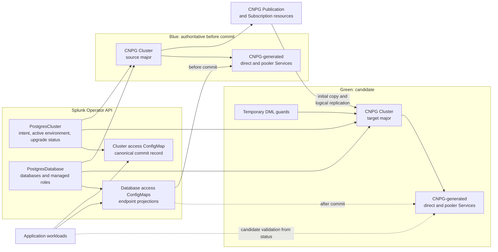
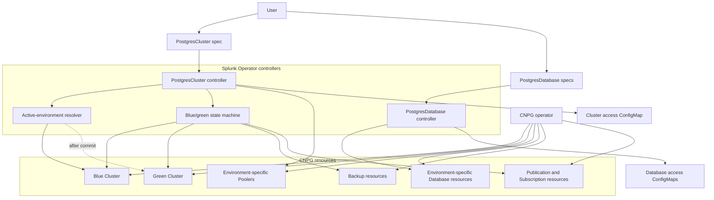
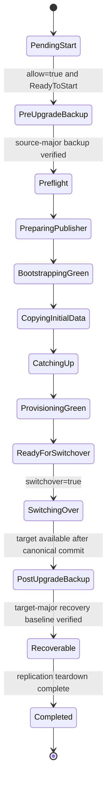
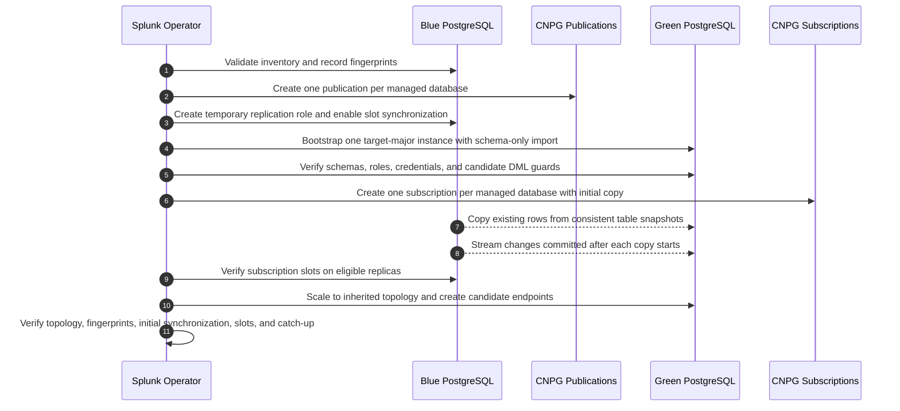
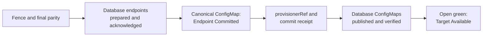
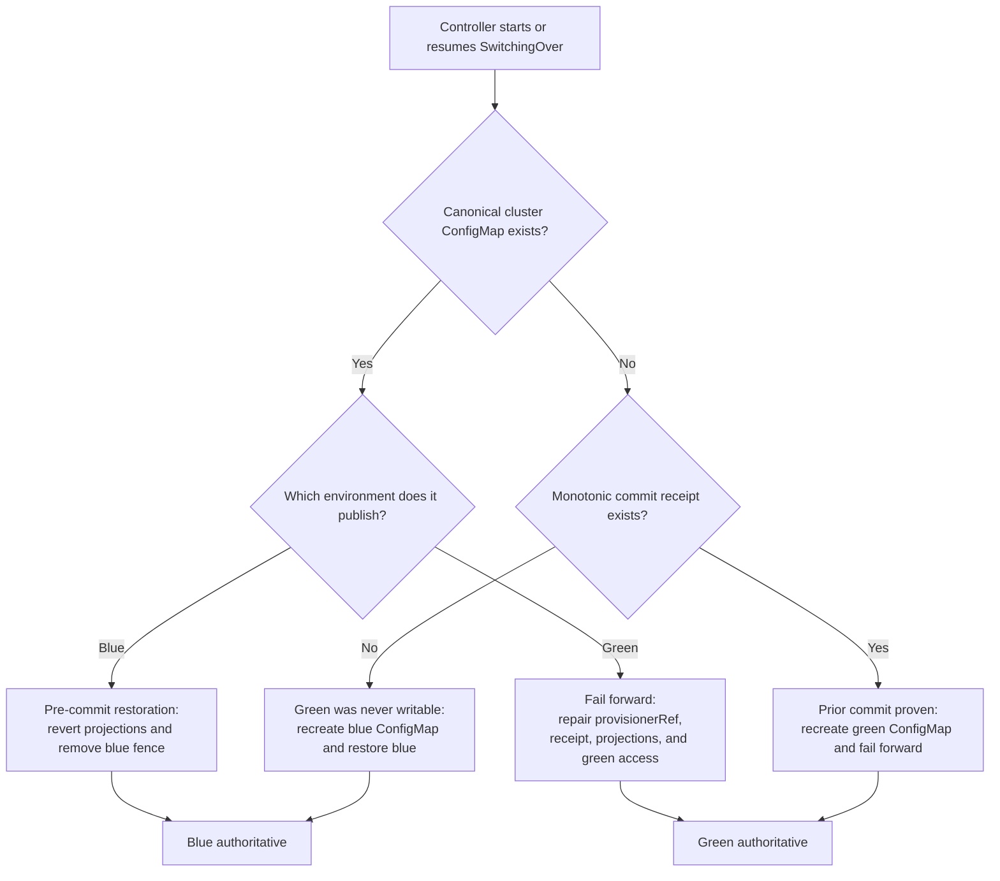
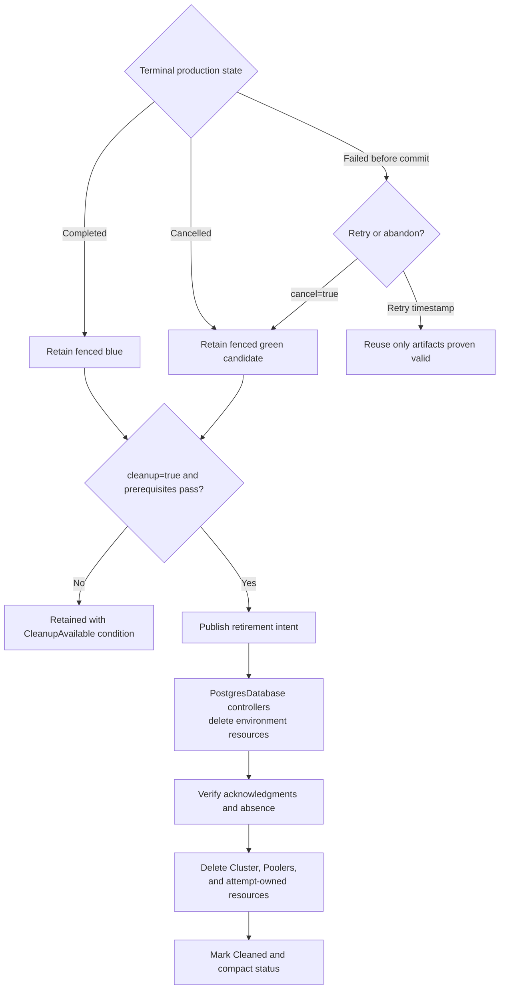

# Blue/Green Major Upgrade Design

Status: Accepted with ADR-0007

## 1. Overview

This design upgrades a CNPG-backed `PostgresCluster` to a higher PostgreSQL major version by preparing a synchronized replacement environment before an explicit switchover.

The current production environment is **blue**. The replacement environment is **green**. Both are internal CNPG `Cluster` resources owned through one user-facing `PostgresCluster`; applications and `PostgresDatabase` resources continue to reference that logical parent.

The workflow combines:

1. schema and configuration freezes on blue;
2. schema-only import into a target-major green environment;
3. CNPG-managed subscription initial copy followed by continuous logical replication;
4. optional, application-owned validation against a write-guarded green endpoint;
5. a fenced, final catch-up and endpoint publication; and
6. post-upgrade backup, replication teardown, and explicit cleanup.

The design preserves committed production data and bounds operator-controlled database interruption. It does **not** preserve endpoint identity. Applications must discover changed endpoint values in access ConfigMaps, reload their connection configuration, reconnect, and retry. Application recovery time is outside the operator's switchover target.

The prose in this document is normative; diagrams summarize ownership, ordering, and recovery boundaries.

### Architecture at a glance



Blue and green are lifecycle roles, not permanent names. After switchover, green remains authoritative under its generated CNPG name. A future upgrade treats that environment as blue.

## 2. Scope and guarantees

### 2.1 Supported scope

The initial version supports:

- CNPG-backed `PostgresCluster` resources;
- one adjacent major-version hop from PostgreSQL X to X+1;
- blue and green in the same Kubernetes cluster and namespace;
- green inheriting blue's topology and configuration except for the target PostgreSQL version;
- direct and optional Pooler connection endpoints; and
- declaratively managed databases and roles.

The strategy is selected explicitly through `postgresMajorUpgradeConfig.strategy`. It does not add a separate deployment feature gate.

### 2.2 Excluded scope

The initial version excludes:

- minor-version upgrades and downgrades;
- skipped major versions;
- arbitrary blue/green configuration experiments;
- cross-cluster or cross-namespace migration;
- object-store recovery as the green seed;
- unmanaged application databases, roles, or global objects;
- large objects, materialized views, and non-empty unlogged tables.

### 2.3 Availability contract

The operator measures switchover against the configured `switchoverTimeout`. It defaults to 60 seconds; selecting another value explicitly changes that attempt's operator-controlled interruption target. The timeout is a hard rollback deadline until Endpoint Committed and an availability target afterward. It covers transaction drain, final catch-up, sequence synchronization, access ConfigMap writes, and restoration and verification of green login access.

Applications must tolerate connection resets and retry aborted transactions. ConfigMap-backed environment variables do not update in running Pods, and mounted ConfigMap updates do not force application reloads. Application propagation, restart, and recovery time are therefore outside the configured switchover target.

### 2.4 Data-safety contract

The workflow guarantees continuity for committed writes made through the supported, declaratively managed application identities. Uncommitted transactions may be terminated during switchover and must be retried.

The operator fails closed whenever it cannot prove:

- complete initial table synchronization and an uninterrupted logical-replication history;
- valid logical slots across eligible blue failover targets;
- final LSN and sequence parity;
- unchanged schema, access policy, credentials, and configuration; or
- complete fencing of ordinary writers.

Privileged out-of-band interference remains unsupported.

## 3. Resource and ownership model

### 3.1 One logical cluster, multiple internal environments

Major-upgrade intent and progress remain on the existing `PostgresCluster`. Green is not another user-visible `PostgresCluster`.

The existing `PostgresCluster.status.provisionerRef` remains the backward-compatible pointer to the authoritative CNPG environment. Existing resources default to the conventionally named CNPG cluster. Nested blue/green status records both source and target references. After switchover, `provisionerRef` points permanently to green.

All foundation components receive a resolved environment context instead of reconstructing CNPG names from `PostgresCluster.metadata.name`. Cluster health, managed roles, Poolers, backups, ConfigMaps, and `PostgresDatabase` reconciliation therefore continue against the authoritative environment throughout an upgrade. Candidate reconciliation is a separate blue/green overlay.



The Splunk Operator owns intent, orchestration, CNPG custom resources, and access metadata. CNPG owns database Pods and generated direct and Pooler Services. The controllers never compete for ownership.

### 3.2 Database ownership

`PostgresDatabase.spec.clusterRef` remains unchanged. During an upgrade, its controller reconciles uniquely named CNPG `Database` resources for both environments. Green resources adopt and verify databases and schemas created by the target-major schema-only import.

`PostgresDatabase.status.phase` and its ordinary references continue to describe the authoritative environment. Candidate readiness and failure are reported under the parent's blue/green status, so a failed candidate does not make an available production database appear unavailable.

### 3.3 Endpoint ownership

CNPG retains ownership of every environment's generated Services. The Splunk Operator publishes the authoritative environment's direct and optional Pooler endpoints through the existing cluster and database access ConfigMaps.

The database ConfigMaps are owned by their `PostgresDatabase` controllers and publish green only after canonical commit. The cluster ConfigMap is owned by the `PostgresCluster` controller and is the canonical switchover commit record.

### 3.4 TLS trust

Blue's server CA becomes a stable `PostgresCluster`-owned trust anchor shared by both environments. Blue and green use distinct leaf certificates and private keys; each leaf covers its environment-specific generated Service names.

The CA identity and contents are frozen for the attempt. CNPG may renew leaf certificates under that CA when SAN coverage remains complete. Preflight rejects a CA too close to expiry. An externally managed CA replacement is terminal drift requiring cancellation and a fresh attempt.

## 4. API and operator controls

The major-upgrade API's existing `allow` field remains the generic preparation gate. Renaming it is deferred to a separate API refactor.

```yaml
postgresMajorUpgradeConfig:
  allow: false
  strategy: blueGreen
  blueGreen:
    switchover: false
    cleanup: false
    cancel: false
    switchoverTimeout: 60s
```

- `allow` authorizes preparation, target-major green provisioning, schema import, initial copy, and catch-up.
- `switchover` authorizes write fencing and endpoint cutover after every readiness condition passes.
- `cleanup` authorizes deletion of the retained non-authoritative environment after a safe terminal boundary.
- `cancel` abandons an attempt before the commit point.

All controls default to `false`. Gates may be pre-authorized and are latched when consumed; setting a consumed gate back to `false` does not reverse work.

`switchoverTimeout` defaults to `60s` and accepts `30s` through `3600s`.

Each blue/green attempt receives a durable `attemptID`. It scopes gates, resource names, labels, acknowledgments, and the canonical ConfigMap commit annotation. After a cancelled attempt is cleaned, the same version pair requires the controller to observe `allow: false` before a later `allow: true` creates another attempt. A different target version already supplies a distinct upgrade identity.

`cleanup` is consumable only from `Completed` or `Cancelled`. A `Failed` attempt must be retried or explicitly cancelled first. `postgresMajorUpgradeConfig` remains present while any non-authoritative environment is retained and may be removed only after cleanup reaches `Cleaned`.

Both upgrade strategies use the edge-triggered `platform.splunk.com/major-upgrade-retry-at` annotation. One timestamp can retry at most one later terminal failure.

## 5. End-to-end workflow

### 5.1 Lifecycle



Any nonterminal phase may enter `Failed`. Cancellation may enter `Cancelling` only before Endpoint Committed and restores source authority if fencing has begun; it then ends at `Cancelled`. Sections 6.1 and 6.2 define retry and cancellation. Each reconcile advances at most one durable step. Cleanup has an independent nested state machine because production can be `Completed` while old blue remains retained.

### 5.2 Pre-upgrade backup, preflight, and freezes

After `allow` is granted and before publisher preparation, the operator creates and verifies a fresh workflow-owned source-major backup using the cluster's configured backup method. Its name and identity are recorded in the strategy-neutral major-upgrade status as the pre-upgrade recovery anchor. The backup does not seed green, establish a replication position, or otherwise participate in target initialization. Normal backup retention governs it.

Before publisher preparation, the operator verifies that:

- the target is exactly one PostgreSQL major higher than blue;
- the target-major operand image contains every required compatible extension;
- green has enough storage for imported schemas, initial table copies, indexes, and its inherited replica topology;
- blue has enough finite WAL headroom for the expected initial-copy and catch-up period;
- network policy permits green to connect to blue for schema import and logical replication;
- every application database and role is declared through `PostgresDatabase`;
- no user-created database, login or ownership role, extension, tablespace, publication, subscription, logical slot, foreign server, user mapping, or maintenance-database object falls outside the supported inventory;
- there are no large objects, materialized views, non-empty unlogged tables, or tables lacking usable replica identity;
- replication slots, WAL senders, logical workers, general worker processes, slot synchronization, and finite `max_slot_wal_keep_size` capacity are sufficient.

The initial version rejects `pg_partman`, `pg_cron`, `pglogical`, `pgactive`, and other extensions requiring background workers or `shared_preload_libraries` unless explicitly certified as safe or required by CNPG for logical-slot continuity.

Restart-requiring tuning is never applied automatically. Users update `postgresqlConfig` and wait for CNPG to settle before granting `allow`.

When preflight completes, two freezes begin:

- the **configuration freeze** covers versions, strategy, topology, storage, resources, PostgreSQL and HBA settings, Poolers, backups, credential references, and `PostgresDatabase` definitions;
- the **schema freeze** permits DML on blue but prohibits DDL, DCL, database-definition, role, grant, ownership, and extension changes.

The operator records normalized schema and access-policy fingerprints instead of installing DDL event triggers. It checks blue before schema import, before switchover readiness, and after fencing. It checks green against the target-major imported-schema baseline. Credential Secret contents are fingerprinted throughout the attempt. The schema freeze ends at switchover or cancellation; the broader configuration freeze ends at `Completed` or `Cancelled`.

### 5.3 Bootstrap and logically synchronize green

ADR-0007 rejects physical and hybrid synchronization because cross-major WAL replay is impossible and cutover-time conversion or custom handoffs violate the selected bounded, CNPG-documented workflow.

The workflow creates one CNPG `Publication` per managed blue database and a temporary replication role and Secret with only `LOGIN`, `REPLICATION`, managed-database connection rights, and publication-consumption permissions. It configures the CNPG-supported logical-slot synchronization mechanism appropriate to blue's PostgreSQL version so the subscriptions can survive an eligible source failover.

Green is created directly at the target major version. CNPG's schema-only import initializes every supported managed database without copying table data. The operator verifies the imported schemas and reconciles declared roles and credentials, then creates one CNPG `Subscription` per managed database with initial data copy enabled. Each subscription creates its logical slot, takes a consistent initial table-copy snapshot, copies existing rows, and continues applying changes committed on blue.



Green may bootstrap as a single instance, then scales to blue's effective topology. It cannot become `ReadyForSwitchover` until every subscription reports complete initial table synchronization, continuous apply is healthy, every slot is valid on every eligible blue replica, and green has its required healthy replica topology.

Correctness relies on PostgreSQL's consistent subscription initial copy and uninterrupted logical stream rather than a custom snapshot-to-slot LSN handoff. If initial-copy completion or replication continuity cannot be proven, the candidate is invalid and must be rebuilt.

### 5.4 Candidate validation

After schema-only import, the operator installs workflow-owned `INSERT`, `UPDATE`, `DELETE`, and `TRUNCATE` guards on every managed green table. They reject ordinary application writes while permitting logical subscription workers through replication-origin and session semantics. Schema fingerprints detect DDL drift.

The candidate direct and optional Pooler endpoints are published in upgrade status. Existing declared credentials are reconciled onto green; the operator creates no validation role, application Secret, ConfigMap, or test job.

Application owners decide what to validate. `ReadyForSwitchover` certifies infrastructure, upgrade, schema, guard, and replication safety—not application compatibility.

While `ReadyForSwitchover`, the operator continues replication and invariant checks indefinitely and fails only if an invariant or capacity limit breaks.

### 5.5 Write fencing and final parity

Shortly before switchover, the workflow creates an attempt-specific operator-only control role and Secret in both environments. It receives only the elevated capabilities needed to apply and verify the fence, terminate sessions, synchronize sequences, inspect replication, remove DML guards, and recover after a controller restart. It is never published to applications.

Fencing is declarative. The operator applies a CNPG operational overlay that:

- sets every write-capable managed application role to `login: false`;
- permits application login only for identities whose effective privileges are proven read-only;
- prevents foundation reconciliation from restoring normal write-capable login state;
- prepends HBA rules that reject remote ordinary-superuser access;
- permits the temporary control and replication identities; and
- preserves local CNPG management access.

After CNPG applies the overlay and SQL catalogs and effective HBA state confirm it, the operator allows a bounded transaction-drain interval within the latched switchover timeout. It then terminates every write-capable or unclassified application or remote session. Only sessions authenticated through identities proven to be read-only may remain during final catch-up; if the operator cannot prove that distinction, it terminates every non-control and non-replication session. Uncommitted write work rolls back.

Only then does it capture the final blue LSN. Final parity requires:

- every subscription applied through that LSN;
- every subscription and slot healthy and valid;
- all managed sequences copied and verified;
- unchanged schema, access-policy, credential, and unsupported-object checks; and
- complete removal of green's candidate DML guards while green remains fenced.

The operator does not run full row counts or cross-environment checksums. Correctness comes from complete subscription initial synchronization, an uninterrupted logical stream through the final LSN, and explicit synchronization of state, such as sequences, that logical table replication does not cover.

### 5.6 Two-phase endpoint publication and commit

Endpoint publication preserves single-writer ownership across controllers without exposing green before commit:

1. `PostgresCluster` records a green endpoint-preparation intent with the `attemptID` and generation.
2. Each `PostgresDatabase` controller validates its green endpoints and acknowledges preparation in status without changing application-facing ConfigMap keys.
3. Green remains fenced while the parent verifies every preparation acknowledgment and endpoint value; all application-facing ConfigMaps still publish blue.
4. `PostgresCluster` updates the canonical cluster access ConfigMap, recording Endpoint Committed as the externally observable and irreversible commit point.
5. The parent atomically records `provisionerRef=green` and a monotonic commit receipt in status.
6. The parent records a post-commit endpoint-publication intent for the prepared generation.
7. Each `PostgresDatabase` controller updates only its owned access ConfigMaps, verifies their green values, and acknowledges publication.
8. The parent verifies every publication acknowledgment and actual endpoint value.
9. The parent terminates any remaining verified read-only blue sessions.
10. The parent removes and verifies green's fence, records Target Available, and emits an endpoint-publication Event.



Before commit, failure clears the preparation intent and restores blue's fence before reopening blue; application-facing ConfigMaps never left blue. After commit, recovery is fail-forward because clients may discover green. It repairs every database projection before opening green. Blue remains a fenced diagnostic artifact, not a lossless rollback target.

`switchoverTimeout` starts with fencing and includes restoration of green access. Expiry before Endpoint Committed restores blue and records `SwitchoverTimedOut`; the operator does not repeat the interruption until a new retry timestamp re-arms it. Expiry after Endpoint Committed but before Target Available records that the target was exceeded and continues fail-forward until green access is verified.

### 5.7 Crash recovery around commit

The canonical cluster ConfigMap carries the active-environment and attempt annotations and is the observable commit record. Status and database ConfigMaps are repairable projections.



Green is not made writable until the canonical ConfigMap has committed, one status update has atomically moved `provisionerRef` and recorded the monotonic commit receipt, and every database ConfigMap publishes verified green values. The receipt acknowledges a commit but cannot initiate one. If the ConfigMap is deleted before the receipt is recorded, green has never been opened and blue can be restored; if the receipt exists, recovery must recreate green's ConfigMap, repair database projections, and fail forward.

### 5.8 Post-commit backup and completion

Blue is the only backup and WAL-archive producer before commit. At commit, the operator disables backup on blue, enables it on green, and creates a workflow-owned target-major backup through the effective class-configured backend. Verifying that backup and its WAL archive baseline records `Recoverable` and gates replication teardown. The source-major recovery anchor remains under normal retention and never seeds green.

The operator then removes subscriptions, publications, logical slots, external-cluster replication configuration, and temporary credentials. It records `Completed` only when green is healthy, every endpoint projection publishes green, recoverability remains verified, and teardown succeeds. Completion does not wait for application acknowledgment; status records the commit time, canonical ConfigMap resource version, and green identity.

### 5.9 Explicit cleanup

Completion does not delete old blue. Another major upgrade is blocked with `CleanupRequired` while a prior environment or temporary artifact remains.

Normal cleanup uses an environment-retirement barrier:

1. the parent publishes an attempt-generation-scoped retirement intent;
2. each `PostgresDatabase` controller deletes its environment-specific CNPG `Database` resources and acknowledges the generation;
3. the parent verifies every child resource is absent; and
4. the parent deletes the non-authoritative CNPG Cluster, Poolers, and remaining attempt-owned resources.



Cleanup never removes the target-major recovery anchor; normal green backup retention owns it.

## 6. Failure, retry, cancellation, and deletion

### 6.1 Retry policy

Transient infrastructure failures retry automatically in their current phase. Terminal failures latch `Failed`.

An explicit retry may reuse artifacts only when every relevant invariant remains provable. A switchover timeout before commit may reuse green after it returns to catch-up and passes readiness checks again.

Incompatible schema import, initial-copy failure with unprovable state, schema drift, interrupted or invalidated slots, and replication conflicts can invalidate green. An invalid candidate requires cancellation, cleanup, and a new attempt with a fresh schema import and initial copy.

### 6.2 Cancellation

`cancel: true` takes priority over unconsumed gates and is allowed only before commit. If fencing has begun, cancellation clears pending endpoint preparation and removes and verifies blue's fence; application-facing ConfigMaps remain on blue. It then tears down logical replication and temporary credentials and marks the attempt `Cancelled`.

Green and diagnostic artifacts remain fenced until explicit cleanup. Cancellation after commit is rejected; recovery is fail-forward.

### 6.3 PostgresCluster deletion

Deleting `PostgresCluster` supersedes stage gates. Status and attempt labels provide a durable inventory; finalization does not rely on naming conventions.

With `clusterDeletionPolicy: Delete`, finalization attempts SQL replication teardown and then deletes every environment, storage object, and temporary resource. An unreachable PostgreSQL server does not block deletion because deleting its storage removes its slots.

With `clusterDeletionPolicy: Retain`, finalization fails closed until subscriptions and WAL-retaining slots are proven removed and, before commit, blue access is restored. It then orphans every remaining CNPG environment and required credential material. A blocking condition explains remediation; manual finalizer removal is the break-glass path.

Top-level deletion is the exceptional path allowed to remove the full durable inventory directly rather than waiting for normal child-controller retirement barriers.

## 7. Status and observability

Each strategy-neutral `status.postgresMajorUpgradeStatus` entry retains its source version, target version, strategy, and phase fields and adds an optional nested `blueGreen` status containing:

- `attemptID`;
- blue and green environment references;
- candidate endpoints;
- per-database schema-import, initial-copy, and replication inventory;
- endpoint-preparation, endpoint-publication, and retirement generations;
- consumed gates;
- monotonic commit receipt and switchover details; and
- cleanup state.

The generic phase describes production progress. `ReadyForSwitchover` represents Candidate Ready, canonical commit metadata records Endpoint Committed, verified green access records Target Available, `Recoverable` records the verified target-major recovery baseline, and `Completed` records successful replication teardown. Nested cleanup independently moves through `Retained`, `Cleaning`, `Cleaned`, or `CleanupFailed`.

Top-level `PostgresCluster.status.phase` remains `Ready` while the authoritative environment is serving during preparation, validation, catch-up, candidate failure, and post-upgrade backup. It becomes `Configuring` only during fencing and endpoint transition. Only an authoritative-environment failure makes the top-level cluster `Failed`.

Conditions advertise:

- `ReadyToStart`;
- `ReadyForSwitchover`;
- `CancellationAvailable`;
- `RetryAvailable`; and
- `CleanupAvailable`.

Conditions explain whether a user gate can be consumed; gates express permission.

Rapidly changing values stay in Prometheus metrics rather than continuously updating Kubernetes status. Metrics include replication lag, retained WAL bytes, apply throughput, estimated catch-up time, switchover duration, and attempt and failure counters. Kubernetes Events are emitted only for meaningful transitions and failures.

Full LSNs, inventories, acknowledgments, and temporary references remain in status while artifacts exist. After `Cleaned`, the controller compacts the entry to its attempt ID, versions, strategy, outcome, timestamps, and failure summary. It retains at most the latest ten cleaned summaries and never prunes an attempt with retained artifacts.

## 8. Glossary

**Canonical cluster access ConfigMap / switchover commit point** — The `PostgresCluster`-owned ConfigMap is the first application-facing endpoint record updated to green. Before that update blue can be restored; afterward recovery is fail-forward. A monotonic status receipt preserves that decision if the ConfigMap is later deleted.

**Candidate endpoint** — A green direct or Pooler Service name exposed through upgrade status for pre-switchover validation.

**Declaratively managed database** — A database whose identity and managed roles are declared by `PostgresDatabase`; preflight rejects unmanaged user-created state.

**Endpoint-preparation and publication intents** — Generation-scoped instructions for each `PostgresDatabase` controller to validate green endpoints before canonical commit, then update and acknowledge its ConfigMaps after commit.

**Environment-retirement barrier** — The cleanup protocol in which child controllers remove and acknowledge environment resources before the parent deletes the CNPG environment.

**Pre-upgrade backup** — A verified source-major recovery anchor that neither seeds green nor defines a replication boundary.

**Replication parity** — Green has applied through blue's final LSN, slots and subscriptions are healthy, sequences are synchronized, and frozen invariants hold.

**Schema freeze** — Blue may receive DML, but database structure, roles, grants, ownership, and extensions cannot change.

**Stage gate** — A user permission—`allow`, `switchover`, or `cleanup`—to cross one safe workflow boundary after its prerequisites pass.

**Upgrade attempt** — One source-version, target-version, and strategy execution identified by a durable `attemptID`.

**Upgrade configuration freeze** — The interval in which upgrade identity, topology, storage, configuration, credentials, backups, Poolers, and database declarations cannot change.

**Upgrade control role** — A temporary operator-only identity for fencing, session termination, sequence synchronization, and crash recovery.

**Upgrade replication role** — A temporary least-privilege identity used only to stream managed publications from blue to green.

**Write fence** — The reconciled state that prevents ordinary source writes while preserving required control and replication access; §5.5 defines its session policy.
