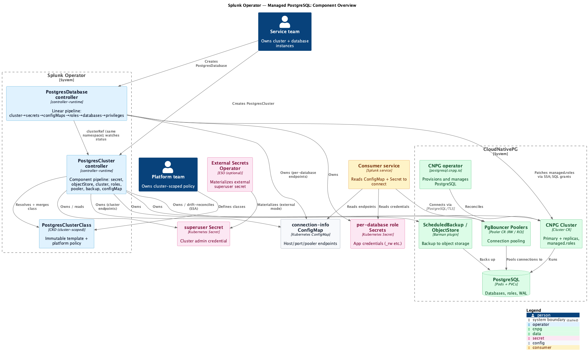
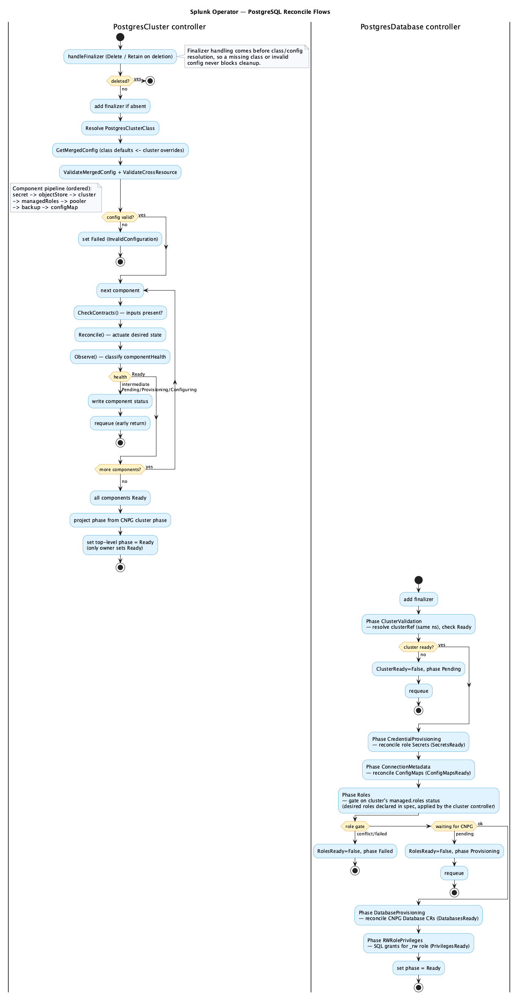
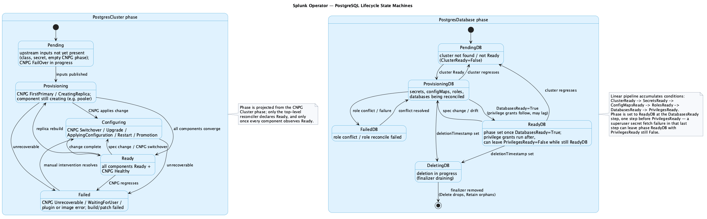

# Managed PostgreSQL — Architecture Overview

This page is the map of how the Splunk Operator manages PostgreSQL. It shows the
components involved, how each controller reconciles, and the lifecycle phases a
`PostgresCluster` and `PostgresDatabase` move through. For the *why* behind each
decision, follow the linked [Architecture Decision Records](adr/README.md);
for the condensed problem/alternatives/chosen-approach narrative, see the
[RFC summary](rfc-summary.md).

> Diagrams are authored in PlantUML under [`docs/pictures/`](../pictures/) and
> rendered to PNG. To regenerate after editing a `.puml` source:
> `java -jar plantuml.jar -tpng docs/pictures/<name>.puml`.

## The big picture

The operator does **not** implement PostgreSQL itself. It sits on top of
[CloudNativePG (CNPG)](https://cloudnative-pg.io/) and translates three custom
resources into CNPG objects, credentials, and connection metadata:

- **`PostgresClusterClass`** — a cluster-scoped, immutable template + platform
  policy (provisioner, sizing defaults, backup and pooler policy). Owned by the
  platform team. See [ADR-0001](adr/0001-crd-structure-and-api-group.md) and
  [ADR-0005](adr/0005-postgresclusterclass-abstraction.md).
- **`PostgresCluster`** — one PostgreSQL cluster. References a class by name and
  applies guard-railed overrides. Owns a CNPG `Cluster`, optional PgBouncer
  `Pooler`s, backup objects, the superuser `Secret`, and a connection-info
  `ConfigMap`.
- **`PostgresDatabase`** — the logical databases, roles, extensions, and
  credentials a service consumes on a referenced cluster (same namespace).

Key relationships (see [ADR-0003](adr/0003-cnpg-integration-and-drift-reconciliation.md)):

- One `PostgresCluster` owns exactly one CNPG `Cluster` via a controller owner
  reference; `Owns()` watches heal out-of-band edits and deletions for most
  owned objects. The Secret is the exception: its watch only reacts to
  deletion, and existing Secret data is never rewritten, so drifted Secret
  content is not healed.
- The operator is **declarative-first**: roles go through CNPG `managed.roles`,
  arbitrated by the `PostgresCluster` controller (it collects intent from every
  `PostgresDatabase` and applies the full role list with a single merge patch —
  not per-database Server-Side Apply), databases through CNPG `Database` CRs.
  Direct SQL is used **only** for privilege grants CNPG can't express
  declaratively.
- Pooling is a class-defined capability with per-cluster enablement; RW and RO
  poolers are separate CNPG `Pooler` CRs, RO gated on effective instances ≥ 2
  (see [ADR-0004](adr/0004-pgbouncer-integration-model.md)).
- Consumers connect using the connection-info `ConfigMap` (endpoints) and the
  per-database role `Secret` (credentials). The superuser secret may be supplied
  externally via the External Secrets Operator.

## Reconcile flows

The two controllers use **deliberately different** reconcile shapes (see
[ADR-0002](adr/0002-actuate-converge-reconcile-pattern.md), which extends
CPI-1961):

- **`PostgresCluster`** runs an ordered **component pipeline**. Each component
  implements a two-phase *Reconcile (actuate) → Observe (converge)* contract
  plus `CheckContracts`/`Requires`/`Provides`. The runner walks the components
  in order (`secret → objectStore → cluster → managedRoles → pooler → backup →
  configMap`); if any component observes an intermediate state
  (`Pending`/`Provisioning`/`Configuring`) it writes that status and returns
  early with a requeue hint. Only when **every** component observes `Ready` does
  the top-level reconciler declare the cluster `Ready`. Component ordering is
  validated on every reconcile by `validateComponentOrder`.
- **`PostgresDatabase`** runs a **linear pipeline** that accumulates conditions:
  `ClusterValidation → CredentialProvisioning → ConnectionMetadata → Roles →
  DatabaseProvisioning → RWRolePrivileges`, persisting status between steps.

## Lifecycle state machines

The `PostgresCluster` phase is **projected from CNPG's own cluster phase** rather
than self-diagnosed (`Healthy → Ready`; `FirstPrimary`/`CreatingReplica` →
`Provisioning`; `Switchover`/`Upgrade`/`ApplyingConfiguration`/restart/promotion
→ `Configuring`; `FailOver` → `Pending`;
`Unrecoverable`/`WaitingForUser`/plugin or image errors → `Failed`; empty →
`Pending`). The `PostgresDatabase` phase advances along its
condition pipeline and enters `Deleting` when a deletion timestamp is set —
where the per-database deletion policy (`Delete` vs `Retain`) decides whether
the underlying database is dropped or orphaned.

## Where to go next

- [Architecture Decision Records](adr/README.md) — the decisions behind this design.
- [RFC summary](rfc-summary.md) — problem, alternatives, chosen approach.
- Operational guides: [scaling up](scaling-up.md), [scaling out](scaling-out.md),
  [minor version upgrades](minor-version-upgrade.md),
  [backup to object storage](backup-object-storage.md),
  [backup with volume snapshots](backup-volume-snapshots.md),
  [connecting with TLS](connecting-to-postgres-with-TLS.md),
  [managed roles](postgresdatabase-managed-roles.md).
