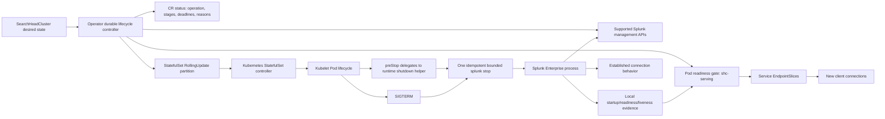
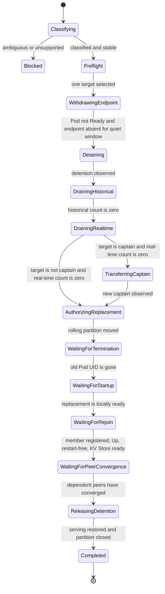

# Reliable Splunk Search Head Clusters on Kubernetes

## Engineering requirements, architecture, delivery plan, and qualification design

| Attribute | Value |
| --- | --- |
| Document status | Draft for engineering review |
| Intended use | Production design and implementation plan |
| Product scope | Splunk Operator for Kubernetes, the Splunk container runtime, Splunk Ansible during the compatibility period, and identified Splunk Enterprise contracts |
| Primary workload | Splunk Search Head Cluster (SHC) |
| API scope | Current stable SearchHeadCluster API only; older API migration is not part of this design |
| Design posture | Prospective. This document specifies what must be built and qualified; it does not claim that the production product already provides the behavior. |

## 1. Purpose

This document converts the Search Head Cluster reliability investigation into a production engineering design. It explains why the work is needed, the customer-visible outcomes, the proposed contracts between Kubernetes and Splunk, the exact order in which the capability should be built, and the tests required before it can be released.

The investigation used prototype code, controlled Kubernetes experiments, source inspection, and failure injection to make the design concrete. Those results are evidence for the requirements. They are not a substitute for product review, production implementation, supported-version qualification, or release acceptance.

The intended readers include Splunk Enterprise engineers who may not work with Kubernetes every day, Splunk Operator and container-runtime engineers, test engineers, support engineers, and product owners. Kubernetes terms are explained when their behavior materially affects Splunk.

Normative words have their usual engineering meaning:

- **MUST** is required for correctness or release.
- **SHOULD** is expected unless a reviewed exception exists.
- **MAY** is optional behavior.

## 2. Why this work started

An SHC member is simultaneously a Kubernetes Pod, a Splunk process, a member of a distributed Splunk cluster, a possible captain, and a traffic endpoint. Today these lifecycle views are not represented as one durable operation. Kubernetes can decide that a Pod is healthy or terminated without knowing whether the member is detained, drained, synchronized, or safe to replace. Splunk can begin a long shutdown without Kubernetes knowing why it is taking time or which distributed transition must finish first.

That gap creates customer-visible unavailability during otherwise normal work such as an image update, app deployment, Pod restart, node drain, or same-version replacement. The investigation found that the important lifecycle work can take materially longer than Kubernetes' implicit 30-second Pod termination allowance. It also found that simply extending the grace period is necessary but insufficient: the system still needs traffic withdrawal, dynamic captain handling, bounded search drain, one owner for shutdown, durable controller stages, and a reliable rejoin gate.

The significant failure modes that this design must remove are:

1. Kubernetes continues sending new traffic to a member after Splunk has put it in detention.
2. Kubernetes marks a replacement Pod Ready before the member is registered, `Up`, synchronized, and free of a pending restart.
3. The active captain is terminated without the supported captain-transfer workflow.
4. Startup automation treats a persistent member restart as initial cluster formation and repeats formation commands or restarts Splunk unnecessarily.
5. Ordinal zero is treated as a permanent captain even though SHC captaincy is dynamic.
6. An ordinary restart is confused with permanent scale-down and unnecessarily changes consensus membership.
7. A StatefulSet uses `OnDelete`, while the controller manually deletes Pods and Kubernetes cannot express or track the desired rolling revision using its native rolling workflow.
8. Long work is performed inside one reconcile call or a Pod hook without a durable stage, deadline, reason, or recovery decision.
9. The termination grace period expires before endpoint withdrawal, detention, drain, captain transfer, and Splunk shutdown have completed.
10. Support cannot determine whether time was spent draining searches, transferring captaincy, stopping Splunk, scheduling a Pod, attaching storage, initializing the container, starting KV Store, or rejoining the SHC.
11. A liveness probe restarts a container during a deliberate lifecycle hold and repeats initialization in an old Pod.
12. App deployment, Deployer activity, an image update, and a member rollout can overlap and create more than one disruptive owner.
13. Persistent HTTP connections remain pinned to an endpoint after Kubernetes removes it from an EndpointSlice, because endpoint removal affects new connection selection rather than established connections.
14. An indexer is replaced before every Search Head has converged on the current set of search peers, creating a period in which searches can return incomplete results.

### 2.1 Evidence that shapes the requirements

The investigation recorded several independent signals. They are included here to explain the design choices, not to assign a cause before the responsible component is proven:

- Captured fleet evidence showed that 67.8 percent of observed Search Head shutdowns exceeded Kubernetes' 30-second default. This supports a configurable grace period and a 1200-second compatibility baseline, while still requiring independent stage timing and supported-matrix remeasurement.
- A customer-reported App Framework case showed an indexer rolling-restart record with `searchable=0`, `force=0`, and successful RF/SF/all-searchable preflight. That line does not by itself prove that replicated bucket copies were simultaneously offline. It does prove that restart policy, peer order, active-search behavior, and result completeness must be observable and qualified instead of inferred from RF/SF health.
- A same-image, same-PVC restart exposed a Splunk KV Store version-marker failure in one build. A later official build passed bounded revalidation, but older-to-newer upgrades and legacy marker states remain separate Splunk Enterprise qualification requirements.
- A separate container-startup failure occurred when Ansible repeated `splunk start` while the first invocation had already launched splunkd and MongoDB. The second invocation treated the live KV Store port 8191 as a conflict. This supports one initial start followed by bounded status observation; it does not justify deleting KV Store data, manufacturing version markers, or weakening Kubernetes probes.
- Persistent-client testing demonstrated that EndpointSlice withdrawal does not move an already established connection. Explicit detention and shutdown responses therefore need product/client connection handling in addition to correct Kubernetes endpoints.
- A full indexer-roll investigation observed successful searches whose counts temporarily regressed and found that exact peer convergence on every Search Head could lag lifecycle completion by many minutes. This is why HTTP success and Pod readiness cannot serve as the distributed-search completeness gate.

### 2.2 How to use spike evidence

Prototype runs may establish that a design is possible, expose a missing contract, or reject a candidate. They cannot establish general availability. Production acceptance must repeat the required scenario on immutable release-candidate images, supported Splunk and Kubernetes versions, declared network/storage modes, and a workload that checks logical results as well as transport success.

## 3. Outcomes, goals, and non-goals

### 3.1 Required outcomes

The production design MUST deliver the following outcomes:

- A planned SHC rollout removes and replaces no more than one member at a time.
- A planned captain replacement transfers captaincy to an eligible member before replacement is authorized.
- A non-target healthy member remains in Kubernetes Service endpoints throughout another member's planned lifecycle.
- No new Service traffic is routed to the target before Splunk detention and drain begin.
- Historical and real-time searches are drained according to explicit, bounded policy.
- Kubernetes owns Pod replacement through a partition-gated `RollingUpdate` StatefulSet.
- The Operator owns distributed preparation and recovery, not process shutdown.
- The container runtime owns exactly one bounded `splunk stop`, regardless of whether `preStop` and `SIGTERM` overlap.
- A replacement does not count as recovered until Kubernetes and Splunk views agree.
- Every long operation is durable, restart-safe, observable, and attributable to one operation identity.
- Existing installations have a disabled-by-default and reversible adoption path.
- Unsupported or ambiguous Splunk behavior fails closed rather than guessing.

### 3.2 Non-goals

This design does not:

- redesign the SHC consensus algorithm or prescribe the Search team’s future service decomposition;
- invent an unsupported Splunk REST endpoint;
- guarantee continuity after force deletion, simultaneous loss beyond SHC redundancy, unavailable persistent storage, or loss of the underlying Kubernetes control plane;
- make established client connections move automatically when a Service endpoint is removed;
- treat a PodDisruptionBudget as a rollout coordinator;
- convert every imperative Splunk administration operation to declarative configuration in the first release;
- automatically migrate existing indexer search-peer identities from Pod IPs to stable addresses;
- implement or qualify migration from older Operator API versions; or
- claim that a prototype result is a supported product matrix.

### 3.3 Design horizon

The near-term architecture is a compatibility design for the current Splunk Enterprise process and administrative interfaces. It deliberately separates the Operator from container-runtime mechanics so that Splunk can later provide Kubernetes-native readiness, maintenance, shutdown, bootstrap, and membership interfaces without redesigning the controller state machine.

## 4. Reliability invariants and service objectives

### 4.1 Hard invariants

These invariants are more important than rollout speed:

| ID | Invariant |
| --- | --- |
| INV-01 | At most one planned SHC member is withdrawn, detained, stopping, absent, or recovering at a time. |
| INV-02 | The target is absent from routable EndpointSlices before detention is requested. A `ready: unknown` EndpointSlice is treated as routable. |
| INV-03 | Captain identity is observed from Splunk and is never inferred from StatefulSet ordinal. |
| INV-04 | A captain target is not authorized for replacement until captain transfer is observed complete. |
| INV-05 | The StatefulSet partition is the only normal authorization for Kubernetes to replace the selected Pod. |
| INV-06 | A controller restart, leader change, or Kubernetes API interruption does not duplicate a completed external side effect. |
| INV-07 | `preStop` and `SIGTERM` converge on one runtime-owned, bounded shutdown result. |
| INV-08 | The next ordinal is not selected until the previous member is fully recovered in both Kubernetes and Splunk. |
| INV-09 | Scale-down, deletion, app restart, same-version restart, template rollout, and image upgrade have explicit classifications and cannot silently change class. |
| INV-10 | A transient observation failure does not evict healthy non-target members from service. |

### 4.2 Service-level indicators

The release MUST capture the following indicators for every qualified operation:

- planned-maintenance request success rate;
- minimum number of serving SHC endpoints during the operation;
- p50, p95, p99, and maximum duration for endpoint withdrawal, detention, historical drain, real-time drain, captain transfer, process shutdown, Pod scheduling, volume attachment, image pull, container initialization, Splunk startup, member registration, SHC `Up`, KV Store readiness, and complete member recovery;
- count of search requests rejected or failed during each lifecycle stage;
- search result completeness, not only HTTP success;
- count of duplicate or ambiguous external side effects;
- restart count per container and reason;
- time between a durable authorization and the corresponding Pod identity change; and
- time from operation start to full cluster convergence.

### 4.3 Initial release objectives

The following are release gates, subject to approval against the supported environment matrix:

- 100 percent of planned three-member SHC rolls retain at least two serving endpoints, except during an explicitly approved unsafe-continuation test.
- 100 percent of planned captain replacements show an observed captain transfer before Pod replacement.
- Zero duplicate shutdown, detention, captain-transfer, initialization, finalization, bootstrap, or join side effects under restart injection.
- Zero logical request loss in the response-aware persistent-client qualification; response retries MUST be bounded and observable.
- Zero successful-but-incomplete distributed searches in the indexer convergence qualification after the relevant completeness gate is declared satisfied.
- p99 stage duration MUST remain below that stage's configured deadline, and the maximum total operation MUST remain within the sum of configured bounded stages plus Kubernetes infrastructure time. Release qualification establishes the supported default values; it must not hide excess duration by using an unbounded timeout.
- A failed or timed-out operation MUST reach a stable, diagnosable condition within two reconciliations after the deciding observation is persisted.

## 5. Current behavior and the required ownership change

The current product design uses an `OnDelete` Search Head StatefulSet. The Operator decides when to delete each Pod. Kubernetes then runs its ordinary termination sequence, and the image handles `SIGTERM`. Container readiness primarily proves that image initialization completed and the local splunkd management root is reachable. It does not prove authoritative SHC registration, `Up` state, captain view convergence, restart state, or completed rejoin. The current design also does not provide the complete durable distributed lifecycle described here.

The target design changes ownership as follows:

| Concern | Required owner | Rationale |
| --- | --- | --- |
| Classify rollout, scale, app, delete, restart, and upgrade intent | Operator | It has desired state and cluster-wide context. |
| Observe actual captain and member state | Operator using supported Splunk APIs | Captaincy and membership are distributed state, not Pod identity. |
| Withdraw the selected member from Kubernetes Service traffic | Operator using a Pod readiness gate, observed through EndpointSlices | Kubernetes owns Service endpoint selection. |
| Detain and drain the selected Search Head | Operator using supported Splunk administrative interfaces | These are distributed preparation steps that must finish before replacement. |
| Transfer captaincy | Operator using the supported captain-transfer workflow | It requires cluster-wide intent and observation. |
| Authorize one Pod replacement | Operator by moving the StatefulSet rolling partition | Kubernetes receives a declarative desired revision. |
| Create, terminate, and replace the Pod | StatefulSet controller and kubelet | This is native Kubernetes workload orchestration. |
| Run one bounded local Splunk shutdown | Container runtime | It receives both lifecycle hook and signal and can serialize them locally. |
| Stop accepting new Splunk requests on an established connection | Splunk Enterprise | EndpointSlice changes cannot close an already established socket. |
| Decide whether a replacement has rejoined | Operator using Kubernetes and Splunk evidence | Neither view alone is sufficient. |
| Long-term native local readiness, maintenance, and shutdown | Splunk Enterprise | The product has the authoritative internal state. |

## 6. Target architecture



The architecture has two coordinated but independent control loops:

1. **Distributed lifecycle control** prepares the SHC, authorizes exactly one replacement, and verifies full recovery.
2. **Local runtime lifecycle control** starts, probes, and stops one Splunk process inside one Pod.

Neither loop may impersonate the other. The Operator does not call `splunk stop` directly. A Pod hook does not perform captain election or make cluster-wide rollout decisions. Splunk process liveness does not imply SHC service readiness.

## 7. API and policy contract

### 7.1 Feature enablement

The capability MUST be introduced behind two disabled-by-default feature gates:

- a generic Splunk Pod lifecycle gate for termination grace, probe termination behavior, and the runtime shutdown contract; and
- an SHC lifecycle gate that depends on the generic gate and enables the distributed Search Head workflow.

The SHC gate MUST be rejected when its dependency is disabled. Disabled gates MUST preserve current Pod templates, StatefulSet strategy, and controller behavior so that installing new CRDs or a new Operator does not silently begin a rollout.

Cross-tier indexer lifecycle and serving-readiness work SHOULD use a separate disabled-by-default indexer lifecycle gate that also depends on the generic Pod lifecycle gate. The core SHC rollout must not require that gate, but App Framework and distributed-search workflows must block safely when they require an indexer capability that is not enabled.

### 7.2 Customer-configurable fields

The stable SearchHeadCluster API MUST expose optional fields equivalent to the following contract:

```yaml
spec:
  terminationGracePeriodSeconds: 1200
  lifecyclePolicy:
    podUpdateStrategy: RollingUpdate
    endpointWithdrawalDelaySeconds: 30
    detentionTimeoutSeconds: 180
    searchDrainTimeoutSeconds: 180
    captainTransferTimeoutSeconds: 180
    podStartupTimeoutSeconds: 1800
    memberRejoinTimeoutSeconds: 1800
```

Requirements for these fields:

- The fields MUST remain optional pointers in storage. Defaults are resolved by the controller only when feature gates are enabled; admission MUST NOT mutate existing objects merely because a CRD was upgraded.
- `terminationGracePeriodSeconds` MUST be customer configurable from 1 through 86400 seconds.
- Stage timeouts MUST be independently configurable and validated as positive bounded values.
- Endpoint withdrawal delay MUST be less than the detention timeout after effective defaults are applied, so propagation observation cannot consume the entire detention budget.
- The planned Pod termination grace MUST cover local runtime shutdown plus kubelet scheduling margin. The initial compatibility default is 1200 seconds.
- Startup- and liveness-probe-triggered termination MAY use a separate default of 660 seconds: 600 seconds for bounded runtime shutdown plus a 60-second kubelet margin.
- Readiness MUST NOT have a probe-level termination grace because readiness failure does not terminate a container.
- The compatibility defaults are endpoint withdrawal 30 seconds, detention 180 seconds, search drain 180 seconds, captain transfer 180 seconds, Pod startup 1800 seconds, and member rejoin 1800 seconds. Production qualification MUST validate or revise them before general availability.
- `OnDelete` is a compatibility and rollback setting. `RollingUpdate` is the target steady-state strategy; the two modes are not equivalent long-term architectures.

### 7.3 Explicit operation intent

The API or durable controller input MUST distinguish:

- ordinary template rollout;
- same-version restart with exact source and target image identity;
- supported image upgrade;
- scale-up;
- scale-down;
- CR deletion;
- app-driven restart;
- ad-hoc restart; and
- scheduled restart.

The controller MUST reject or block ambiguous intent. In particular, a mutable image tag is not sufficient evidence of same-version replacement or upgrade direction.

### 7.4 Validation

Admission and controller validation MUST reject:

- invalid timeout ranges;
- unknown strategies or operation intents;
- `RollingUpdate` while required gates are disabled;
- an SHC lifecycle gate without the generic Pod lifecycle gate;
- unsupported Splunk version or topology combinations;
- a same-version intent whose source and target do not match the observed revision; and
- an image-upgrade workflow that cannot authoritatively classify every member's source image.

## 8. Durable status and operation model

### 8.1 Operation identity

Every disruptive workflow MUST have a stable operation identity derived from the resource UID, observed generation, operation class, source revision, target revision, and target ordinal where applicable. A new desired revision may supersede work only through an explicit persisted handoff. A transient observation may not silently change the operation identity.

### 8.2 Required status

The SearchHeadCluster status MUST contain enough information to resume without guessing:

- operation ID and class;
- source and target revisions and images;
- target ordinal and target Pod UID;
- current stage and stage start time;
- absolute stage deadline;
- observed captain identity and observation time;
- per-member registration, status, captain-reported status, restart state, and serving eligibility;
- whether endpoint withdrawal was observed and its quiet-window start;
- detention ownership and release requirement;
- historical and real-time search counts;
- whether captain transfer was requested and observed;
- StatefulSet partition authorization;
- expected and observed Pod revision and UID;
- startup, rejoin, KV Store, and peer-convergence evidence;
- last progress time;
- typed reason, message, and retry class; and
- any required user approval for unsafe continuation.

### 8.3 Condition and reason taxonomy

At minimum, status conditions MUST distinguish `Progressing`, `Ready`, `Degraded`, `Blocked`, `Paused`, `UnsafeContinuationRequired`, and `Terminal`. Reasons MUST identify the subsystem and failure class, for example:

- `AwaitingEndpointWithdrawal`
- `DetentionPending`
- `HistoricalSearchesDraining`
- `RealtimeSearchesDraining`
- `CaptainTransferPending`
- `AwaitingStatefulSetRevision`
- `AwaitingPodReplacement`
- `PodUnschedulable`
- `VolumeAttachmentPending`
- `ImagePullFailed`
- `ContainerInitializationPending`
- `SplunkStartupPending`
- `KVStoreNotReady`
- `MemberNotRegistered`
- `MemberNotUp`
- `MemberRestartPending`
- `AwaitingSearchPeerConvergence`
- `MemberRejoinTimedOut`
- `DependencyUnavailable`
- `RevisionSuperseded`
- `UserActionRequired`

The controller MUST preserve the last decisive reason and evidence when entering a blocked or terminal state. Generic `NotReady` or `Timeout` messages are insufficient.

### 8.4 Persist-before-side-effect rule

Before every non-read-only external action, the controller MUST persist:

1. the intent to perform the action;
2. the operation identity;
3. the expected target and preconditions; and
4. the deadline and ambiguity policy.

After restart, the controller MUST first observe whether the action completed. It may repeat the action only if the endpoint is proven idempotent or supplies a supported idempotency key/read-back contract. Captain transfer, image initialization, finalization, and membership operations require explicit ambiguity handling before production release.

## 9. Health and traffic semantics

### 9.1 Startup, liveness, and readiness are different questions

| Signal | Question | Required evidence | Must not depend on |
| --- | --- | --- | --- |
| Startup probe | Has this container completed image-owned initialization and started local splunkd? | Container state plus local splunkd management-root reachability | Captain reachability, cluster quorum, another Pod |
| Liveness probe | Is this container/process locally recoverable by a restart? | Local container state, exact splunkd process identity, or local management-root reachability | SHC health, captain election, remote network |
| Container readiness | Can the local container accept basic Splunk management traffic? | Container state plus local management-root reachability | A nonexistent SHC member-ready endpoint |
| Pod SHC serving gate | Should Kubernetes route new Search traffic to this member? | Local readiness plus Operator-observed registration, `Up`, acceptable restart state, and no owned lifecycle withdrawal | Ordinal-based captain assumptions |
| Cluster readiness | Can the controller start or advance a disruptive operation? | Authoritative captain/member view, minimum healthy peers, stable revision, no competing owner | A single Pod probe |

There is no supported `/services/shcluster/member/ready` endpoint in the current Splunk interface. The design MUST NOT call it. Captain and non-captain Search Heads use the same local startup, liveness, and container-readiness checks. Captain-specific state is observed separately by the Operator and affects orchestration, not local liveness.

### 9.2 Pod readiness gate

The Operator MUST add a Search Head-specific Pod readiness gate, for example `enterprise.splunk.com/shc-serving`. The kubelet-managed `ContainersReady` condition and the Operator-managed SHC condition jointly determine Kubernetes `Ready`.

The serving condition is `False` when the Pod is terminating, local containers are not ready, initial formation is incomplete, the member is unregistered, the member or captain reports a non-`Up` state, restart is pending, or an owned lifecycle operation targets that ordinal.

A healthy non-target member SHOULD remain serving during a planned lifecycle or a transient loss of cluster-wide observation after the topology was previously proven stable. This avoids turning a captain API timeout into an unnecessary fleet-wide traffic outage. The controller must still fail closed for new disruptive actions until authoritative observation returns.

### 9.3 EndpointSlice withdrawal barrier

Setting a readiness gate to `False` is an intent, not proof that traffic routing has changed. Before requesting detention, the controller MUST observe all of the following:

1. the Operator-owned serving condition is `False`;
2. Kubernetes Pod `Ready` is `False`;
3. no EndpointSlice for the Search Head Service contains the target Pod as a ready or unknown endpoint; and
4. the absence remains true for the configured quiet window.

EndpointSlice `ready: null` is treated as potentially routable. Any list, watch, or API error blocks advancement. This order minimizes the interval in which Kubernetes sends new traffic to a member that Splunk is rejecting because of detention.

### 9.4 Established connections

Endpoint removal controls new endpoint selection. It does not close an existing TCP or HTTP keep-alive connection. Therefore:

- Splunk Enterprise SHOULD close a Search response and underlying connection when detention rejects a request.
- HEC SHOULD close its response and connection when shutdown rejection returns HTTP 503.
- Clients and ingress proxies MUST retry boundedly on explicit maintenance responses and MUST discard or rotate the affected connection.
- Qualification MUST cover direct Service access, ingress TLS termination, TLS pass-through, service mesh, and no-mesh topologies.

The Operator cannot claim zero request disruption solely because EndpointSlices are correct.

### 9.5 Captain-unavailable behavior

The captain owns scheduled-search coordination and other cluster-wide work. During captain loss or election, scheduled reports and alerts can be delayed or fail because there is temporarily no scheduler owner. Reachable members may still serve ad-hoc searches as independent Search Heads when Splunk's majority and member state permit it.

Kubernetes readiness must preserve that distinction. The Operator reports captain unavailability as a cluster condition, blocks new planned disruption, and waits for Splunk election. It does not mark every locally healthy, non-detained member unready merely because captain observation is temporarily unavailable. Tests must measure ad-hoc searches and scheduled searches separately rather than reporting a single undifferentiated “search availability” result.

## 10. Planned member lifecycle



### 10.1 Step 1: classify and acquire ownership

The controller classifies the desired change, confirms that no app, Deployer, scale, deletion, image-upgrade, or other lifecycle owner conflicts, creates a durable operation, and freezes the source and target revisions. A conflict blocks before traffic is changed.

### 10.2 Step 2: preflight the cluster

The controller obtains an authoritative captain view, maps each management URI to a StatefulSet ordinal, and waits for local and captain member views to converge. It proves the supported version, replica safety, stable StatefulSet revision, expected PVC identity, minimum peers, and absence of another disrupted member.

### 10.3 Step 3: select one target

Targets normally proceed in reverse ordinal order, while actual captaincy remains dynamic. The chosen target, Pod UID, revision, and operation identity are persisted. Ordinal zero receives no permanent captain preference and may be rolled like any other non-captain.

### 10.4 Step 4: withdraw new Kubernetes traffic

The Operator sets the target's serving readiness gate to `False`, observes Pod readiness and EndpointSlice removal, and waits for the quiet window. Other healthy members remain serving. No detention request is sent until this barrier completes.

### 10.5 Step 5: detain and drain

The controller requests manual detention through the supported Splunk interface, verifies that the target is detained, and records that this operation owns detention. It then drains historical and real-time searches independently, refreshing counts until both are zero or their deadline expires.

A timeout blocks by default. Unsafe continuation, if the product supports it, requires an explicit customer approval tied to the operation ID, an event, a warning condition, and an audit record. Silent forced continuation is forbidden.

### 10.6 Step 6: transfer captaincy when required

If the target is the observed captain, the controller selects an eligible non-target member and invokes the supported captain-transfer workflow. Completion means a new captain is authoritatively observed and the target is no longer captain. A stale response, unreachable captain, failed transfer, or election in progress blocks replacement.

### 10.7 Step 7: authorize Kubernetes replacement

The controller persists authorization and moves the StatefulSet rolling partition by one ordinal. The StatefulSet controller, not the Operator, replaces the Pod. The partition is a safety gate: it must never expose two ordinals to replacement at once.

The controller records the expected ControllerRevision and waits for the old Pod UID to disappear and a new Pod at the target ordinal to use the desired revision. Manual deletion, force deletion, and an unexpected revision are detected and classified rather than mistaken for successful authorization.

### 10.8 Step 8: run one local shutdown

The Pod `preStop` hook delegates to a shared runtime shutdown executable and does no cluster-wide work. The later `SIGTERM` path calls the same executable. The executable uses local ownership, a stopping marker, an atomic result, and a bounded timeout so only one caller runs `splunk stop`; followers wait for and return the same result.

Compatibility behavior for an older image without the helper is limited to withdrawing the existing local readiness marker and allowing the image's TERM handler to remain the single shutdown owner. The Operator MUST NOT add a second `splunk stop`.

### 10.9 Step 9: wait for Kubernetes recovery

The controller separately attributes waiting time to termination, scheduling, volume attachment, image pull, container initialization, startup probe, and container readiness. A Pod that cannot start is not described as an SHC rejoin failure.

### 10.10 Step 10: wait for Splunk recovery

Local readiness is only the beginning. Full recovery requires:

- the replacement retains the expected persistent member identity;
- the captain registers the member;
- local and captain-reported state are `Up`;
- no required restart remains advertised;
- KV Store is ready where required;
- initial-formation or upgrade restart work is complete;
- the member's serving gate is restored; and
- any dependent indexer search-peer convergence contract is satisfied.

Only then may detention be released, the partition close behind the completed ordinal, and the next target be selected.

### 10.11 Step 11: complete or recover

Completion records stage durations and emits one terminal transition. On retryable failure the operation remains durable and resumes from observation. On terminal failure the partition closes, no new member is disrupted, the target remains safely withdrawn if necessary, and the status explains exact recovery steps. Rollback to the prior revision uses the same safety workflow; it is not an uncontrolled batch revert.

## 11. Initial formation, restart, scaling, and deletion

### 11.1 Initial formation

Initial SHC creation is not a rolling update. With `Parallel` Pod management, all desired containers may initialize concurrently, but Kubernetes traffic readiness remains closed until the Operator has authoritative evidence that the desired members are registered, the captain has observed all members, any formation-required restart is complete, and the topology is stable.

The container compatibility layer SHOULD render static SHC configuration directly before the first Splunk start. It MAY still use supported imperative bootstrap-captain and add-member operations, but those actions MUST be guarded by explicit bootstrap/join classification and persist-before-side-effect barriers.

### 11.2 Persistent member restart

A restart with the same PVC is rejoin, not formation. Startup automation MUST NOT repeat `init shcluster-config`, bootstrap captain, or add-member merely because a container was recreated. It MUST preserve the member identity and perform one initial `splunk start`, followed by a bounded status poll if the start command returns nonzero while splunkd may still be coming up.

Repeated `splunk start` calls are forbidden. They can overlap slow KV Store/MongoDB recovery and lead to port 8191 conflicts or restart loops.

### 11.3 Scale-up

Scale-up is an explicit operation. New persistent identities are initialized and joined without withdrawing existing members. Existing members remain serving while each new member reaches authoritative `Up` state. Scale-up MUST NOT be conflated with a template rollout.

### 11.4 Scale-down

Scale-down permanently removes consensus membership and storage according to policy. It requires a different workflow from restart: select a removable non-captain, withdraw, detain, drain, transfer captain if required, perform supported membership removal, reduce replicas, and handle PVC retention deliberately. Cancellation before irreversible membership mutation MUST restore the original serving state.

### 11.5 CR and namespace deletion

CR deletion uses a finalizer while the namespace and dependencies are operational. Namespace termination changes the safety boundary: the controller MUST stop initiating new administrative work and MUST not keep a namespace indefinitely in `Terminating` because a dependency or Splunk endpoint no longer exists. Referenced LicenseManager deletion ordering and finalization must be handled explicitly.

### 11.6 Automatic recovery boundaries

Automatic recovery is layered:

- the kubelet may restart a locally unhealthy container after the startup/liveness policy allows it;
- the StatefulSet controller may recreate a missing Pod with its retained identity and PVC;
- the Operator may observe and gate unplanned recovery, preserve other members, and resume a previously authorized operation; and
- Splunk Enterprise performs its supported member, KV Store, and captain recovery.

The Operator MUST NOT automatically remove and re-add consensus membership, replace a PVC identity, force captain election, or continue a timed-out drain merely to make status green. Those actions can convert a recoverable outage into data or consensus risk and therefore require a supported, explicit recovery workflow.

## 12. Image upgrades and same-version replacement

A cluster-wide image upgrade composes with, but is not identical to, the per-member lifecycle. It MUST have its own durable state:

1. `PendingInitialization`
2. `Initializing`
3. `RollingMembers`
4. `PendingFinalization`
5. `Finalizing`
6. `Completed`

Initialization is requested only after the controller proves a single authoritative source image, a supported source-to-target path, a stable source topology, and no member already moved. The controller persists intent before the Splunk initialization action. Per-member replacement then uses the lifecycle in Section 10. Finalization begins only after every member is fully recovered on the target image.

The production design MUST resolve the idempotency contract for Splunk initialization and finalization. Acceptable solutions are an idempotent endpoint, an idempotency token, or an authoritative read-back that proves whether the action completed. Without one of these, controller crash ambiguity is a release blocker.

An ordinary template change does not run image initialization or finalization. A same-version restart requires exact source and target image identity; a mutable tag alone is not a safe classifier.

## 13. App Framework and Deployer coordination

App Framework polling is not itself a disruptive operation. The design MUST distinguish an empty poll from durable app mutation. An empty poll returns the exact configured polling interval and does not acquire a disruptive owner.

When an app change requires a restart:

- the app mutation and its target revision are persisted;
- only one Deployer, Search Head member, or indexer disruption owner may act at a time;
- Search Head bundle propagation and captain-coordinated work are observed before a member rollout begins;
- indexer rolling restart uses searchable behavior where supported and proves serving/search-peer recovery before advancing; and
- app status is not declared complete merely because files were downloaded.

The Operator MUST serialize Deployer work, member replacement, cluster image upgrade, and scale/delete workflows through one durable coordination contract.

## 14. Indexer dependency and distributed-search completeness

SHC availability also depends on the indexer tier. During an indexer rollout, each Search Head can temporarily hold a different search-peer view. HTTP-successful searches may therefore return incomplete results even when all Pods are Ready.

Before advancing to the next indexer ordinal, the Operator MUST observe that every desired Search Head reports the expected indexer GUID and stable search address as `Up`. The observation batch MUST be bounded, cancellation-aware, and closed promptly when a decisive result exists. Timeouts and transport failures must identify the Search Head and peer that blocked convergence.

Stable indexer search addresses SHOULD be an explicit opt-in for new or deliberately migrated deployments. The Operator MUST NOT silently rewrite retained clusters from Pod-IP identities to StatefulSet FQDN identities. The address, TLS mode, DNS behavior, and ownership marker require supported-version qualification.

Searchable indexer restart configuration and the exact effect on running searches remain Splunk Enterprise contracts. The Operator can sequence work and observe convergence; it cannot make an unsupported restart mode safe.

## 15. Networking and protocol requirements

The architecture MUST work without a service mesh. Mesh behavior is an additional qualification dimension, not an assumed dependency.

Required network variants are:

- direct Kubernetes Service with HTTP Splunk management or HEC where supported;
- direct Service with HTTPS;
- ingress that terminates TLS and uses HTTP upstream;
- ingress that terminates and re-encrypts TLS;
- TLS pass-through;
- service mesh sidecar and sidecar-free modes where supported;
- internal and external load balancers; and
- restricted or air-gapped clusters.

For each variant, tests MUST distinguish:

- new connections after EndpointSlice withdrawal;
- established keep-alive connections;
- DNS and stable Pod address resolution;
- certificate verification and Server Name Indication;
- proxy retry behavior;
- response status, connection-close behavior, and logical request result; and
- Kubernetes NetworkPolicy or mesh policy failures from Splunk health failures.

Every short-lived REST client in the Operator MUST own and close its response body and transport. Long-lived reusable clients MUST have bounded timeouts and explicit connection reuse. Observation fan-out must stop remaining work once the context is canceled or the result is decisive.

## 16. Security requirements

- The controller MUST use least-privilege RBAC for Pod status, EndpointSlice reads, StatefulSet updates, Events, Secrets, and status subresources.
- Splunk credentials MUST come from Kubernetes Secrets or an approved credential provider and MUST never appear in status, Events, log fields, metric labels, command lines, or diagnostic bundles.
- REST URLs in logs MUST be sanitized of credentials and sensitive query parameters.
- TLS verification policy MUST be explicit. Development-only insecure behavior must not become the production default.
- Unsafe continuation requires authenticated authorization, operation binding, and audit evidence.
- Diagnostic collection MUST redact tokens, passwords, session keys, license contents, and customer search data.
- Image provenance, signature, vulnerability, and software-bill-of-materials gates apply independently to Operator and Splunk runtime images.

## 17. Storage, identity, backup, and recovery

StatefulSet ordinal, PVC, Splunk member identity, and captain-reported management URI MUST map deterministically. Defaulted volume fields must be normalized before template comparison so Kubernetes defaulting does not cause a false rollout.

The controller MUST separately classify:

- scheduler delay;
- zone or topology constraint;
- PVC pending;
- volume attachment or mount failure;
- CSI error;
- node loss; and
- a Splunk rejoin failure after storage is available.

Force deletion and lost storage are outside graceful guarantees. Recovery documentation MUST explain whether a retained PVC can be reattached, when a new member identity is required, and how consensus membership is repaired through supported Splunk procedures.

Backup and restore remain external dependencies but must be qualified with this lifecycle. A supported release MUST document:

- which SHC and KV Store data is protected;
- the consistency point required before backup;
- expected recovery point objective (RPO);
- expected recovery time objective (RTO), including storage attach and SHC rejoin; and
- how a restored member avoids being mistaken for an already-active identity.

## 18. Observability and supportability

### 18.1 Kubernetes-native evidence

Every meaningful stage transition MUST update CR status and emit a deduplicated Kubernetes Event. Repeated polling MUST not generate an Event storm. The SearchHeadCluster, StatefulSet, Pod, ControllerRevision, EndpointSlice, PVC, and node evidence must be correlated by operation ID, ordinal, Pod UID, and revision.

### 18.2 Structured logs

Controller and runtime logs MUST include, where applicable:

- namespace and resource name;
- operation ID and class;
- target ordinal, Pod name, and Pod UID;
- source and target revision;
- stage and previous stage;
- observed captain;
- deadline and elapsed time;
- search counts;
- retry class and reason; and
- external action name without credentials.

The runtime shutdown helper MUST log owner source (`prestop` or `term`), start, completion, exit code, timeout, follower observation, and total duration.

### 18.3 Prometheus metrics

The Operator SHOULD expose:

- lifecycle operations started, completed, blocked, timed out, rolled back, and terminal by operation class and reason;
- current operations by stage;
- stage duration histograms;
- endpoint withdrawal duration;
- search drain duration and last observed counts;
- captain transfer duration and failures;
- Pod termination, scheduling, volume, image pull, startup, and rejoin duration;
- member and captain observation age;
- serving-member count and expected-member count;
- restart and retry counts;
- unsafe-continuation approvals; and
- app/Deployer/member coordination wait duration.

Metric labels MUST be low-cardinality. Resource name, Pod UID, revision hash, URL, or error text must not be labels; those belong in logs and status.

### 18.4 Alerts

Initial alerting requirements are:

- fewer than the minimum serving SHC members;
- lifecycle stage at or beyond 80 percent of its deadline;
- lifecycle operation with no progress for a configured interval;
- captain unavailable or election age above threshold;
- endpoint still routable after withdrawal request;
- member not registered or not `Up` after local readiness;
- KV Store not ready;
- repeated Pod restarts or shutdown timeouts;
- persistent peer-convergence failure; and
- a blocked or terminal operation requiring user action.

### 18.5 Diagnostic bundle

A supported diagnostic command MUST gather a bounded, redacted bundle containing the CR and status, StatefulSet and ControllerRevisions, relevant Pods and conditions, EndpointSlices, PVC and Events, feature-gate state, Operator stage logs, runtime shutdown records, local probe results, and supported Splunk SHC/member/KV Store observations. The bundle must include timestamps and a common operation identity so support can reconstruct the timeline without asking the customer to repeat a failure.

## 19. Day-0, Day-1, and Day-2 lifecycle

| Lifecycle | Required behavior |
| --- | --- |
| Day 0: install and create | Install CRDs without defaulting existing objects; deploy disabled gates; validate dependencies; initialize all desired containers; bootstrap/join exactly once; keep traffic closed until authoritative formation completes. |
| Day 1: configure and enable | Opt in explicitly; verify supported versions; select policy values; create PDB/topology policy; validate TLS/network mode; observe a no-change reconcile; perform one canary non-captain roll. |
| Day 2: operate | Run app changes, planned restarts, upgrades, scale, node maintenance, backup, restore, incident diagnosis, rollback, and deletion through durable classified workflows. |

A PodDisruptionBudget protects against voluntary eviction but does not coordinate Operator-controlled replacement. For a three-member SHC, the default PDB SHOULD preserve two available members, subject to topology and supported quorum requirements. Node drain tests must verify that PDB behavior and controller lifecycle do not create two simultaneous disruptions.

## 20. Ordered production implementation plan

The work MUST be delivered as small, reviewable increments in the order below. A later increment may begin in parallel only when it owns different files and does not depend on an unaccepted contract. Every increment gets its own branch, review, unit tests, generated-artifact check where applicable, and immutable commit. Integration happens only after the increment's exit gate passes.

### 20.1 Foundation increments

| Step | Proposed increment | Why it comes here | Required tests and exit gate |
| --- | --- | --- | --- |
| FND-01 | Record the current Operator, container-runtime, Ansible, and Splunk Enterprise lifecycle facts. | Design must begin from verified behavior, including `OnDelete`, current probes, TERM handling, and supported REST interfaces. | Source references reviewed by component owners; no unsupported endpoint or ordinal-captain assumption; baseline manifest and version matrix approved. |
| FND-02 | Add the optional generic `terminationGracePeriodSeconds` API field and validation. | Kubernetes must have enough time for a supported local stop before broader orchestration is added. | API omitted/explicit/invalid tests; CRD schema and deepcopy generation; upgrade test proves an omitted existing object is not mutated. Maps to API-001 through API-005. |
| FND-03 | Introduce disabled Pod-lifecycle and SHC-lifecycle feature gates with dependency validation. | Compatibility and rollback must exist before workload templates change. | Disabled-gate no-diff test; dependency rejection; unsupported-version rejection; startup flag/Helm render tests. Maps to API-007 and API-008. |
| FND-04 | Define the SHC lifecycle policy fields, resolved compatibility defaults, strategy enum, operation intent, and status schema. | All later controller work needs one reviewed durable contract. | API round-trip, omission, validation, conversion, status patch, and schema compatibility tests; sample manifests server-side dry-run. |
| FND-05 | Separate local container readiness from SHC service readiness using a Pod readiness gate. | A local management port is necessary but not sufficient for Service eligibility. | Captain/non-captain local probe tests; registered/Up/restart-state table tests; no call to `/services/shcluster/member/ready`; healthy-peer preservation. Maps to HLT-001 through HLT-006. |
| FND-06 | Add the target serving-withdrawal condition and EndpointSlice observation contract. | Kubernetes routing must stop before Splunk detention. | Pod condition conflict/retry, EndpointSlice ready/false/nil/missing cases, quiet-window test, API-error fail-closed test. Maps to HLT-009 through HLT-014 and K8S-007. |
| FND-07 | Add the runtime shutdown executable and have `preStop` and TERM delegate to it. | There must be exactly one local shutdown owner before the Operator authorizes native replacement. | Executable tests for prestop-first, term-first, overlap, timeout, stop failure, missing owner, exact result, atomic markers, and old-image fallback. Maps to RUN-001 through RUN-005. |
| FND-08 | Render the preStop hook, termination grace, startup budget, and startup/liveness probe-level termination grace. | Pod lifecycle timing must match runtime timing. | Pod template tests; custom probe preservation; readiness termination-grace rejection; slow-start and liveness-failure tests. Maps to API-001 through API-004, HLT-008, and RUN-004. |
| FND-09 | Implement pure lifecycle decision functions and durable status transitions without external side effects. | The state machine must be deterministic and restartable before it mutates Splunk or Kubernetes. | Table tests for every stage, deadline, retry class, supersession, approval, and terminal reason; fuzz/properties prove at most one target and monotonic authorization. |
| FND-10 | Add supported Splunk actions for detention, search observation, captain discovery/transfer, and detention release behind interfaces. | External actions become testable and their ambiguity can be reviewed. | Fake-client tests for success, timeout, stale response, transport error, HTTP error, partial response, and repeat/read-back semantics. Maps to LFC-001 through LFC-007. |
| FND-11 | Render a partitioned `RollingUpdate` StatefulSet while preserving `OnDelete` as disabled-gate and rollback behavior. | Kubernetes can express the desired revision before the controller uses it. | StatefulSet golden tests for both strategies, partition bounds, ControllerRevision, upgrade/no-change, and disabled-gate template equality. Maps to STS-001, STS-002, STS-006, and CMP-001. |
| FND-12 | Add the partition coordinator and connect one member lifecycle end to end. | This is the first complete thin vertical slice. | Envtest with fake Splunk: select one non-captain, withdraw, detain, drain, move one partition, replace, rejoin, restore; controller restart at every persist boundary. Maps to LFC-001, STS-003, STS-004, and RUN-006. |
| FND-13 | Fail closed on conflicts, stale observations, unclassifiable images, unsupported topology, and ambiguous external action results. | Safe failure semantics are required before expanding coverage. | Conflict-injection, stale-captain, update conflict, same-tag ambiguity, unsupported version, and double-reconcile tests; no Pod replacement on uncertainty. |

### 20.2 Controller correctness and first lifecycle qualification

These increments harden the first vertical slice in the order in which production risks should be removed.

| Step | Proposed increment | Required production behavior | Required tests and exit gate |
| --- | --- | --- | --- |
| SHC-60 | Parse and normalize each member management URI into one StatefulSet identity. | Handle supported URI schemes, DNS names, IPv4/IPv6 forms, ports, and malformed values without falling back to ordinal zero. | Parser table tests and mixed-address fake captain response; malformed or duplicate identity blocks. Scenarios HLT-002, STS-011. |
| SHC-61 | Require local member observations and the captain's authoritative member view to converge. | Do not advance from a one-sided or stale member view. Preserve healthy non-target serving state while observation retries. | Divergent/local-only/captain-only/stale observation tests; convergence resumes without duplicate actions. Scenarios HLT-001, HLT-005, LFC-001. |
| SHC-62 | Bound replacement startup and classify where time is spent. | Start an explicit startup deadline after Pod replacement and separately report scheduling, attachment, pull, initialization, and local startup. | Fake clock tests for each substate and E2E delayed-image/startup cases. Scenarios HLT-008, REJ-002 through REJ-006. |
| SHC-63 | Persist a blocked rollout rather than re-entering preparation indefinitely. | A deciding timeout or unsupported condition reaches a stable condition and does not disrupt another member. | Reconcile-loop stability and event-dedup tests; no partition movement after block. Scenarios LFC-004, STS-008, OBS-002. |
| SHC-64 | Preserve terminal failure detail. | Status must retain stage, target, last successful observation, underlying cause, and recovery action. | Status serialization and truncation/redaction tests; terminal detail survives Operator restart. Scenarios OBS-002, OBS-006. |
| SHC-65 | Keep non-target healthy peers serving during a lifecycle operation and transient captain observation loss. | A target withdrawal must not make the entire Service unready. New operations still fail closed. | Three-member condition matrix; inject captain API timeout after prior stability; verify only target leaves endpoints. Scenarios HLT-006, LFC-001, OBS-008. |
| SHC-66 | Emit each metric and event transition once. | Polling must not inflate counts or flood customer Events. | Reconcile the same object repeatedly and assert one transition counter/Event; reason changes emit one new event. Scenarios OBS-001, OBS-004, OBS-008. |
| SHC-67 | Preserve safe operation for existing `OnDelete` while migration remains disabled and recognize the detained target. | Compatibility mode may continue a verified in-progress lifecycle but must not infer arbitrary deleted Pods as authorized. | Existing-object upgrade, detained-target, unauthorized manual deletion, and gate-disable tests. Scenarios STS-001, STS-005, STS-009. |
| SHC-68 | Make detention request and release bounded and uncertainty-aware. | A request timeout is not proof of failure; read back state before repeating. Release only detention owned by this operation. | Request-lost/response-lost/retry/release tests and detention-owner mismatch. Scenarios LFC-004, LFC-005, LFC-007. |
| SHC-69 | Add the required KV Store recovery gate. | A Search Head is not fully recovered merely because SHC member state is `Up` if its required KV Store is not ready. | Ready/not-ready/unreachable/degraded KV Store response tests; startup deadline attribution. Scenarios REJ-010, REJ-011. |
| SHC-70 | Run the first complete lifecycle qualification. | Demonstrate one non-captain and one actual-captain replacement with durable evidence. | Immutable-image E2E: endpoints never below two, captain transfer observed, one Pod UID changes at a time, zero duplicate actions, final three `Up`/serving members. Scenarios LFC-001, LFC-002, STS-006, OBS-005. |
| SHC-71 | Qualify rollback from rolling lifecycle to compatibility `OnDelete`. | Disabling or reverting the feature must close the partition safely and must not batch replace Pods. | Rollback before work, during each pre-authorization stage, after replacement authorization, and after recovery; explicit status outcome. Scenarios STS-005, CMP-001. |

### 20.3 Scale, recovery, and runtime hardening

| Step | Proposed increment | Required production behavior | Required tests and exit gate |
| --- | --- | --- | --- |
| SHC-72 | Add scale lifecycle, cancellation, operation identity, and observability. | Scale-up, scale-down, restart, and rollout cannot reuse one another's irreversible actions. A canceled pre-commit scale restores service. | Scale 3→4→3; captain selected for scale-down; cancellation at every stage; controller restart; operation-ID uniqueness. Scenarios OPS-001, OPS-002, STS-003. |
| SHC-73 | Refresh historical and real-time search counts throughout drain and recover safely from timeout. | Both counts must reach zero from fresh observations. Stale zero or a cleared timer cannot authorize replacement. | Changing-count, stale-count, API-failure, historical timeout, real-time timeout, retry, and detention-timer reset tests. Scenarios LFC-002 through LFC-004. |
| SHC-74 | Add explicit, audited unsafe continuation. | Default is block. Approval is scoped to one operation/stage, expires on supersession, and remains visible after completion. | Authorization, wrong-operation, revoked, expired, replay, status/Event/audit tests. Scenario LFC-005. |
| SHC-75 | Recover failed captain transfer and bind ControllerRevision reuse to the correct generation. | Failure does not replace the captain. A hash reused by Kubernetes cannot be confused with an older desired generation. | Transfer failure/unreachable/election tests; revision hash reuse and generation supersession envtests. Scenarios LFC-006, STS-003, STS-010. |
| SHC-76 | Implement post-authorization superseding-revision handoff. | Once replacement is authorized, finish or safely account for that Pod before adopting a newer revision; never open two partitions. | New spec before and after authorization, repeated changes, Operator restart during handoff. Scenarios STS-003, STS-006. |
| SHC-77 | Distinguish retryable image-pull failures from terminal image errors. | Backoff and report registry/auth/network vs invalid image; do not select another member. | `ErrImagePull`, `ImagePullBackOff`, auth denial, manifest unknown, transient recovery, and fixed spec tests. Scenario REJ-004. |
| SHC-78 | Attribute scheduler, infrastructure, and CSI delay. | Status names the Kubernetes blocker rather than reporting member rejoin timeout. | Unschedulable, insufficient resource, topology, PVC pending, attach, mount, node loss, and recovery tests. Scenarios REJ-002, REJ-003, K8S-008. |
| SHC-79 | Normalize API-defaulted volume state during revision comparison. | Kubernetes defaults do not create an endless false template diff or roll. | Defaulted volume/PVC fixture round-trip and envtest no-op reconcile; genuine storage change still detected. Scenario STS-003. |
| SHC-80 | Recover an authorized replacement that cannot start. | Keep the partition constrained, preserve ownership, retry recoverable infrastructure, accept a fixed revision, and never disrupt the next member. | Bad image then corrected image; scheduling failure then node added; Controller restart in each wait. Scenarios STS-008, REJ-002 through REJ-005. |
| SHC-81 | Make CR finalization safe during namespace termination. | Finalize normally when possible; stop initiating remote work and release the finalizer under reviewed namespace-termination policy when dependencies disappear. | Normal deletion, namespace deletion, API admission race, missing Service/Secret, repeated reconcile. Scenarios OPS-003, K8S-010. |
| SHC-82 | Coordinate restart-required App Framework work across Search Heads and indexers. | App mutation is durable; Deployer/member/indexer disruptions are serialized; availability and searchability are measured. | Restart-required and no-restart apps, failure/retry, Operator restart, SH endpoint floor, indexer searchable-restart and result-completeness checks. Scenarios OPS-004, OPS-005, OPS-011. |
| SHC-83 | Prevent traffic before image initialization, SHC synchronization, and required restarts complete. | A locally reachable splunkd does not become a Service endpoint prematurely. | Slow Ansible/init, formation restart, member registered-but-not-Up, advertised restart, captain rolling restart. Scenarios HLT-008, REJ-005, REJ-007. |
| SHC-84 | Bound startup/probe budgets and preserve exact TERM exit behavior. | Slow KV Store upgrade gets adequate startup budget; probe failure shutdown has a separate bounded grace; TERM returns the runtime result. | Legacy/custom probe migration, 660-second probe grace rendering, 1200-second planned grace, readiness-grace rejection, TERM 0/nonzero/timeout. Scenarios HLT-008, RUN-002 through RUN-005. |

### 20.4 Cross-tier operation and supportability

| Step | Proposed increment | Required production behavior | Required tests and exit gate |
| --- | --- | --- | --- |
| SHC-85 | Add indexer serving readiness and recovery of the previous search peer. | An indexer targeted for replacement leaves HEC endpoints, and advancement waits for required serving/search-peer evidence. | HEC disabled/enabled HTTP/HTTPS/custom port; target-only withdrawal; Search Head peer view delayed; no-mesh E2E. Scenarios OPS-011, HLT-010, HLT-011. |
| SHC-86 | Finalize referenced LicenseManager resources safely. | Namespace or parent deletion cannot deadlock because an SHC/indexer still references a LicenseManager. | Reference present/removed, deletion ordering, namespace termination, missing dependent resource. Scenario OPS-012. |
| SHC-87 | Treat unavailable dependencies as retryable convergence, not terminal corruption. | Deployer, LicenseManager, captain, Service, Secret, and API reachability have typed retry states and bounded backoff. | Each dependency missing/unreachable then restored; no duplicate side effect and no event storm. Scenarios LFC-007, OBS-008. |
| SHC-88 | Resolve and observe the LicenseManager health endpoint correctly. | Referenced LM name, namespace, service, protocol, and credentials map deterministically; health is not inferred from ordinal. | Same/cross namespace as supported, TLS modes, missing Service/Secret, unhealthy/recovered LM. Scenario OPS-013. |
| SHC-89 | Keep a valid durable paused state. | Pause closes authorization, records what is safe to resume, and does not falsify Ready. | Pause at every stage, restart while paused, resume, spec supersession, delete while paused. Scenarios LFC-010, LFC-011. |
| SHC-90 | Stop ordinary reconciliation once namespace termination is observed. | No new StatefulSet, Secret, ConfigMap, or Splunk mutation is attempted in a terminating namespace. | Admission-race and repeated-reconcile envtests; finalizer path still follows SHC-81. Scenario K8S-010. |
| SHC-91 | Give deletion precedence over pause and ordinary apply. | Deletion cannot be blocked behind a paused lifecycle or trigger a new rollout. | Delete before/after pause, delete during authorized replacement, delete during dependency outage. Scenarios OPS-003, K8S-010. |
| SHC-92 | Define namespace-scoped Helm install and uninstall semantics. | Namespaced and cluster-scoped resources, CRDs, webhooks, RBAC, finalizers, and managed CR cleanup have a documented safe order. | Helm install/upgrade/rollback/uninstall in empty and populated namespaces; no orphaned finalizers. Scenario K8S-010. |
| SHC-93 | Separate Operator manager readiness from liveness. | Loss of Kubernetes API/cache sync/leader ability makes manager readiness fail without provoking a destructive liveness loop. | API interruption, cache not synced, leader transition, webhook dependency, and recovery; liveness remains local. Scenario K8S-011. |
| SHC-94 | Distinguish an empty App Framework poll from durable mutation. | Empty polls do not claim the disruptive owner, write false progress, or requeue immediately. | No-object/no-change/change/error timing tests with fake clock. Scenario OPS-004. |
| SHC-95 | Qualify Search Head app restart and replicated-versus-local configuration. | Document which app content is Deployer-managed, locally mounted, or restart-triggering; never assume replication scope. | App matrix with no restart/restart/bundle failure, captain change, local-only file, replicated file, and persistent-client workload. Scenarios OPS-004, OPS-011. |
| SHC-96 | Redact credentials in every lifecycle path. | Status, Events, errors, URLs, logs, metrics, and evidence artifacts contain no Splunk credentials. | Golden redaction tests with passwords/tokens in URL, body, Secret, CLI output, nested error, and diagnostic bundle. Scenario OBS-007. |
| SHC-97 | Enforce a single Splunk start and bounded status poll in the container configuration path. | Static SHC configuration is rendered before first start; a nonzero initial start is observed, not followed by a second start. | Executable Ansible tests, same-PVC replacement twice, slow KV Store start, full topology startup, zero port-8191 conflict and zero restart loop. Scenarios REJ-005, REJ-010, CMP-003. |
| SHC-98 | Add stable indexer search-address support as explicit opt-in. | New or deliberately migrated deployments can use a stable address; retained clusters are never automatically rewritten. | Address modes absent/explicit/auto, ownership marker, DNS/TLS, rollback, retained-PVC no-migration, every SH peer observes same GUID/address. Scenarios OPS-008, CMP-003. |
| SHC-99 | Match the real splunkd process exactly in liveness. | Helper, grep, child, or unrelated process names cannot satisfy the probe. | Process-table fixtures and live container kill/recover test; no false positive. Scenario HLT-003. |
| SHC-100 | Make stable-address migration a separate reviewed workflow. | Enabling lifecycle support alone does not change existing peer identities; migration needs explicit intent, preflight, rollback, and evidence. | Existing retained cluster enable/disable, explicit migration success/failure, mixed peer view blocked. Scenarios OPS-008, CMP-001. |
| SHC-101 | Reconcile probe ConfigMaps with optimistic concurrency. | Concurrent user/Operator update cannot lose data or install half a probe contract. | ResourceVersion conflict, retry, deletion/recreate, and multiple controllers. Scenarios STS-007, K8S-006. |
| SHC-102 | Preserve customer probe scripts unless an Operator ownership marker exists. | Upgrades do not overwrite unowned customization. Owned content is versioned and updated deterministically. | Custom/owned/legacy marker cases, removal, rollback, hash stability. Scenarios API-005, CMP-001. |
| SHC-103 | Create a missing probe ConfigMap without depending on cache history. | A cold controller or cache miss converges deterministically. | Empty cache, API already-exists race, delete/recreate, leader change. Scenarios STS-004, K8S-006. |
| SHC-104 | Make Docker-Splunk test bootstrap reproducible. | The exact Ansible source, Splunk package, build inputs, architecture, and image digest are recorded and verified before qualification. | Make-owned source pin, checksum, package-key, shell, image-label, and runtime smoke gates on supported Linux builder. Scenario CMP-008. |

### 20.5 Workload, connection, and convergence closure

| Step | Proposed increment | Required production behavior | Required tests and exit gate |
| --- | --- | --- | --- |
| SHC-105 | Return the exact App Framework poll requeue interval after an empty poll. | Poll timing is deterministic and does not become a controller hot loop. | Fake-clock unit test, live no-change poll over multiple intervals, reconcile-rate metric. Scenario OPS-004. |
| SHC-106 | Serialize Deployer/app work with member disruption. | A Deployer bundle, app mutation, member roll, scale, and image upgrade cannot overlap their unsafe stages. | Conflict matrix; start each operation first; Operator restart; eventual fair progress; no two targets. Scenarios OPS-004, OPS-005, LFC-008. |
| SHC-107 | Qualify established client connections during Search Head and indexer rolls. | Response-aware clients close and retry explicit maintenance responses; transport-only behavior is recorded as a product limitation, not hidden. | Continuous ingest/search; exact event accounting; HTTP 405/503; captain and non-captain roll; Operator restart; bounded retries. Scenarios HLT-014, LFC-012 through LFC-014. |
| SHC-108 | Classify transient observations by severity and deduplicate them. | A short API or Splunk observation failure is visible but does not look terminal or remove healthy peers. Escalation occurs after policy threshold. | One-shot/repeated/recovered error tests, Event count, condition severity, metric transition. Scenarios OBS-002, OBS-008. |
| SHC-109 | Specify Splunk HEC connection-close behavior on shutdown rejection. | HTTP 503 during shutdown closes the established connection so a retry can select a serving indexer. This is a Splunk Enterprise dependency until supplied by the product. | Splunk component test plus Kubernetes keep-alive E2E verifies response and socket close for HTTP/HTTPS. Scenarios HLT-014, OPS-011. |
| SHC-110 | Specify Search Head connection-close behavior on detention rejection. | HTTP 405 or supported maintenance response closes the established connection so retry can select another Search Head. This is a Splunk Enterprise dependency until supplied by the product. | Splunk component test and keep-alive search E2E across captain/non-captain detention. Scenarios HLT-014, LFC-012 through LFC-014. |
| SHC-111 | Qualify explicit protocol and topology variants. | HTTP, HTTPS, no mesh, ingress TLS termination/re-encryption/pass-through, and supported mesh modes have separate outcomes. | Parameterized matrix captures endpoint, connection, certificate, retry, and logical-result evidence. Scenarios HLT-009 through HLT-014, OPS-008. |
| SHC-112 | Gate each indexer advancement on every Search Head's authoritative peer convergence. | Every SH reports the expected GUID and address `Up` before the next indexer ordinal is exposed. | Delayed/missing/wrong GUID/wrong address/non-Up/SH unreachable; full four-indexer roll; completeness workload. Scenarios OPS-011, REJ-011. |
| SHC-113 | Close every Splunk REST response body and private short-lived transport. | Controller observation does not leak sockets or file descriptors across a long roll. | Static ownership tests, repeated error responses, connection/file-descriptor soak, race detector. Scenarios OBS-003, CMP-006. |
| SHC-114 | Bound and cancel peer-observation batches. | Timeout or decisive failure cancels outstanding Search Head observations and returns promptly. | Slow/hung/mixed response fakes, context cancellation, goroutine count, max duration. Scenarios K8S-006, OBS-003. |
| SHC-115 | Apply bounded transport ownership to every short-lived Splunk REST call. | No lifecycle path creates an unbounded private client or leaves an idle transport behind. | Repository audit test, transport factory unit tests, long controller soak with resource ceilings. Scenarios OBS-003, CMP-006. |
| SHC-116 | Add an indexer EndpointSlice-withdrawal barrier before decommission. | The selected indexer is absent from serving endpoints before Splunk decommission/shutdown begins. | Target-only hold, EndpointSlice nil/ready/false/missing, quiet window, HEC workload, no next ordinal on failure. Scenarios HLT-014, OPS-011. |
| SHC-117 | Require a long, finite evidence window for a complete indexer roll. | Qualification must observe every ordinal and post-roll convergence; an incomplete test window cannot be called a pass. | Full 3→2→1→0 or supported replica sequence, workload before/during/after, resource soak, exact evidence manifest. Scenarios OPS-011, OBS-005. |
| SHC-118 | Add the Search Head EndpointSlice-withdrawal barrier before detention. | Persist target withdrawal, observe Pod not Ready and endpoint absence for the quiet window, then detain. Ownership survives restart and revision supersession. | Race between condition patch and EndpointSlice update; Operator restart; manual Pod change; default lifecycle; captain/non-captain full roll. Scenarios HLT-014, LFC-001, STS-003, K8S-007. |

### 20.6 Parallel work boundaries

Parallel work is safe only under these ownership rules:

- API/status and generated CRDs are one serialized workstream.
- Pure state-machine logic may proceed in parallel with the runtime helper after the runtime interface is frozen.
- Operator StatefulSet rendering and Docker runtime packaging may proceed independently, but integrated Pod-template tests wait for both.
- Observability can proceed alongside controller stages only after condition, reason, and operation-ID schemas are accepted.
- E2E harness development can proceed early against fakes, but a scenario is not accepted until it uses immutable production-candidate images.
- Splunk Enterprise connection-close and idempotency work is a separate product dependency and must not be hidden by Operator-only success criteria.

No workstream may introduce another lifecycle owner, alternate stage vocabulary, or a second shutdown command.

## 21. Functional requirement catalog

| Requirement | Production requirement | Primary verification |
| --- | --- | --- |
| SHC-R1 | Local container readiness and Operator-owned SHC serving readiness are separate. | HLT-001, HLT-002, HLT-006 |
| SHC-R2 | Captain health and captain identity are cluster observations, not a special local Pod probe. | HLT-005, LFC-006, STS-011 |
| SHC-R3 | Liveness depends only on local recoverability and uses an exact splunkd process match. | HLT-003, HLT-007, SHC-99 |
| SHC-R4 | The actual captain is discovered from a supported Splunk API and never inferred from ordinal. | LFC-001, STS-011, STS-013 |
| SHC-R5 | A planned captain replacement completes supported captain transfer first. | LFC-001, LFC-006, K8S-004 |
| SHC-R6 | Planned replacement withdraws traffic, detains, and drains historical and real-time search work. | LFC-002 through LFC-005, SHC-118 |
| SHC-R7 | Restart, rollout, scale-down, deletion, app restart, same-version restart, and image upgrade have distinct intent. | OPS-001 through OPS-007, STS-003 |
| SHC-R8 | The StatefulSet uses partition-gated `RollingUpdate`; preStop is bounded last-mile work and does not orchestrate the cluster. | STS-002, STS-006, RUN-001 |
| SHC-R9 | Replacement recovery requires local startup plus authoritative SHC rejoin and synchronization. | RUN-006, REJ-001, REJ-007 through REJ-011 |
| SHC-R10 | Every long operation and external action is represented by durable restart-safe status. | STS-003, STS-004, LFC-008 |
| SHC-R11 | Termination grace, endpoint withdrawal, detention, drain, captain transfer, startup, and rejoin have independent bounded policy. | API-001 through API-004, RUN-004, OBS-003 |
| SHC-R12 | preStop and TERM are idempotent callers of one runtime shutdown owner. | RUN-001 through RUN-005, RUN-009 |
| SHC-R13 | Formation, rejoin, upgrade, scale, deletion, and recovery are explicit runtime/controller classifications. | RUN-006 through RUN-008, OPS-001 through OPS-007 |
| SHC-R14 | App Framework resolves the actual captain or current dynamic target; it does not permanently target ordinal zero. | OPS-004, OPS-005, STS-011 |
| SHC-R15 | A material change is classified before any disruption, including exact image intent. | STS-003, OPS-006, OPS-007 |
| SHC-R16 | Status, Events, logs, metrics, and evidence attribute each stage and subsystem. | OBS-001 through OBS-008 |
| SHC-R17 | Abort, retry, resume, rollback, supersession, and unsafe continuation have explicit semantics. | LFC-004 through LFC-009, STS-005 |
| SHC-R18 | Release support is bounded by an explicit Splunk/Kubernetes/provider/network/storage matrix. | CMP-001 through CMP-008 |
| SHC-R19 | Ordinal zero is not a permanent or preferred captain unless a separately supported preference is configured and observed. | STS-011, STS-013 |
| SHC-R20 | A stalled rejoin is diagnosed without mutating consensus membership as if it were scale-down. | REJ-006 through REJ-011 |
| SHC-R21 | Parallel bootstrap, cold restart, scale, and rolling update are separate workflows. | STS-012, RUN-007, OPS-001 |
| SHC-R22 | PDB protects voluntary eviction; it never authorizes or sequences a controller rollout. | K8S-001, K8S-009 |
| SHC-R23 | Endpoint withdrawal is observed before detention/decommission, and established connections are handled explicitly. | K8S-007, HLT-014, SHC-109, SHC-110, SHC-116, SHC-118 |
| SHC-R24 | A persistent cold restart does not repeat formation commands or kill a process because a start result is inconclusive. | RUN-006, RUN-007, SHC-97 |

## 22. Test strategy and evidence model

### 22.1 Test layers

| Layer | Purpose | Runs where | Release meaning |
| --- | --- | --- | --- |
| L0 static | Formatting, lint, generated artifacts, API schema, shell syntax, ownership and redaction audits | Every change | Prevents structurally invalid or unsafe changes |
| L1 unit | Pure state transitions, policy resolution, parsing, probes, runtime ownership, API client behavior | Every change | Proves deterministic local behavior and edge cases |
| L2 envtest/component | Controller reconciliation against a real Kubernetes API server with fake Splunk endpoints | Every controller change | Proves status persistence, conflicts, watches, revisions, and restart recovery |
| L3 container integration | Exact Operator/runtime/Ansible source assembled into immutable Linux images | Every runtime candidate | Proves packaging, signals, probes, startup, shutdown, and source provenance |
| L4 Kubernetes E2E | Real supported Kubernetes cluster, storage, networking, and Splunk topology | Candidate build | Proves lifecycle behavior under actual controllers, kubelet, EndpointSlices, PVCs, and Splunk |
| L5 endurance/fault | Repeated full rolls with client workload, controller and infrastructure fault injection | Release candidate | Proves resource stability, idempotence, recovery, and p95/p99 objectives |

### 22.2 Standard E2E topology

Unless a case says otherwise, the reference topology contains:

- one Operator deployment with leader election;
- one LicenseManager Custom Resource with a license Secret or ConfigMap reference;
- one Cluster Manager;
- four indexers on separate eligible nodes/zones where the provider permits;
- one Deployer;
- three Search Heads with retained PVCs;
- a PDB preserving two Search Heads;
- a Search Head Service and the required indexer/HEC Services;
- a continuous search workload that validates result counts and logical completeness;
- a continuous HEC workload with unique sequence IDs and exact accounting;
- a response-aware persistent-connection client and a transport-only control client;
- Prometheus metric scraping, Kubernetes watch capture, Operator/runtime logs, and supported Splunk observations; and
- immutable image digests and a complete source/build manifest.

The test harness MUST discover captaincy dynamically before choosing a captain or non-captain case. It MUST never assume Pod 0 is captain.

### 22.3 Standard procedure for every E2E case

1. Record Kubernetes version, provider, node image, CSI, CNI, ingress/mesh mode, storage class, Operator digest, Splunk runtime digest, Splunk build, CR YAML, feature gates, and all policy values.
2. Wait for a stable baseline: desired Pods Ready, all members registered and `Up`, captain ready, no advertised restart, required KV Store ready, expected EndpointSlices, and a successful workload baseline.
3. Capture the operation start time and current Pod UIDs, ControllerRevisions, PVC UIDs, captain, serving endpoints, peer GUID/address set, and counters.
4. Apply exactly one action or injected fault.
5. Observe status, Events, logs, metrics, EndpointSlices, Pods, StatefulSet partition/revisions, Splunk state, and client results continuously. Do not infer intermediate state from the final result.
6. Assert the case-specific result and all common invariants.
7. Continue the workload through a post-recovery observation window long enough to detect delayed peer convergence, data visibility regression, restarts, or resource leaks.
8. Produce a machine-readable result and redacted human timeline. A missing evidence channel is a failed test, not an assumed pass.

### 22.4 Common pass invariants

Every planned-operation E2E MUST assert:

- no more than one planned member is disrupted;
- the target leaves EndpointSlices before detention/decommission;
- non-target healthy members remain serving;
- actual captaincy is recorded, and captain transfer precedes captain replacement;
- StatefulSet partition changes expose one ordinal only;
- one old Pod UID is replaced by one desired-revision Pod UID;
- preStop/TERM cause exactly one bounded runtime shutdown;
- PVC and Splunk member identity are preserved for restart/rollout;
- no formation-only command runs during rejoin;
- the next target waits for complete recovery of the previous target;
- operation status is monotonic and survives Operator restart;
- Events are deduplicated, metrics match transitions, and credentials are absent;
- the final cluster has all desired members `Up`, serving, restart-free, and on the expected revision; and
- client evidence states both transport success and logical data completeness.

## 23. Complete end-to-end qualification catalog

### 23.1 API, installation, and compatibility

| E2E | Scenario coverage | Setup and action | Required assertions |
| --- | --- | --- | --- |
| E2E-API-01 | API-001, API-005 | Upgrade CRDs and Operator with lifecycle gates disabled; existing v4 CR omits all new fields. | No stored default mutation, no StatefulSet template/revision change, no Pod replacement, current behavior remains stable. |
| E2E-API-02 | API-002, API-004 | Enable gates and create SHCs with explicit minimum, default-equivalent, and large valid grace/stage values. | Exact values appear in the correct Pod/probe/controller policies; planned and probe termination budgets remain distinct. |
| E2E-API-03 | API-003 | Submit zero, negative, overflow, readiness probe grace, unknown strategy, and invalid dependency combinations. | Admission or controller validation rejects deterministically before workload mutation; message names the field and allowed contract. |
| E2E-API-04 | API-007 | Install feature-capable Operator with both gates off, then generic gate only, then invalid SHC-only combination. | Off means exact compatibility; generic-only changes only generic Pod lifecycle; SHC-only is rejected; no accidental roll. |
| E2E-API-05 | API-008, CMP-002 | Request lifecycle on unsupported Splunk/Kubernetes/topology matrix entry. | Operation blocks before serving withdrawal with `UnsupportedConfiguration`; upgrade path and documentation link are present. |
| E2E-API-06 | CMP-001 | Start enabled, complete one roll, disable to `OnDelete`, re-enable, and roll back a target revision. | Each transition is explicit, partition closes, no batch replacement, status preserves completed history. |
| E2E-API-07 | CMP-008 | Build on supported Linux using pinned Operator, runtime, Ansible, and Splunk artifacts. | Checksums, source identities, architecture, signatures, labels, and immutable digests match the evidence manifest. |

### 23.2 Formation, health, and readiness

| E2E | Scenario coverage | Setup and action | Required assertions |
| --- | --- | --- | --- |
| E2E-HLT-01 | HLT-001, HLT-002 | Discover captain, verify local probes on captain and non-captains, then transiently make captain API unavailable. | Same local probe contract on every role; no `/services/shcluster/member/ready`; healthy Pods remain locally live; new disruption blocks. |
| E2E-HLT-02 | HLT-003 | Replace the real splunkd process with misleading similarly named processes in a test image. | Exact liveness check fails; kubelet recovery occurs within policy; no helper process produces a false pass. |
| E2E-HLT-03 | HLT-004 | Manually detain one non-target member without an Operator operation, then release it. | Serving readiness becomes false or controller reports external detention according to policy; other endpoints remain; no automatic replacement is authorized. |
| E2E-HLT-04 | HLT-005, HLT-007 | Trigger a supported captain election and separately remove only remote captain reachability from one member. | Local liveness never depends on election/remote reachability; controller waits for authoritative convergence and does not kill Pods. |
| E2E-HLT-05 | HLT-006 | During an owned target lifecycle, inject intermittent captain observation failures. | Target remains withdrawn, verified healthy peers remain serving, operation retries without expanding disruption. |
| E2E-HLT-06 | HLT-008 | Use a slow first start/KV Store upgrade that exceeds legacy startup timing but stays within configured budget. | Startup probe protects the process; no restart-from-scratch loop; stage metrics attribute the delay; readiness waits for rejoin. |
| E2E-HLT-07 | STS-012, RUN-007 | Create a new three-member cluster with parallel Pod startup and formation-required restart. | Bootstrap/join side effects occur exactly as designed, Service remains closed until authoritative formation, all members finish `Up`. |
| E2E-HLT-08 | RUN-006, REJ-001 | Delete one non-captain Pod while retaining its PVC and no desired revision change. | Classified as persistent restart/rejoin, not formation or scale-down; identity remains; no init/bootstrap/add repetition; service restores only after full recovery. |

### 23.3 Planned Search Head lifecycle

| E2E | Scenario coverage | Setup and action | Required assertions |
| --- | --- | --- | --- |
| E2E-LFC-01 | LFC-001, STS-002, STS-006 | Roll a non-captain revision through every ordinal. | For each ordinal: withdraw, quiet window, detain, drain, partition, one replacement, rejoin, restore; endpoint floor and common invariants hold. |
| E2E-LFC-02 | LFC-001, K8S-004 | Make the next target the actual captain and apply a revision. | Captain transfer request and new captain observation precede partition movement and Pod UID change. |
| E2E-LFC-03 | STS-011 | Arrange for ordinal zero not to be captain and roll ordinal zero. | No transfer is attempted solely because of ordinal; ordinary non-captain lifecycle completes. |
| E2E-LFC-04 | STS-013 | If preferred captain is supported, configure a nonzero preference and roll around it. | Preference is advisory/observed according to Splunk contract; controller still follows actual captain and never hardcodes Pod 0. |
| E2E-LFC-05 | LFC-002 | Maintain historical searches on the target and then let them complete. | Drain stage reports fresh nonzero counts, no replacement occurs, advancement begins only after observed zero. |
| E2E-LFC-06 | LFC-003 | Maintain real-time searches after historical drain reaches zero. | Real-time stage remains blocked and separately observable until zero. |
| E2E-LFC-07 | LFC-004 | Keep search count nonzero beyond deadline. | Default behavior blocks, partition remains closed, no other member changes, status and alert identify drain type and elapsed time. |
| E2E-LFC-08 | LFC-005 | Approve unsafe continuation for the exact blocked operation. | Approval is authenticated/audited, warning remains visible, only that operation advances, client impact is recorded; wrong or stale approval fails. |
| E2E-LFC-09 | LFC-006 | Make captain transfer fail, time out, return ambiguous, or enter election. | No replacement; read-back prevents duplicate ambiguous action; recovery resumes after a valid new captain appears. |
| E2E-LFC-10 | LFC-007 | Lose captain API before and after detention request/release. | Retryable dependency condition, detention ownership retained, no blind repeat, eventual safe resume or explicit block. |
| E2E-LFC-11 | LFC-008, STS-004 | Restart the Operator at every durable lifecycle stage, including before and after each external action. | Operation resumes from persisted evidence, no duplicate side effects, endpoint floor and single-target invariant hold. |
| E2E-LFC-12 | LFC-009 | Restart during a persist-before-initialization or persist-before-finalization barrier. | Read-back/idempotency resolves ambiguity; if product contract cannot do so, test remains a release blocker rather than repeating blindly. |
| E2E-LFC-13 | LFC-010 | Request an ad-hoc restart with exact operation intent. | It follows the same safety lifecycle but does not run image upgrade initialization/finalization or scale membership. |
| E2E-LFC-14 | LFC-011 | Schedule a restart, pause before due time, resume, and supersede the schedule. | Durable scheduled identity, no early work, pause/resume correct, supersession does not duplicate restart. |
| E2E-LFC-15 | LFC-012, LFC-013, LFC-014 | Run sustained and burst historical/real-time workload during non-captain and captain rolls. | Drain semantics, endpoint floor, response-aware retry, search completeness, and per-stage latency are recorded for each workload shape. |

### 23.4 Runtime and Pod lifecycle

| E2E | Scenario coverage | Setup and action | Required assertions |
| --- | --- | --- | --- |
| E2E-RUN-01 | RUN-001 | Delete an authorized Pod and capture kubelet hook/signal order. | preStop calls the shared helper; helper runs one stop; TERM follower returns the same result; no cluster orchestration in hook. |
| E2E-RUN-02 | RUN-002, RUN-009 | Force TERM to race before, during, and after preStop; add a second concurrent trigger. | Atomic ownership elects one owner; all followers terminate boundedly with consistent result; one `splunk stop` in logs/process trace. |
| E2E-RUN-03 | RUN-003 | Deliver TERM without preStop using direct container termination/fault injection. | TERM alone performs one bounded graceful stop and exits with exact result. |
| E2E-RUN-04 | RUN-004 | Make `splunk stop` exceed its timeout and then the Pod grace period. | Runtime returns timeout, kubelet eventually sends SIGKILL only after configured grace, status distinguishes runtime timeout from grace expiry. |
| E2E-RUN-05 | RUN-005 | Make `splunk stop` return nonzero promptly. | Exit code and reason are preserved, no second stop is attempted, controller blocks or classifies replacement outcome safely. |
| E2E-RUN-06 | RUN-006, RUN-007 | Restart the same PVC and compare with a brand-new member. | Persistent path does not run formation commands; new-member path does; both use one initial start and bounded status observation. |
| E2E-RUN-07 | RUN-008 | Crash splunkd and trigger OOM outside planned lifecycle. | Liveness recovery is local; controller classifies unplanned recovery and does not pretend preparation/captain transfer occurred. |
| E2E-RUN-08 | RUN-010 | Qualify supported single-site/multisite or provider layouts. | Shutdown helper paths, signals, PVC identity, DNS, and timing are consistent or matrix limitation is documented. |
| E2E-RUN-09 | RUN-011 | Delete or crash the Operator after it marks a lifecycle hold and before Pod replacement. | Hold remains safe, liveness does not restart old initialization, new leader resumes and eventually clears hold. |

### 23.5 StatefulSet revisions and controller recovery

| E2E | Scenario coverage | Setup and action | Required assertions |
| --- | --- | --- | --- |
| E2E-STS-01 | STS-001 | Begin from an existing `OnDelete` SHC, enable the new controller without selecting rolling strategy, and perform a verified compatibility replacement. | Compatibility path remains one-at-a-time, recognizes its owned target, and does not mutate strategy or revisions unexpectedly. |
| E2E-STS-02 | STS-005 | Opt an existing stable `OnDelete` StatefulSet into `RollingUpdate`. | Initial partition is closed at replica count before the template revision is exposed; no immediate Pod replacement; lifecycle later opens one ordinal. |
| E2E-STS-03 | STS-003 | Apply one new spec during each lifecycle stage, including before and after replacement authorization. | Documented block/queue/coalesce policy is deterministic; pre-authorization may supersede safely; post-authorization finishes original target before adopting new intent. |
| E2E-STS-04 | STS-014 | Withdraw or roll back the desired revision after the target Pod replacement is authorized. | The already-authorized target reaches known recovered or terminal state under the original operation; no false in-place cancellation and no second disruption; rollback is then queued. |
| E2E-STS-05 | STS-004 | Kill the active controller leader during every stage and allow a second replica to acquire leadership. | New leader resumes durable operation exactly once; non-leading healthy replica remains Ready according to manager contract. |
| E2E-STS-06 | STS-007 | Inject resourceVersion conflict on the partition/status write at each ordinal. | Retry observes latest state, does not skip or expose another ordinal, and emits no duplicate external action. |
| E2E-STS-07 | STS-008 | Make the authorized replacement permanently fail readiness. | Partition stays at target, next ordinal is protected, exact Kubernetes/Splunk reason and deadline are recorded, fixed spec can recover. |
| E2E-STS-08 | STS-009, K8S-002 | Manually gracefully delete a non-target Pod during a planned roll. | Classified as unplanned; no second planned replacement; planned target waits until deleted member is locally and authoritatively recovered. |
| E2E-STS-09 | STS-010 | Request rollback to `OnDelete` before authorization and while a target is already replacing. | Advancement stops; an already authorized target reaches known state; partition closes; no batch rollback. |
| E2E-STS-10 | STS-006 | Complete a three-member revision roll with a workload. | Reverse ordinal sequence, one target, exact desired ControllerRevision, recovery before advancement, final partition closed and all Pods updated. |

### 23.6 Rejoin and infrastructure failures

| E2E | Scenario coverage | Setup and action | Required assertions |
| --- | --- | --- | --- |
| E2E-REJ-01 | REJ-001 | Perform a normal retained-PVC non-captain and captain replacement. | Same persistent identity, registered and `Up`, KV Store/restart gates satisfied, serving restored, no membership remove/add. |
| E2E-REJ-02 | REJ-002 | Constrain scheduler resources or topology after authorization, then restore capacity. | `PodUnschedulable` with Kubernetes reason and duration; no Splunk failure label; operation resumes without another target. |
| E2E-REJ-03 | REJ-003 | Delay CSI attachment/mount, then restore the storage path. | Storage-specific stage and Events; no rejoin timer starts before mount/start; preserved PVC and eventual resume. |
| E2E-REJ-04 | REJ-004 | Use transient registry outage, bad credentials, and nonexistent manifest as separate cases. | Retryable vs terminal classification is correct; pull Secret/image correction resumes safely; no next target. |
| E2E-REJ-05 | REJ-005 | Make splunkd startup fail after container initialization. | `SplunkStartupPending/Failed` with runtime evidence, distinct from scheduler/storage/image; liveness/startup budgets behave as configured. |
| E2E-REJ-06 | REJ-006, K8S-005 | Partition only the recovering member from the captain while local splunkd remains healthy. | Local liveness passes, serving remains false, rejoin blocks, no restart cascade, recovery follows network restoration. |
| E2E-REJ-07 | REJ-007 | Return member registered but not `Up` from local or captain view. | Full recovery remains closed and next ordinal protected; reason identifies which view is not `Up`. |
| E2E-REJ-08 | REJ-008 | Replace or alter the expected PVC/member identity. | Operation blocks without automatic remove/re-add; status records expected and observed identity and supported manual recovery. |
| E2E-REJ-09 | REJ-009 | Hold an otherwise reachable member below recovery until the rejoin deadline. | Bounded evidence snapshot, typed cause, alert, closed partition, and no destructive membership mutation. |
| E2E-REJ-10 | REJ-010 | Reproduce or simulate slow KV Store/Raft catch-up. | Startup/rejoin/KV stages remain distinguishable; process is not repeatedly started; evidence is preserved for Splunk engineering. |
| E2E-REJ-11 | REJ-011 | Delay SHC configuration, KV synchronization, or Search Head peer convergence independently. | Local readiness may pass while serving/full recovery remains false; exact dependency controls advancement. |

### 23.7 Day-2 operations

| E2E | Scenario coverage | Setup and action | Required assertions |
| --- | --- | --- | --- |
| E2E-OPS-01 | OPS-001 | Scale a stable three-member SHC to four. | Existing endpoints remain stable; one new identity receives new-member intent, joins once, reaches `Up`; no rollout of existing Pods. |
| E2E-OPS-02 | OPS-002 | Permanently scale down an actual non-captain. | Withdraw, detain, drain, supported membership removal, replica reduction, explicit PVC policy; no captain transfer unless role changes. |
| E2E-OPS-03 | OPS-003 | Permanently scale down the actual captain. | Captain transfer precedes membership removal; new captain remains authoritative; storage policy is explicit. |
| E2E-OPS-04 | OPS-004 | Delete a complete SHC normally and during dependency outage; separately delete its namespace. | Deletion is never confused with recycle; finalizers follow normal/namespace policy; no orphan workload or endless namespace termination. |
| E2E-OPS-05 | OPS-005 | Make ordinal zero unavailable while applying an SHC app/bundle action. | Current reachable captain/dynamic target is used; no permanent Pod-0 dependency; result is durable. |
| E2E-OPS-06 | OPS-006 | Begin app mutation during a roll and a roll during app mutation; also run empty polls. | Durable disruptive work serializes; empty/unchanged poll does not own lifecycle or starve rollout; eventual progress is fair. |
| E2E-OPS-07 | OPS-007 | Upgrade over every supported Splunk source-to-target path. | Persisted init, one-at-a-time member lifecycle, full target recovery, persisted finalize, no ambiguous duplicate; unsupported path blocks. |
| E2E-OPS-08 | OPS-007A | Declare exact immutable same-version source/target and replace every member, with Operator restart and mixed images at partition boundary. | Ordinary lifecycle only; no init/finalize; only owned target may be unavailable; third revision or unowned outage blocks. |
| E2E-OPS-09 | OPS-007B | Omit, stale, or mismatch same-version intent while image identity differs. | Fail closed before withdrawal/partition movement; actionable reason identifies observed and declared images. |
| E2E-OPS-10 | OPS-008 | Enable a Splunk setting that requires unsupported simultaneous restart. | Admission or controller blocks treating it as safe rolling behavior; no partial disruption. |
| E2E-OPS-11 | OPS-011 | Deploy apps requiring no restart, SH restart, indexer restart, and both, while running ingest and historical/real-time/scheduled searches. | Effective restart policy observed; mutation distinguished from polling; roles serialize; endpoint and peer recovery precede advancement; no acknowledged-event loss or silent incomplete search. |
| E2E-OPS-12 | OPS-012 | Delete a namespace before a referenced LicenseManager and its dependents. | No create after termination; finalizers clear without manual edit; no owned Secret/workload/PVC/PV remains according to retention policy. |
| E2E-OPS-13 | OPS-013 | Exercise valid, expired, malformed, unavailable, HTTP, and HTTPS LicenseManager health responses. | Named Service exists before per-Pod call; exact Pod identity and parsed result; expiration only from successful proof; transport failure is retryable and deduplicated. |

### 23.8 Kubernetes disruption and platform behavior

| E2E | Scenario coverage | Setup and action | Required assertions |
| --- | --- | --- | --- |
| E2E-K8S-01 | K8S-001 | Drain one node through Eviction while one SHC member is already unavailable. | SHC-specific PDB denies a second voluntary eviction; controller does not use PDB as sequencing; event clearly attributes denial. |
| E2E-K8S-02 | K8S-002 | Gracefully delete a non-target Pod outside controller ownership. | Unplanned classification, no second target, complete local and Splunk recovery before planned work resumes. |
| E2E-K8S-03 | K8S-003 | Force-delete a captain and a non-captain in separate runs. | No preStop assumption; missing Pod blocks planned rollout; readiness alone does not resume before member and captain recovery; impact is recorded. |
| E2E-K8S-04 | K8S-004 | Abruptly lose the node running the captain. | `CaptainUnavailable` is distinct from formation; partition/owned target do not move; new authoritative service-ready captain is observed before recovery decisions. |
| E2E-K8S-05 | K8S-005 | Partition member-to-captain, Operator-to-Splunk, and split network views separately. | No liveness cascade; conflicting views block new disruption; restored network resumes from durable state. |
| E2E-K8S-06 | K8S-006 | Disconnect the active Operator from the Kubernetes API during each lifecycle stage. | No in-memory-only progress claim; API return resumes from stored status and observation; no skipped target or duplicate action. |
| E2E-K8S-07 | K8S-007 | Delay EndpointSlice controller propagation beyond normal timing. | Target is not detained/decommissioned until observed absent for quiet window; duration metric captures delay; API error fails closed. |
| E2E-K8S-08 | K8S-008 | Trigger autoscaler scale-up/down and cross-zone rescheduling where supported. | Scheduler, topology, storage attachment, and Splunk rejoin durations remain separately attributable; single-target invariant holds. |
| E2E-K8S-09 | K8S-009 | Reconcile PDBs for every supported SHC size and introduce a user-owned name collision. | Selector owns only the SHC; at most one voluntary unavailable; idempotent update; user-owned collision is reported and not overwritten. |
| E2E-K8S-10 | K8S-010 | Install two namespaced Helm releases with `namespaceOverride`, upgrade, rollback, and uninstall. | Watch namespace, Deployment/service account, Roles/Bindings, cluster-scoped Namespace-reader resourceNames, and cleanup agree; releases do not collide. |
| E2E-K8S-11 | K8S-011 | Remove API/cache/watch or leader-election capability while the manager process remains alive. | Liveness remains healthy, readiness is false when the replica cannot reconcile; capable nonleader HA replica remains healthy; takeover has no restart loop. |

### 23.9 Network, TLS, mesh, and persistent clients

| E2E | Scenario coverage | Setup and action | Required assertions |
| --- | --- | --- | --- |
| E2E-NET-01 | HLT-009, OPS-009 | Direct Service, no mesh, local splunkd HTTP; ingress terminates external TLS. | Local probe uses effective splunkd HTTP and bypasses proxy variables; external TLS setting does not change local scheme; lifecycle completes. |
| E2E-NET-02 | HLT-009, HLT-012, OPS-009 | Direct Service with splunkd HTTPS; ingress re-encrypts or passes TLS. | Correct local scheme, certificate/SNI behavior, supported trust, endpoint withdrawal, and retries; no insecure default. |
| E2E-NET-03 | HLT-010, HLT-011 | Repeat direct HTTP/HTTPS lifecycle without any service mesh. | No mesh component is required for readiness, routing withdrawal, captain management, or retry. |
| E2E-NET-04 | HLT-013 | Repeat in each supported mesh sidecar/ambient mode and with sidecar termination ordering. | Probe and management traffic are valid, sidecar does not hide endpoint state, preStop/TERM stay bounded, differences are documented. |
| E2E-NET-05 | HLT-014 | Keep one HTTP connection pinned to the target during Search Head detention and indexer shutdown. | Transport-only control shows real behavior; response-aware client closes/retries 405/503; exact requests/events and logical results reconcile. |
| E2E-NET-06 | SHC-109, SHC-110 | Use Splunk Enterprise build containing connection-close contracts. | Detention 405 and HEC shutdown 503 include supported close behavior; retry selects a serving endpoint without depending on a mesh. |
| E2E-NET-07 | OPS-010 | Deploy from a private registry in an air-gapped cluster. | Digest, pull Secrets, and registry references survive rendering; no undeclared helper image, Internet service, or telemetry dependency. |

### 23.10 Observability, diagnostics, and resource safety

| E2E | Scenario coverage | Setup and action | Required assertions |
| --- | --- | --- | --- |
| E2E-OBS-01 | OBS-001 | Run a full captain and non-captain roll. | Every stage has consistent status, condition, one Event, structured log, and duration metric with matching timestamps. |
| E2E-OBS-02 | OBS-002 | Hold several stages in normal polling and transient failure. | Debug/sampled poll logs; bounded Warning Events; severity escalates only after threshold; recovery transition appears once. |
| E2E-OBS-03 | OBS-003 | Scrape throughout a long repeated roll and inspect controller resources. | Stable counters/gauges/histograms, low-cardinality labels, no transport/goroutine/file-descriptor growth outside accepted bounds. |
| E2E-OBS-04 | OBS-004 | Exercise short expected delays and sustained deadline risk. | No alert for expected transitions; warning before deadline; page only at reviewed sustained condition; recovery clears alert. |
| E2E-OBS-05 | OBS-005 | Collect a diagnostic bundle in success, blocked rejoin, and failed captain-transfer cases. | Complete stage-ordered timeline, Kubernetes and supported Splunk evidence, source/digest metadata, redaction, bounded size. |
| E2E-OBS-06 | OBS-006 | Inject credentials, authorization headers, Secret data, and recognizable search text into every error path. | None appears in status, Event, logs, metrics, traces, or diagnostic bundle; safe identifiers remain useful. |
| E2E-OBS-07 | OBS-007 | Complete more operations than retained history capacity. | Current and most recent result retained; bounded rollover deterministic; no unbounded CR status growth. |
| E2E-OBS-08 | OBS-008 | Create the CR already paused. | Complete schema-valid paused status persists once, no managed workload created, no error retry loop; delete still works. |

### 23.11 Version, provider, and upgrade compatibility

| E2E | Scenario coverage | Setup and action | Required assertions |
| --- | --- | --- | --- |
| E2E-CMP-01 | CMP-001 | Run the new Operator against the oldest explicitly supported runtime image lacking the new shutdown helper. | Either documented safe fallback with TERM as single stop owner or explicit incompatibility before rollout; never two stops. |
| E2E-CMP-02 | CMP-002 | Run the new runtime image under the previous supported Operator. | Existing startup, probes, TERM shutdown, and ordinary workload remain functional; runtime helper is backward compatible. |
| E2E-CMP-03 | CMP-003 | Upgrade the Operator while an existing `OnDelete` workflow is active. | Operation identity is adopted or compatibility work reaches a known state; no duplicate deletion or external action. |
| E2E-CMP-04 | CMP-004 | Upgrade the Operator during every `RollingUpdate` lifecycle stage. | Status, partition, target, deadline, and external-action ambiguity remain valid; new controller resumes safely. |
| E2E-CMP-05 | CMP-005 | Run the complete P0 lifecycle suite on the previous supported Splunk release. | Every used endpoint and state interpretation is confirmed; differences are an explicit matrix limit, not silent fallback. |
| E2E-CMP-06 | CMP-006 | Run P0 suite on the minimum supported Kubernetes version. | Readiness gates, probe grace, EndpointSlices, StatefulSet partitions/revisions, PDB, Events, status and Helm behavior work. |
| E2E-CMP-07 | CMP-007 | Run P0 suite on the latest qualified Kubernetes version. | No changed defaulting, probe, EndpointSlice, eviction, or StatefulSet behavior breaks invariants. |
| E2E-CMP-08 | CMP-008 | Run the provider subset on EKS, AKS, GKE, and OpenShift. | Provider scheduling, storage, eviction, networking, security context, ingress and image behavior are recorded; each supported cell passes its declared gates. |

### 23.12 Indexer convergence and search-result correctness

| E2E | Scenario coverage | Setup and action | Required assertions |
| --- | --- | --- | --- |
| E2E-IDX-01 | OPS-011, SHC-112 | Roll four indexers while continuously querying peer state from every Search Head. | Next ordinal waits until every SH reports the prior replacement's expected GUID/address `Up`; no observation batch exceeds deadline. |
| E2E-IDX-02 | OPS-011, SHC-116 | Delay indexer EndpointSlice withdrawal while sending HEC. | No decommission before endpoint absence/quiet window; non-target HEC endpoints remain; acknowledged events reconcile exactly. |
| E2E-IDX-03 | OPS-011, SHC-117 | Run a full long-window indexer roll with historical, real-time, and scheduled searches. | Every ordinal and post-roll convergence observed; successful results never silently regress after the convergence gate; p95/p99 and maximum captured. |
| E2E-IDX-04 | SHC-113 through SHC-115 | Repeat full rolls and failed peer observations for an extended resource soak. | All response bodies/transports close, cancellations stop remaining work, goroutines/file descriptors/connections return to bounded steady state. |

## 24. Test data, fault injection, and automation requirements

The E2E harness MUST be code, not a manual checklist. It SHOULD use existing repository Make targets for build, generation, unit, Helm, and focused checks, and add deterministic Make targets for each qualification group.

Test data requirements:

- every ingested event has a monotonically increasing sequence and test-run ID;
- search assertions compare exact expected ranges and counts, not only HTTP status;
- historical, real-time, and scheduled searches are separately labeled;
- app packages declare whether Splunk reports no restart, member restart, cluster restart, or unsupported behavior;
- all credentials and customer-like search strings use synthetic values suitable for redaction validation; and
- clocks used in controller tests are injectable; E2E records use synchronized UTC timestamps.

Fault injection MUST include:

- controller process kill and leader loss;
- Kubernetes API disconnection and write conflict;
- captain API timeout, response loss, stale view, and election;
- EndpointSlice propagation delay;
- scheduler and autoscaler delay;
- CSI attach/mount delay;
- registry outage and invalid image;
- splunkd startup failure, slow KV Store recovery, and non-`Up` member;
- preStop/TERM overlap, stop failure, timeout, and SIGKILL;
- network partition, TLS failure, proxy interception, and established connection pinning; and
- competing app, Deployer, scale, deletion, restart, and revision intents.

Fault mechanisms MUST be reversible and scoped to the test namespace, Pod, endpoint, or controller instance. Tests must not rely on uncontrolled provider failures.

## 25. Component-level implementation design

The exact package names may change during review, but the ownership boundaries must remain.

### 25.1 Splunk Operator API and configuration

The stable v4 API owns optional customer policy and durable public status. Generated CRDs, deepcopy code, Helm schema/samples, and user documentation are updated from the same source. Feature-gate configuration lives outside the CR so a cluster administrator controls availability of alpha behavior, while per-CR policy controls opt-in after the gate is available.

No admission webhook should insert lifecycle defaults into stored customer CRs. A resolver computes effective values at reconcile time and only while the required gates are enabled. This prevents CRD installation from changing a StatefulSet hash.

### 25.2 Pure workflow package

Lifecycle decisions SHOULD live in a package that imports API value types but not Kubernetes clients or Splunk REST clients. Inputs are a durable operation, an immutable observation snapshot, policy, and time. Outputs are a new operation plus a typed action request or wait decision.

This package owns:

- stage transitions and legal-transition validation;
- deadlines and retry classes;
- target selection rules;
- supersession, cancellation, pause, rollback, and approval semantics;
- recovery evaluation; and
- invariant checking.

Pure functions allow exhaustive table testing and make it possible to review safety independently from network code.

### 25.3 Reconciliation adapter

The SearchHeadCluster controller gathers a bounded snapshot from Kubernetes and supported Splunk APIs, calls the pure workflow, persists the result, and executes at most one requested side effect per reconcile. External actions are represented through interfaces with explicit timeout, response-body ownership, idempotency/read-back, and typed errors.

The adapter must use optimistic concurrency for status, Pod conditions, ConfigMaps, and StatefulSet partition writes. It must re-read after a conflict rather than replaying an action from stale state.

### 25.4 StatefulSet and readiness rendering

Workload rendering owns:

- optional Pod termination grace;
- startup/liveness probe-level termination grace;
- SHC readiness gate;
- lifecycle hook that delegates to the runtime helper;
- strategy and rolling partition;
- operation/hold inputs consumed by probe scripts; and
- PDB and stable identity labels.

Rendered defaults must be normalized against Kubernetes API defaulting before deciding that the template changed. Unowned customer probe scripts and configuration are preserved.

### 25.5 Splunk REST client layer

REST client operations require a common transport contract:

- context deadline on every request;
- bounded dial, TLS handshake, response-header, and idle behavior;
- caller ownership and closure of every response body;
- explicit reusable-client versus short-lived-client choice;
- safe URL and error redaction;
- typed transport, authentication, HTTP, parsing, stale-data, and unsupported errors; and
- supported idempotency or read-back for every mutating endpoint.

Parallel observations use a bounded worker group and cancel outstanding work after timeout or a decisive fail-closed result.

### 25.6 Docker-Splunk runtime

The image provides one executable shutdown contract. An atomic local lock elects an owner; a state marker withdraws local readiness; the owner calls one bounded `splunk stop`; an atomic result records completion; concurrent callers wait within a greater bounded follower timeout and return the same result. The entrypoint TERM trap and the Operator-rendered preStop hook call this executable.

The shutdown executable must be PID-namespace and filesystem safe, must not depend on the Operator being alive, and must preserve the exact failure result for diagnostics. Runtime packaging tests verify it is executable and present in the final image.

### 25.7 Splunk Ansible compatibility layer

During the current image architecture, Splunk Ansible SHOULD render static `[shclustering]` and replication-port configuration before the first Splunk start and validate effective configuration. It must perform one initial start and a bounded status observation instead of issuing a second start when startup is slow.

Supported bootstrap-captain and add-member commands may remain for actual formation. They must not run during a retained-PVC rejoin. Replacing `init shcluster-config` with pre-start configuration does not mean all SHC membership commands have been removed.

The container build pins the exact Ansible source rather than consuming a floating branch. Production build provenance records the source identity and content checksum.

### 25.8 Splunk Enterprise dependencies

The first production release may integrate with current supported administrative APIs, but the following product contracts remain explicit dependencies:

- authoritative captain/member/restart/search-count/KV Store observations;
- supported, bounded detention and captain transfer;
- image-upgrade initialization/finalization idempotency or read-back;
- HEC connection close after shutdown rejection;
- Search connection close after detention rejection;
- searchable indexer restart and running-search semantics;
- stable search-address support across versions and TLS/DNS modes; and
- evidence that a recovered member is fully synchronized, not merely locally reachable.

If a dependency is absent in a supported Splunk version, the Operator must block the affected workflow or document a narrower support matrix. It must not emulate unverified product internals by editing consensus state directly.

## 26. CI/CD and release pipeline

The production pipeline SHOULD expose deterministic repository-owned targets equivalent to:

1. format and generated-artifact verification;
2. Go vet, unit, race, and envtest suites;
3. shell format/syntax/static analysis and executable runtime tests;
4. Helm lint, template, namespace, upgrade, and rollback tests;
5. container build on a supported Linux builder with exact Splunk package and Ansible pin;
6. signature, SBOM, vulnerability, architecture, and image-label checks;
7. deploy to an isolated qualification namespace;
8. run P0 E2E suites on every required matrix cell;
9. run P1/P2 suites according to provider/version qualification policy;
10. execute endurance and resource-soak campaigns;
11. collect and validate the evidence manifest and diagnostic bundle; and
12. promote the exact digests that passed, never rebuild from moving source.

The Operator and Splunk runtime images must be promoted as a tested pair with a declared compatibility table. A source commit that passed unit tests but was not the source of the qualified image is not release evidence.

## 27. Production acceptance gates

### 27.1 Design acceptance

- Operator, container/runtime, Splunk Enterprise, Kubernetes architecture, security, support, and test owners approve their contracts.
- Every mutating Splunk endpoint has an accepted idempotency/ambiguity policy.
- The supported version/provider/network/storage matrix and excluded cells are explicit.
- Policy defaults and unsafe-continuation behavior are approved.
- Status, reason, metric, Event, and alert schemas are stable enough for support documentation.

### 27.2 Source acceptance

- All API generation, formatting, vet, unit, race, envtest, shell, Ansible, Helm, and static ownership/redaction gates pass.
- Coverage includes every legal state transition and every persist-before-side-effect boundary.
- Feature gates disabled produce no unplanned workload template diff.
- Upgrade, rollback, pause, deletion, and unsupported configuration paths pass.

### 27.3 Runtime acceptance

- Immutable Linux image contains the exact approved shutdown helper and pinned Ansible source.
- Same-PVC restart, slow startup, preStop/TERM races, stop failure, stop timeout, and liveness-triggered termination pass.
- No repeated Splunk start and no repeated formation operation occurs during rejoin.
- Image provenance, security, and supported architecture checks pass.

### 27.4 Kubernetes and Splunk acceptance

- Every P0 E2E case passes on the minimum and latest qualified Kubernetes versions and all required Splunk versions.
- Provider matrix cells required for release pass on immutable images.
- Full Search Head and indexer rolls satisfy endpoint floor, captain transfer, rejoin, peer convergence, exact ingest, and search completeness.
- Controller restart/failover and API disconnection at every stage produce no duplicate action.
- No sustained goroutine, file-descriptor, socket, memory, or status-size leak appears in endurance testing.
- Diagnostic evidence is complete enough for an independent engineer to identify the slow or failed stage.

### 27.5 Documentation and support acceptance

- Customer documentation explains opt-in, policy, supported versions, current limitations, monitoring, safe rollback, and recovery.
- Support runbooks map every condition/reason to evidence and next action.
- Alert and dashboard content is shipped or linked.
- Known Splunk Enterprise dependencies are tracked independently and are not described as completed Operator work.

No single successful E2E run closes a gate. A gate closes only when the exact immutable candidate, environment, workload, assertions, and artifacts are recorded and the required repetition count passes.

## 28. Rollout, migration, and rollback plan

### 28.1 Phase 0: dark delivery

Ship schemas and code with both gates disabled. Verify no diff for existing resources. Publish matrix and operational preview. Collect lifecycle duration metrics from non-disruptive observations where possible.

### 28.2 Phase 1: internal canary

Enable on a non-production three-member SHC with no app mutation in progress. Use conservative timeouts and immutable images. Perform one non-captain roll, one captain roll, Operator restart injection, and rollback to compatibility mode.

### 28.3 Phase 2: selected customer preview

Require explicit opt-in and support review. Limit Splunk/Kubernetes/provider/network cells to those fully qualified. Monitor stage SLOs, endpoint floor, client results, and blocked reasons. Do not automatically migrate stable search addresses.

### 28.4 Phase 3: broader availability

Enable only after matrix, support, observability, security, endurance, and Splunk Enterprise dependencies meet release gates. Retain the feature gate and `OnDelete` rollback for at least one supported release window.

### 28.5 Rollback semantics

Rollback is stage-aware:

- before traffic withdrawal, cancel and restore normal serving;
- after withdrawal but before replacement authorization, release owned detention and serving state after the cluster is safe;
- after authorization, finish the target to a known recovered or terminal state under the original operation before changing revision or strategy;
- close the rolling partition before switching to `OnDelete`; and
- never roll back by manually deleting multiple Pods or clearing durable status.

Rollback documentation must distinguish Operator rollback, runtime image rollback, Splunk image downgrade support, configuration rollback, and recovery from a failed member. Splunk version downgrade is allowed only when supported by Splunk Enterprise.

## 29. Risk register

| Risk | Consequence | Required mitigation | Qualification |
| --- | --- | --- | --- |
| Captain identity is stale | Active captain can be killed | Authoritative observation, freshness bound, transfer read-back, fail closed | LFC-006, K8S-004 |
| EndpointSlice propagation is delayed | New traffic reaches a detained member | Observe Pod/EndpointSlice withdrawal and quiet window before detention | K8S-007, SHC-118 |
| Established connection stays pinned | Requests fail despite correct endpoints | Splunk connection close plus response-aware bounded client retry | HLT-014, SHC-109, SHC-110 |
| Shutdown exceeds grace | SIGKILL and recovery risk | Independent bounded stage policy, 1200-second compatibility default, timing metrics | RUN-004 |
| preStop and TERM both stop Splunk | Duplicate or conflicting shutdown | One atomic runtime owner and shared result | RUN-001, RUN-002, RUN-009 |
| Slow startup triggers repeated start | KV Store/Mongo conflict and loop | One start, bounded status poll, larger startup budget | HLT-008, SHC-97 |
| Operator crashes after side effect | Duplicate or ambiguous action | Persist-before-side-effect plus idempotency/read-back | LFC-008, LFC-009 |
| Revision changes after authorization | Two disruptions or false cancellation | Finish owned target, queue deterministic handoff | STS-003, STS-014 |
| Healthy peers become unready on observation loss | Fleet-wide outage | Preserve previously verified non-target serving; block only new disruption | HLT-006 |
| Local readiness precedes SHC recovery | Traffic to unsynchronized member | Operator-owned serving gate and full rejoin contract | REJ-007, REJ-011 |
| Kubernetes wait is called a Splunk failure | Slow support diagnosis | Stage-specific scheduler/storage/pull/start/rejoin reasons | REJ-002 through REJ-005 |
| Search peer views converge late | Successful but incomplete searches | Every-SH GUID/address `Up` advancement gate and completeness workload | SHC-112, SHC-117 |
| App work overlaps member roll | Multiple disruptions | One durable coordination owner; empty poll owns nothing | OPS-006, SHC-105, SHC-106 |
| Mutable tag obscures image intent | Incorrect init/finalize or mixed cluster | Immutable identity and explicit same-version/upgrade intent | OPS-007A, OPS-007B |
| Old/new Operator-runtime mismatch | Missing helper or changed behavior | Capability detection, safe fallback or explicit incompatibility matrix | CMP-001, CMP-002 |
| REST resources leak during long roll | Controller degradation | Shared bounded transport contract, response closure, cancellation, soak | SHC-113 through SHC-115 |
| Force delete bypasses hooks | No graceful preparation | Classify as unplanned, block other work, recover from authoritative state | K8S-003 |
| Namespace deletion deadlocks finalizers | Uninstall or namespace stuck | Termination-aware reconciliation and finalization policy | OPS-012, K8S-010 |
| Credential/search content leaks | Security and privacy incident | Central redaction and evidence tests | OBS-006, SHC-96 |
| PDB is mistaken for rollout control | Simultaneous disruption | Partition is rollout control; PDB only guards voluntary eviction | K8S-001, K8S-009 |

## 30. Open design decisions

The following decisions require explicit owner approval before implementation is considered production ready:

1. Which Splunk versions provide authoritative, supportable member, restart, search-count, KV Store, captain-transfer, upgrade-init, and upgrade-finalize interfaces?
2. What idempotency or read-back contract resolves controller failure after each Splunk mutating action?
3. What is the supported definition of KV Store ready for SHC service recovery, including upgrade/catch-up states?
4. What maintenance response and connection-close behavior will Splunk provide for detained Search Heads and shutting-down HEC?
5. Which client/proxy retry behaviors are part of the supported solution and which remain customer application responsibilities?
6. What default drain deadlines and unsafe-continuation policy are acceptable for large production workloads?
7. Which app restart policies can be observed authoritatively before mutation, and how is searchable indexer restart support qualified?
8. Which stable search-address modes are supported across DNS, TLS, retained PVC, and upgrade scenarios?
9. What exact PDB and topology defaults apply to each supported SHC size?
10. What RPO/RTO and backup consistency contract applies to SHC and KV Store recovery?
11. Which matrix cells are required at initial release and which are documented exclusions?
12. How long is operation history retained in status, and where is longer audit history stored?

An open decision is not resolved by choosing whatever the prototype happened to do. It requires a documented product or engineering decision and corresponding tests.

## 31. Long-term Kubernetes-native Splunk direction

The compatibility architecture deliberately creates seams that Splunk Enterprise can replace with native product capabilities.

### 31.1 Native health interfaces

Splunk SHOULD expose unauthenticated-or-locally-authenticated, low-cost endpoints with stable semantics for:

- local process liveness;
- local traffic readiness;
- member registration and synchronization readiness;
- cluster/captain readiness for maintenance orchestration;
- KV Store readiness and catch-up state; and
- active maintenance/detention/shutdown state.

These must be distinct signals. A member-ready endpoint must not be invented in the Operator before Splunk defines and supports it.

### 31.2 Native asynchronous maintenance and shutdown

Splunk SHOULD provide idempotent asynchronous operations with operation IDs and read-back:

- enter/exit maintenance or detention;
- drain historical and real-time work;
- transfer captaincy;
- initiate shutdown;
- report shutdown completion; and
- initialize/finalize an image upgrade.

Then preStop can issue one local request and wait boundedly, while the Operator observes the durable product operation rather than parsing loosely related endpoints.

### 31.3 Declarative formation, membership, and configuration

Static configuration should be rendered before process start without invoking a CLI that causes a restart. Bootstrap and membership should become idempotent desired-state operations that distinguish new identity, existing identity, rejoin, scale, and removal. This removes the need for Ansible to infer lifecycle from container history.

### 31.4 Distroless runtime direction

Moving away from a general-purpose Docker-Splunk/Ansible image requires Splunk to own deterministic first-start configuration, signals, certificate and Secret loading, non-root filesystem layout, diagnostics, and lifecycle endpoints. The Operator should mount or project declarative inputs and should not shell into the container to manage the cluster.

### 31.5 Service decomposition

Future Search services may reduce the amount of state tied to one Pod. This design does not prescribe that architecture. The enduring requirements remain: explicit traffic readiness, durable maintenance intent, bounded shutdown, persistent identity where state exists, one disruption owner, observable recovery, and complete client-result validation.

## 32. Traceability and design inputs

The production implementation should maintain bidirectional traceability from requirement to design increment, source review, automated test, immutable image, E2E evidence, and release matrix cell.

Primary design inputs in this repository are:

- `docs/SearchHeadClusterKubernetesStabilizationRequirements.md` for the product problem and original requirement set;
- `docs/shc-reliability-implementation/OperatorLifecycleTechnicalDesign.md` for detailed controller/API alternatives;
- `docs/shc-reliability-implementation/RuntimeLifecycleContract.md` for the local Pod/runtime boundary;
- `docs/shc-reliability-implementation/SHCImageUpgradeWorkflowTechnicalDesign.md` for cluster image-upgrade state;
- `docs/shc-reliability-implementation/SHCImplementationExecPlan.md` and `SHCWorkItemIndex.md` for ordered spike discoveries;
- `docs/shc-reliability-implementation/SHCTestScenarioMatrix.md` for stable scenario identifiers;
- `docs/shc-reliability-implementation/QualificationObservabilityRolloutPlan.md` for evidence and rollout detail; and
- `docs/shc-reliability-implementation/SplunkEnterpriseIndexerRollingRestartRequirements.md` for the indexer/search-completeness boundary.

The source areas that must be revalidated during implementation include:

- stable SearchHeadCluster and common API types;
- feature-gate configuration;
- lifecycle policy resolution and validation;
- SearchHeadCluster lifecycle and workflow packages;
- Pod serving readiness and EndpointSlice observation;
- StatefulSet/probe/lifecycle-hook rendering;
- Splunk REST clients and transport ownership;
- readiness, startup, and liveness scripts;
- Docker entrypoint and shutdown helper;
- Ansible SHC pre-start, bootstrap/join, and start tasks; and
- Splunk Enterprise captain, member, detention, drain, KV Store, connection, and upgrade code paths or supported documentation.

## 33. Definition of done

This engineering program is complete only when:

1. every MUST requirement has an approved owner and implementation;
2. every increment in Section 20 meets its exit gate on reviewed source;
3. all P0 E2E scenarios and required P1/P2 matrix scenarios pass on the exact immutable release candidates;
4. no unresolved Splunk Enterprise dependency is represented as an Operator capability;
5. the release meets the hard invariants and approved p95/p99 objectives;
6. migration, rollback, deletion, diagnostics, alerts, and support runbooks are qualified; and
7. an independent reviewer can reconstruct each operation and failure from the shipped status, Events, logs, metrics, and diagnostic bundle.

Until those conditions are met, this document describes a proposed production architecture informed by spike evidence, not a completed production feature.
