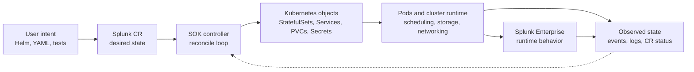

# Required Kubernetes Knowledge

This section is a living onboarding checklist. It will be updated as the team's
supported platforms evolve.

## Baseline knowledge

You should be comfortable with the following before making non-trivial SOK code
changes:

- `kubectl` workflows: `get`, `describe`, `apply`, `delete`, `logs`, `exec`,
  `port-forward`, JSONPath output, and YAML output.
- Workloads and pod lifecycle: Pods, Deployments, StatefulSets, init
  containers, container readiness, restart behavior, image pulls, probes, and
  events.
- Storage basics: PersistentVolumes, PersistentVolumeClaims, StorageClasses,
  volume mounts, access modes, and how storage failures appear in pods and
  events.
- Configuration and secrets: ConfigMaps, Secrets, projected volumes,
  environment variables, image pull secrets, and the risks around logging or
  committing secret values.
- RBAC and identity: ServiceAccounts, Roles, ClusterRoles, RoleBindings,
  ClusterRoleBindings, and how operator permissions differ between
  namespace-scoped and cluster-wide installs.
- CRDs and the operator pattern: custom resources, `spec` as desired state,
  `status` as observed state, reconciliation loops, status conditions,
  watches, owner references, and finalizer-driven cleanup.

## How to gain it

See the official Kubernetes documentation:

- Read the Kubernetes [concepts overview](https://kubernetes.io/docs/concepts/overview/),
  [kubectl quick reference](https://kubernetes.io/docs/reference/kubectl/quick-reference/),
  [debugging applications](https://kubernetes.io/docs/tasks/debug/debug-application/),
  [custom resources](https://kubernetes.io/docs/concepts/extend-kubernetes/api-extension/custom-resources/),
  [operator pattern](https://kubernetes.io/docs/concepts/extend-kubernetes/operator/),
  and [StatefulSets](https://kubernetes.io/docs/concepts/workloads/controllers/statefulset/)
  pages.
- For beginners, take the [Coursera Kubernetes for Beginners](https://www.coursera.org/learn/kubernetes-for-absolute-beginners)
  course, including hands-on labs. Cisco offers a free [Coursera Subscription](https://cisco.edcast.com/insights/ECL-206ca16e-7798-4da3-8cce-dc67792cb955),
  paid by the ELT level.
- For more advanced users, take the [Certified Kubernetes Application Developer (CKAD)](https://www.oreilly.com/videos/certified-kubernetes-application/9780138086558/)
  course on O'Reilly. Cisco offers a free [O'Reilly subscription](https://cisco.edcast.com/insights/ECL-3799144b-6da6-4242-8793-cabc08087dda),
  paid by the ELT level. Taking this course prepares you for the CKAD exam, but does not give you the cerification.

# What is SOK?

SOK is the Splunk Operator for Kubernetes. Operators are software extensions
to Kubernetes that make use of custom resources to manage applications and
their components. SOK is the [Kubernetes operator](https://kubernetes.io/docs/concepts/extend-kubernetes/operator/)
that deploys and operates Splunk Enterprise on Kubernetes by reconciling
Splunk custom resources into Kubernetes resources, pods, services, storage,
and Splunk configuration.

This page is written for internal Splunk engineers building SOK operators,
controllers, CRDs, tests, and supporting automation. It explains the operating
boundaries of SOK and the layer model to keep in mind when changing controller
behavior. It is intended to enhance public (customer) SOK documentation, and contribution
expectations. All documentation on this page NOT included in this "Internal Onboarding"
section is available to the public on [GitHub](https://splunk.github.io/splunk-operator/).

## What SOK is

SOK is:

- A Kubernetes operator for deploying and operating Splunk Enterprise on Kubernetes.
- A set of Custom Resource Definitions (CRDs) and controllers that automate
  Kubernetes resource creation and Splunk topology orchestration.
- A supported deployment method for distributed Splunk Enterprise environments
  using containers, subject to the applicable Splunk support policy terms.
- An open-source project with public documentation, releases, Helm charts,
  examples, and integration tests.
- A platform for Splunk Validated Architecture style topologies such as S1,
  C3, and M4, plus patterns such as index and ingestion separation.

In practical terms, users describe the Splunk Enterprise topology they want,
and SOK drives Kubernetes and Splunk-side setup toward that declared state. The
operator owns the workflows it implements, such as creating StatefulSets,
Services, ConfigMaps, Secrets, PVCs, and related Splunk orchestration steps.

## What SOK is not

SOK is not:

- A replacement for Kubernetes cluster administration.
- A replacement for Splunk Enterprise architecture, capacity, security, or
  storage planning.
- A general-purpose Kubernetes operator framework.
- A guarantee that all Splunk-side configuration is correct. SOK manages
  defined operator-owned workflows, while Splunk Enterprise still owns many
  runtime behaviors.
- A substitute for service-team operational ownership.

This distinction matters when designing controller changes. SOK should automate
the parts of Splunk Enterprise on Kubernetes that are part of the operator
contract, but it should not hide missing cluster prerequisites, bypass normal
Splunk architecture decisions, or assume ownership of every runtime state that
Splunk Enterprise exposes.

## Relationship to Kubernetes and Splunk Enterprise

SOK follows the Kubernetes operator pattern:

- CRDs extend the Kubernetes API with Splunk resource types.
- Users declare desired Splunk topology in custom resource specs.
- Controllers watch Splunk custom resources and dependent resources through
  controller-runtime.
- Reconciliation translates desired state into Kubernetes API objects and
  Splunk configuration.
- Kubernetes schedules and restarts pods; SOK observes state and updates custom
  resource status.
- Splunk Enterprise runs inside the pods and exposes Splunk-specific APIs, UI
  behavior, and runtime state.

At a high level, SOK sits between declared Splunk intent and the Kubernetes
objects that make that intent real:

For controller builders, the important boundary is that SOK does not directly
"run Splunk" in the abstract. It declares and manages Kubernetes objects,
performs supported Splunk orchestration actions, and records observed progress.
Kubernetes remains responsible for the cluster control plane, scheduling,
storage attachment, networking primitives, and container lifecycle. Splunk
Enterprise remains responsible for Splunk runtime behavior inside the
containers.

## Public-facing docs to start from

<!-- TODO: Update these as more consolidated documentation happens. -->

Use the public docs as the source of truth for supported user workflows. Use
this internal documentation to connect those workflows to development setup,
controller implementation expectations, test strategy, and operational
troubleshooting.

| Task | Start with |
| --- | --- |
| I need to inspect current source, issues, releases, or PR history. | [GitHub repository](https://github.com/splunk/splunk-operator) |
| I need to install SOK. | [Getting Started](../GettingStarted.md), [Advanced installation](../deploy/Install.md), [Helm](../deploy/Helm.md) |
| I need to understand a CR field. | [Custom resources](../operate/CustomResources.md), [Examples](../reference/Examples.md) |
| I need to debug a failing test. | [Integration testing](../develop/IntegrationTesting.md), [Logging and events](../develop/LoggingAndEvents.md), [Kubernetes collectors](../platforms/K8SCollectors.md) |
| I need to change controller behavior. | [Custom resources](../operate/CustomResources.md), [Logging and events](../develop/LoggingAndEvents.md), [Feature gates](../develop/FeatureGates.md) |
| I need to investigate a customer cluster. | [Kubernetes collectors](../platforms/K8SCollectors.md), [Getting Started](../GettingStarted.md), [Advanced installation](../deploy/Install.md) |
| I need to work on ingestion separation. | [Index and ingestion separation](../deploy/IndexIngestionSeparation.md), [Custom resources](../operate/CustomResources.md), [Examples](../reference/Examples.md) |
