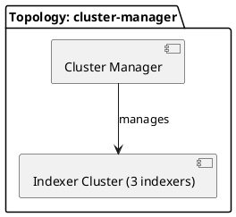

# Splunk Operator E2E Test Framework

Modern, declarative end-to-end testing framework for Splunk Operator with built-in observability.

## Table of Contents

- [Quick Start](#quick-start)
- [Overview](#overview)
- [Test Specification Format](#test-specification-format)
- [Running Tests](#running-tests)
- [Observability](#observability)
- [Troubleshooting](#troubleshooting)
- [Test Organization](#test-organization)
- [Available Actions](#available-actions)
- [Best Practices](#best-practices)
- [Debugging](#debugging)
- [Advanced Features](#advanced-features)
- [Running Tests](#running-tests)

## Overview

The E2E Test Framework is a declarative, YAML-based testing system that enables comprehensive end-to-end testing of the Splunk Operator for Kubernetes. Write tests in YAML, not Go code, and leverage built-in topologies, actions, and assertions.

### Why Use This Framework?

**Benefits:**
- **Fast Test Development** - Write tests in minutes with YAML specs
- **Clear Test Intent** - Self-documenting test specifications
- **Reliable** - Built-in retry logic and timeout warnings
- **Maintainable** - Framework updates don't require test rewrites
- **Comprehensive** - Test deployments, upgrades, configurations, and data flow

**Use Cases:**
- Smoke testing operator deployments
- Integration testing cluster configurations
- Upgrade and rollback scenarios
- License configuration validation
- Data ingestion and search verification
- Custom Resource CRUD operations

## Goals

- Modular execution with step registry
- Spec-driven tests to scale to thousands of cases
- Structured logs, metrics, and knowledge graph output
- Clean separation between data, topology, and assertions

## Quick Start

### Prerequisites

- Kubernetes cluster (EKS, GKE, AKS, or local)
- kubectl configured
- Splunk Operator deployed
- Go 1.21+ (for building)
- splunk.lic file (for license tests)

## Running

Basic run (loads specs under `e2e/specs`):

```
E2E_SPEC_DIR=./e2e/specs E2E_DATASET_REGISTRY=./e2e/datasets/datf-datasets.yaml \
  go run ./e2e/cmd/e2e-runner
```

Key env vars:

- `E2E_SPEC_DIR`: directory containing spec files
- `E2E_DATASET_REGISTRY`: dataset registry YAML
- `E2E_ARTIFACT_DIR`: where to write results/graph/metrics
- `E2E_CAPABILITIES`: comma-separated capability list to enable optional tests
- `E2E_TOPOLOGY_MODE`: `suite` (default) or `test` for per-test topology
- `E2E_LOG_COLLECTION`: `failure` (default), `always`, or `never`
- `E2E_SPLUNK_LOG_TAIL`: tail N lines of Splunk internal logs (0 = full file)
- `E2E_OTEL_ENABLED`: enable OTLP metrics/traces
- `E2E_OTEL_ENDPOINT`: OTLP gRPC endpoint (host:port)
- `E2E_OTEL_HEADERS`: OTLP headers as comma-separated key=value pairs
- `E2E_OTEL_INSECURE`: disable TLS for OTLP endpoint (default true)
- `E2E_OTEL_SERVICE_NAME`: service name for OTel resources
- `E2E_OTEL_RESOURCE_ATTRS`: extra OTel resource attributes as key=value pairs
- `E2E_NEO4J_ENABLED`: enable Neo4j graph export
- `E2E_NEO4J_URI`: Neo4j connection URI
- `E2E_NEO4J_USER`: Neo4j username
- `E2E_NEO4J_PASSWORD`: Neo4j password
- `E2E_NEO4J_DATABASE`: Neo4j database name (default `neo4j`)

DATF dataset support (objectstore-backed):

- `DATF_S3_BUCKET`: bucket name containing DATF datasets
- `DATF_S3_PREFIX`: prefix path for dataset objects (include trailing slash if needed)
- `S3_REGION` or `AWS_REGION`: region for S3 access

Dataset sources can be `s3`, `gcs`, `azure`, `minio`, or `objectstore`; use `E2E_OBJECTSTORE_*` for credentials and optional per-dataset overrides via `settings` (for example `objectstore_endpoint`).

Object store access (used by objectstore.* steps and dataset fetch):

- `E2E_OBJECTSTORE_PROVIDER`: `s3`, `gcs`, or `azure`
- `E2E_OBJECTSTORE_BUCKET`: bucket/container name
- `E2E_OBJECTSTORE_PREFIX`: base prefix for object keys
- `E2E_OBJECTSTORE_REGION`: region (S3)
- `E2E_OBJECTSTORE_ENDPOINT`: endpoint override (S3/Azure)
- `E2E_OBJECTSTORE_ACCESS_KEY`: access key (S3)
- `E2E_OBJECTSTORE_SECRET_KEY`: secret key (S3)
- `E2E_OBJECTSTORE_SESSION_TOKEN`: session token (S3)
- `E2E_OBJECTSTORE_S3_PATH_STYLE`: set to `true` for path-style S3 endpoints
- `E2E_OBJECTSTORE_GCP_PROJECT`: GCP project ID
- `E2E_OBJECTSTORE_GCP_CREDENTIALS_FILE`: path to GCP credentials JSON
- `E2E_OBJECTSTORE_GCP_CREDENTIALS_JSON`: raw GCP credentials JSON
- `E2E_OBJECTSTORE_AZURE_ACCOUNT`: Azure storage account name
- `E2E_OBJECTSTORE_AZURE_KEY`: Azure storage account key
- `E2E_OBJECTSTORE_AZURE_ENDPOINT`: Azure blob endpoint override
- `E2E_OBJECTSTORE_AZURE_SAS_TOKEN`: Azure SAS token (optional, use instead of key)

Regenerate the DATF dataset registry from core_datf conftests:

```
python3 e2e/tools/datf_extract.py --qa-root /path/to/splunkd/qa \
  --output e2e/datasets/datf-datasets.yaml
```

Artifacts are written to `e2e/artifacts/<run-id>` by default.

## Spec Variants

Use `variants` to clone a base spec with different names/tags (and optional topology params) without duplicating steps:

```yaml
apiVersion: e2e.splunk.com/v1
kind: Test
metadata:
  name: operator_secret_s1_update
  tags: [operator, secret, s1, integration]
variants:
  - name: operator_secret_manager_s1_update
    tags: [managersecret]
  - name: operator_secret_master_s1_update
    tags: [mastersecret]
steps:
  - name: deploy
    action: topology.deploy
```

`step_overrides` can update specific steps for a variant without duplicating the full spec:

```yaml
variants:
  - name: operator_secret_master_c3_update
    step_overrides:
      - name: deploy
        with:
          cluster_manager_kind: master
          license_manager_ref: null
      - name: deploy_license_manager
        action: splunk.license_master.deploy
```

When `replace: true` is set, the step is replaced entirely. Otherwise, `with` keys merge, and `null` removes a key.

## App Framework

Use the app framework steps to build and apply AppFrameworkSpec settings:

```yaml
steps:
  - name: appframework_spec
    action: appframework.spec.build
    with:
      provider: s3
      bucket: ${E2E_OBJECTSTORE_BUCKET}
      prefix: apps/
      volume_name: app-volume
      app_source_name: appsource
      location: release
  - name: apply_appframework
    action: appframework.apply
    with:
      target_kind: clustermanager
      target_name: ${cluster_manager_name}
      spec_path: ${last_appframework_spec_path}
      replace: true
```

If `provider`, `bucket`, or credentials are omitted, the `E2E_OBJECTSTORE_*` settings are used.

## Observability

The framework provides comprehensive observability for test runs:

### Metrics and Traces
- Metrics and traces export over OTLP when OTel is enabled, so you can route to Prometheus/Tempo with an OTel Collector.
- Logs are written to artifacts; ship them to Loki with promtail/agent if desired.
- Graph export pushes `graph.json` data to Neo4j for querying and support analysis.

### PlantUML Diagrams (Auto-generated)

The framework automatically generates visual PlantUML diagrams for every test run when `-graph` is enabled (default):

**Generated Diagrams** (in `artifacts/` directory):
- `topology.plantuml` - Visual topology architecture showing components and relationships
- `run-summary.plantuml` - Test run statistics with pass/fail breakdown
- `failure-analysis.plantuml` - Failure patterns grouped by error type
- `test-sequence-<name>.plantuml` - Step-by-step execution flow for each test (first 10 tests)

**Viewing Diagrams**:
```bash
# Generate PNG images
brew install plantuml  # or apt-get install plantuml
cd artifacts/
plantuml *.plantuml    # Creates .png files

# Or use VS Code with PlantUML extension
code --install-extension jebbs.plantuml
code artifacts/topology.plantuml  # Press Alt+D to preview

# Or paste into online editor
open http://www.plantuml.com/plantuml/uml/
```

**Example Topology Diagram**:


**Example Sequence Diagram**:
```plantuml
Test Runner -> K8s API: 1. k8s_create (2.1s) ✓
K8s API -> Test Runner: Created ✓
Test Runner -> K8s API: 2. k8s_wait_for_pod (120s) ✓
K8s API -> Test Runner: Pod ready ✓
```

**Benefits**:
- 📊 Visual understanding of test execution
- 🐛 Faster failure debugging with sequence diagrams
- 📖 Auto-updated architecture documentation
- 🔍 Pattern recognition for common failures
- 👥 Better PR reviews with visual test changes

---

# Writing Tests

## Basic Test Structure

Every test follows this YAML structure:

```yaml
apiVersion: e2e.splunk.com/v1
kind: Test
metadata:
  name: my_test_name              # Unique identifier
  description: "What this tests"  # Human-readable description
  tags: [operator, smoke, s1]    # Tags for test selection
topology:
  kind: s1                        # Topology (s1, c3, m4, etc.)
  params:                         # Optional topology parameters
    custom_param: value
steps:
  - name: step_name               # Step identifier
    action: action.name           # Action to execute
    with:                         # Action parameters
      param1: value1
```

## Simple Example

```yaml
apiVersion: e2e.splunk.com/v1
kind: Test
metadata:
  name: test_standalone_deployment
  description: "Verify standalone Splunk deployment becomes ready"
  tags: [operator, smoke, s1]
topology:
  kind: s1  # Standalone deployment
steps:
  - name: deploy
    action: topology.deploy

  - name: wait_ready
    action: topology.wait_ready

  - name: verify_phase
    action: assert.splunk.phase
    with:
      kind: Standalone
      name: ${standalone_name}
      phase: Ready
```

## Using Variables

Tests support variable substitution with `${variable_name}`:

**Topology Variables** (auto-available):
- `${namespace}` - Test namespace
- `${base_name}` - Base name for resources
- `${standalone_name}` - Standalone CR name (s1 topology)
- `${cluster_manager_name}` - Cluster manager name (c3, m4)
- `${indexer_cluster_name}` - Indexer cluster name
- `${search_head_cluster_name}` - Search head cluster name

**Example:**

```yaml
- name: patch_standalone
  action: k8s.resource.patch
  with:
    kind: Standalone
    name: ${standalone_name}  # Uses topology variable
    spec:
      resources:
        limits:
          cpu: "6"
```

# Test Organization

## Test Suites

**Smoke Tests** (`smoke.yaml`, `smoke_fast.yaml`):
- Fast validation (<5 minutes)
- Run before merging PRs
- Basic functionality verification

**Integration Tests**:
- Comprehensive feature testing
- Complex scenarios (5-20 minutes)
- License, upgrade, data flow tests

## Tagging Strategy

```yaml
tags: [operator, smoke, fast, s1]
#      Component  Suite  Speed  Topology
```

**Common Tags:**
- Component: `operator`, `app`, `storage`
- Suite: `smoke`, `integration`, `upgrade`
- Speed: `fast` (<2 min), `slow` (>10 min)
- Topology: `s1`, `c3`, `m4`
- Feature: `license`, `crcrud`, `search`

**Run by Tags:**

```bash
# Fast smoke tests
-include-tags fast

# All s1 topology
-include-tags s1

# Integration without slow tests
-include-tags integration -exclude-tags slow
```

# Available Actions

## Topology Actions

### topology.deploy
Deploy the base topology (standalone, cluster, etc.)

```yaml
- name: deploy
  action: topology.deploy
```

### topology.wait_ready
Wait for topology to become ready

```yaml
- name: wait
  action: topology.wait_ready
  with:
    timeout: 600s  # Optional
```

### topology.wait_stable
Wait for topology to stabilize (no pod restarts)

```yaml
- name: stable
  action: topology.wait_stable
```

## Kubernetes Resource Actions

### k8s.resource.patch
Patch a Kubernetes resource

```yaml
- name: update_cpu
  action: k8s.resource.patch
  with:
    kind: Standalone
    name: ${standalone_name}
    spec:
      resources:
        limits:
          cpu: "6"
```

### k8s.resource.delete
Delete a resource

```yaml
- name: cleanup
  action: k8s.resource.delete
  with:
    kind: Standalone
    name: ${standalone_name}
```

## Splunk Deployment Actions

### splunk.license_manager.deploy
Deploy LicenseManager CR

```yaml
- name: deploy_lm
  action: splunk.license_manager.deploy
  with:
    name: ${base_name}
    configmap: ${license_configmap}
```

### splunk.license_manager.wait_ready
Wait for LicenseManager to be ready

```yaml
- name: wait_lm
  action: splunk.license_manager.wait_ready
```

### splunk.monitoring_console.deploy
Deploy MonitoringConsole CR

```yaml
- name: deploy_mc
  action: splunk.monitoring_console.deploy
  with:
    name: ${base_name}
```

## License Configuration

### license.configmap.ensure
Ensure license ConfigMap exists

```yaml
- name: license
  action: license.configmap.ensure
  with:
    path: ./splunk.lic
```

### splunk.license_manager.verify_configured
Verify license is configured on pods (with retry logic)

```yaml
- name: verify
  action: splunk.license_manager.verify_configured
  with:
    pods:
      - splunk-${standalone_name}-standalone-0
    expected_contains: "license-manager-service:8089"
    retries: 30           # Optional: default 30
    retry_interval: 2s    # Optional: default 2s
```

## Search and Data Actions

### splunk.search.sync
Execute synchronous search

```yaml
- name: search
  action: splunk.search.sync
  with:
    query: "search index=_internal | stats count"
```

### splunk.ingest.oneshot
Ingest data via oneshot

```yaml
- name: ingest
  action: splunk.ingest.oneshot
  with:
    index: test_index
    data_var: my_data
```

## Assertion Actions

### assert.splunk.phase
Assert CR phase

```yaml
- name: check_ready
  action: assert.splunk.phase
  with:
    kind: Standalone
    name: ${standalone_name}
    phase: Ready
```

### assert.k8s.pod.cpu_limit
Assert pod CPU limit

```yaml
- name: check_cpu
  action: assert.k8s.pod.cpu_limit
  with:
    pod: splunk-${standalone_name}-standalone-0
    cpu: "4"
```

### assert.cluster.rf_sf
Assert replication/search factors

```yaml
- name: check_factors
  action: assert.cluster.rf_sf
```

### assert.search.count
Assert search result count

```yaml
- name: verify
  action: assert.search.count
  with:
    expected: 100
```

# Best Practices

## Test Design

**1. Keep Tests Focused**
- One test = one behavior
- Use descriptive names
- Add clear descriptions

```yaml
# Good
metadata:
  name: test_standalone_cpu_update
  description: "Verify CPU limit updates trigger pod recreation"

# Bad
metadata:
  name: test_stuff
```

**2. Use Appropriate Topologies**
- `s1` - Single standalone
- `c3` - 3 indexers + 3 search heads
- `m4` - Multisite cluster (4 sites)

**3. Verify State Transitions**

```yaml
- name: phase_updating
  action: assert.splunk.phase
  with:
    phase: Updating

- name: phase_ready
  action: assert.splunk.phase
  with:
    phase: Ready
```

**4. Use Tags Correctly**

```yaml
tags: [operator, integration, upgrade, c3]
#      Component Suite      Feature  Topo
```

## Performance

**1. Separate Fast/Slow Tests**

```yaml
# Fast
tags: [operator, smoke, fast, s1]

# Slow
tags: [operator, integration, slow, m4]
```

**2. Reuse Topologies**
- Tests with same topology run sequentially
- Topology deployed once, reused
- Much faster than individual deploys

## Error Handling

**1. Set Timeouts**

```yaml
- name: long_op
  action: some.action
  with:
    timeout: 10m
```

**2. Leverage Retry Logic**
License verification automatically retries 30 times over 60 seconds.

# Debugging

## Enhanced Logging

The framework provides detailed step-level logging:

```json
{"level":"info","msg":"step start","test":"my_test","step":"deploy","action":"topology.deploy"}
{"level":"info","msg":"step complete","test":"my_test","step":"deploy","duration":0.5}
{"level":"warn","msg":"step completed but took longer than 2 minutes","duration":185.3}
```

## Timeout Warnings

Steps >2 minutes automatically log warnings:

```json
{"level":"warn","msg":"step completed but took longer than 2 minutes",
 "step":"wait_license_manager","duration":297.234}
```

## Common Issues

**Pods not ready:**
```bash
kubectl get pods -n <namespace>
kubectl logs <pod> -n <namespace>
kubectl logs -n splunk-operator deployment/splunk-operator
```

**Test timeout:**
- Increase: `-default-timeout 30m`
- Check cluster resources
- Verify operator running

See `DEBUGGING_GUIDE.md` for detailed instructions.

# Examples

## Example 1: Simple Smoke Test

```yaml
apiVersion: e2e.splunk.com/v1
kind: Test
metadata:
  name: smoke_standalone
  description: "Fast smoke test for standalone"
  tags: [operator, smoke, fast, s1]
topology:
  kind: s1
steps:
  - name: deploy
    action: topology.deploy
  - name: wait_ready
    action: topology.wait_ready
  - name: wait_stable
    action: topology.wait_stable
```

## Example 2: CPU Update Test

```yaml
apiVersion: e2e.splunk.com/v1
kind: Test
metadata:
  name: test_cpu_update
  tags: [operator, integration, crcrud, s1]
topology:
  kind: s1
steps:
  - name: deploy
    action: topology.deploy
  - name: wait_ready
    action: topology.wait_ready

  - name: cpu_before
    action: assert.k8s.pod.cpu_limit
    with:
      pod: splunk-${standalone_name}-standalone-0
      cpu: "4"

  - name: update_cpu
    action: k8s.resource.patch
    with:
      kind: Standalone
      name: ${standalone_name}
      spec:
        resources:
          limits:
            cpu: "6"

  - name: phase_ready
    action: assert.splunk.phase
    with:
      kind: Standalone
      name: ${standalone_name}
      phase: Ready

  - name: cpu_after
    action: assert.k8s.pod.cpu_limit
    with:
      pod: splunk-${standalone_name}-standalone-0
      cpu: "6"
```

## Example 3: License Test

```yaml
apiVersion: e2e.splunk.com/v1
kind: Test
metadata:
  name: test_license_manager
  tags: [operator, integration, license, s1]
topology:
  kind: s1
steps:
  - name: deploy
    action: topology.deploy

  - name: ensure_license
    action: license.configmap.ensure
    with:
      path: ./splunk.lic

  - name: deploy_lm
    action: splunk.license_manager.deploy

  - name: wait_lm
    action: splunk.license_manager.wait_ready

  - name: configure_standalone
    action: k8s.resource.patch
    with:
      kind: Standalone
      name: ${standalone_name}
      spec:
        licenseManagerRef:
          name: ${license_manager_name}

  - name: wait_standalone
    action: assert.splunk.phase
    with:
      kind: Standalone
      name: ${standalone_name}
      phase: Ready

  - name: verify_license
    action: splunk.license_manager.verify_configured
    with:
      pods:
        - splunk-${standalone_name}-standalone-0
```

# Contributing

## Adding New Actions

1. Create handler in `framework/steps/handlers_*.go`
2. Register in `Register*Handlers` function
3. Document in this README
4. Add test using new action

## Adding New Topologies

1. Add function in `framework/topology/`
2. Update topology registry
3. Document parameters
4. Create example tests

# Additional Resources

- **DEBUGGING_GUIDE.md** - Detailed debugging instructions
- **framework/steps/** - Action implementations
- **specs/operator/** - Example tests

# Support

For issues:
1. Check example tests in `specs/operator/`
2. Review `DEBUGGING_GUIDE.md`
3. Check operator logs
4. File issues in project repository
