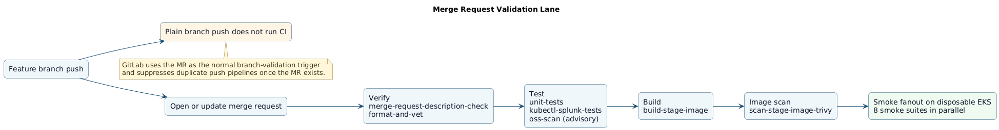
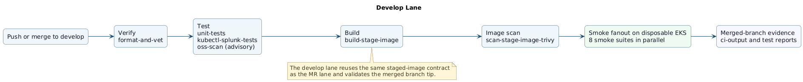
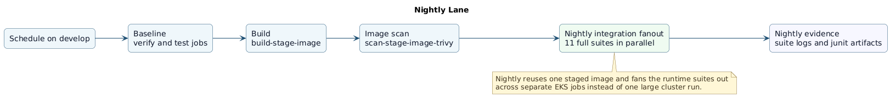
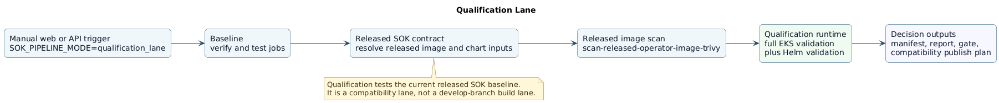
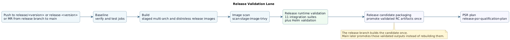
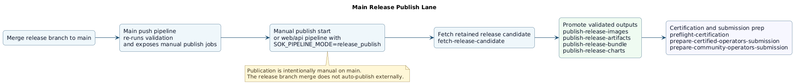

# GitLab CI

This directory is the checked-in GitLab CI implementation for `sok/splunk-operator`.
The top-level [`.gitlab-ci.yml`](../.gitlab-ci.yml) only decides which lane is allowed to run.
The actual lane behavior lives in the YAML modules and scripts under `gitlab-ci/`.

The operating model is:

- merge requests validate normal code changes
- `develop` re-runs the same validation after merge
- the nightly schedule runs broader runtime coverage on `develop`
- qualification is a manual compatibility decision lane
- release validation runs on `release/*` or `release-*` branches and on the matching MR to `main`
- `main` never rebuilds for release publication; it promotes the validated release-candidate outputs from the release branch

## Trigger Map

[`gitlab-ci/includes/admin.yml`](includes/admin.yml) defines the one-off admin jobs and the daily scheduled GitHub intake backfill and GitHub mirror health-check jobs. The daily lane defaults to the public `splunk/splunk-operator` GitHub repository, so the schedule needs `SOK_PIPELINE_MODE=github_admin_daily`, `PIPELINE_GITHUB_INTAKE_TOKEN` for GitHub auto-discovery, and `PIPELINE_GITLAB_API_TOKEN` for GitLab issue or merge-request creation unless a different mirror target is required.

For a one-off manual intake run, trigger a pipeline with `SOK_PIPELINE_MODE=github_intake` and pass comma-separated GitHub numbers through `PIPELINE_GITHUB_INTAKE_ISSUES` and `PIPELINE_GITHUB_INTAKE_PRS`. Example: `PIPELINE_GITHUB_INTAKE_ISSUES=1234,1250` and `PIPELINE_GITHUB_INTAKE_PRS=812,815`. Set `PIPELINE_GITHUB_INTAKE_DRY_RUN=true` if you want the report artifacts without creating GitLab issues or merge requests. Manual runs that use only explicit issue or PR numbers do not require `PIPELINE_GITHUB_INTAKE_TOKEN`; auto-discovery does.

[`gitlab-ci/includes/release.yml`](includes/release.yml) defines the release-branch validation lane, the main-branch publish jobs, Red Hat preflight certification, and the operator-catalog submission-prep jobs.

[`gitlab-ci/github-intake-backfill.py`](github-intake-backfill.py) backfills selected GitHub issues and PRs into GitLab issue and MR records, and the daily admin lane can auto-discover recently updated GitHub items without manual number input.

[`gitlab-ci/mirror-health-check.sh`](mirror-health-check.sh) performs a read-only branch parity check against the configured GitHub mirror repository.

[`gitlab-ci/release-candidate-artifacts.sh`](release-candidate-artifacts.sh), [`gitlab-ci/fetch-release-candidate.sh`](fetch-release-candidate.sh), [`gitlab-ci/release-publish-images.sh`](release-publish-images.sh), [`gitlab-ci/release-publish-artifacts.sh`](release-publish-artifacts.sh), [`gitlab-ci/release-publish-bundle.sh`](release-publish-bundle.sh), and [`gitlab-ci/release-publish-charts.sh`](release-publish-charts.sh) implement the checked-in release path: package once on the release branch, then promote or publish those validated outputs on `main`.

| Event | Pipeline behavior | What automation does | What the user needs to do |
| --- | --- | --- | --- |
| Feature branch push without an MR | No pipeline by design | Prevents duplicate or low-signal branch pipelines | Open or update the merge request |
| Merge request event | MR validation lane | Verify, test, build, scan, and smoke-test the commit | Fill the MR template, watch the MR pipeline, address findings |
| Push or merge to `develop` | Develop lane | Re-runs baseline validation and smoke fanout on the merged branch | Nothing unless the merged branch fails |
| Scheduled pipeline on `develop` | Nightly lane | Re-runs the baseline and then runs the full nightly integration fanout | Review nightly failures and fix the repo or infrastructure issue |
| Web or API pipeline with `SOK_PIPELINE_MODE=qualification_lane` | Qualification lane | Tests the latest released SOK image and chart path against the qualification inputs, then writes the report and gate result | Trigger the lane intentionally and review the report/gate output |
| Push to `release/<version>` or `release-<version>` | Release validation lane | Builds the release candidate once, runs full release validation, then packages the candidate outputs | Fix the release branch until the branch pipeline is green |
| MR from `release/*` to `main` | Release validation lane again | Re-runs release validation on the reviewed release-branch tip | Update changelog or release notes, open the MR, get review and approval |
| Push to `main` after merge | Main validation plus manual publish jobs | Re-validates the merged `main` tip and exposes the publish jobs | Start the manual publish jobs only when the release is approved |
| Web or API pipeline on `main` with `SOK_PIPELINE_MODE=release_publish` | Publish-only rerun | Re-fetches a retained release candidate and re-runs the publish or certification path | Use only when the main publish path must be re-run intentionally |

The important rule is that ordinary feature-branch pushes do not run their own GitLab pipeline.
Branch validation is MR-driven.
GitLab also suppresses duplicate push pipelines once a branch already has an open MR.

## Merge Request Lane

The merge request lane is the normal branch-validation path.
It runs on `merge_request_event`, not on plain feature-branch pushes.
The lane checks the MR description template, runs repository verification, runs unit and `kubectl-splunk` tests, builds the staged operator image, scans that staged image with Trivy, and runs the smoke fanout on disposable EKS clusters.

In practice this means:

- authors open or update the MR
- GitLab validates the exact commit under review
- reviewers use the MR pipeline as the source of truth for normal code changes

## Develop Lane

The `develop` lane is the same baseline validation path on the merged branch.
It exists so the branch that the team integrates against is continuously verified with the same build and smoke contract as the MR lane.

Automation on `develop` does this:

- runs `format-and-vet`
- runs `unit-tests` and `kubectl-splunk-tests`
- runs advisory `oss-scan`
- builds the staged operator image
- scans the staged image
- runs the smoke fanout jobs

The user action is simply to watch the merged branch and fix `develop` quickly if this lane breaks.

## Nightly Lane

The nightly lane is the scheduled deep-runtime lane on `develop`.
It reuses the same baseline verification gates, builds the staged image once, scans it once, and then runs the full nightly integration fanout across separate EKS jobs.

What the nightly automation does:

- re-validates the repo baseline on the current `develop` tip
- reuses the staged image contract instead of rebuilding per suite
- runs the nightly integration suites in parallel
- writes per-suite `ci-output/` evidence for debugging and triage

What the user needs to do:

- keep the schedule enabled
- treat nightly failures as operational or product regressions to triage

## Qualification Lane

The qualification lane is the manual compatibility decision path.
It is intentionally separate from the normal `develop` and nightly flow because it answers a different question: whether the current released SOK baseline is compatible with the targeted release inputs.

What the qualification automation does:

- runs baseline repository verification and tests
- resolves the released-SOK contract
- scans the released operator image with Trivy
- runs the qualification EKS integration validation
- runs Helm validation against the released chart path
- writes the qualification manifest, report, gate result, and compatibility publish plan

What the user needs to do:

1. Trigger a web or API pipeline with `SOK_PIPELINE_MODE=qualification_lane`.
2. Review the report and gate output.
3. Decide whether the cycle stops at compatibility or needs to escalate into a product release.

## Release Validation Lane

The release validation lane is the product-release path for SOK itself.
It is triggered by a real `release/<version>` or `release-<version>` branch, and it also re-runs on the MR from that release branch to `main`.

What the release validation automation does:

- runs the baseline repository verification and tests
- builds the release candidate images once on the release branch
- builds both multi-arch and distroless staged images for the release path
- scans the staged release image
- runs the full release integration fanout
- runs the release Helm validation job
- packages the release-candidate artifacts only after validation
- records the PSR qualification plan

What it does not do:

- it does not publish GA images from the release branch
- it does not create the MR to `main`
- it does not auto-merge anything

## Main Release Publish Lane

After the release branch is reviewed and merged to `main`, GitLab creates a normal `main` push pipeline.
That `main` pipeline re-runs validation on the merged tip and exposes the release publish jobs as manual jobs.
The publish path can also be re-run later from a dedicated `main` web or API pipeline with `SOK_PIPELINE_MODE=release_publish`.

What the publish automation does on `main`:

- fetches the retained release-candidate artifacts from the validated release branch
- promotes the validated candidate operator and distroless images to GA tags
- prepares the validated deployment-artifact archive
- promotes the validated bundle and catalog images
- pushes the validated Helm charts to the approved OCI repository
- runs Red Hat preflight checks
- prepares the certified-operators and community-operators submission payloads

The important guardrail is that `main` promotes validated outputs.
It does not rebuild the product from source for publication.

## End-To-End Operator Process

### Normal code change

1. Push your feature branch.
2. Open or update the merge request.
3. Fill the MR template and let the MR lane run.
4. Address review and CI findings.
5. Merge to `develop`.
6. Watch the `develop` lane.
7. Let nightly continue to validate the integrated branch over time.

### Qualification cycle

1. Trigger the qualification lane intentionally with `SOK_PIPELINE_MODE=qualification_lane`.
2. Review the qualification report and gate result.
3. If qualification says no new SOK release is needed, stop there.
4. If qualification says a new SOK release is required, cut a release branch and move into the release flow.

### Product release

1. Cut `release/<version>` or `release-<version>`.
2. Let the release validation pipeline run on that branch.
3. Fix the branch until release validation is green.
4. Update changelog or release notes on the release branch.
5. Open the MR from the release branch to `main`.
6. Let the MR pipeline re-run on the final release-branch tip.
7. Get review and approval.
8. Merge to `main`.
9. Start the manual publish jobs on `main`, or start a dedicated `release_publish` pipeline on `main` if the publish path must be re-run intentionally.
10. Complete any external release steps that stay outside GitLab, such as the actual upstream PR submission or partner-portal approval.

### Patch release later

Keep the retained release branch.
When a patch is needed, make the patch change there, re-run the same release validation flow, update changelog or release notes again, merge that reviewed branch tip to `main`, and then run the publish path again with a new release-candidate number if needed.

## Inputs And Guardrails

The CI contract uses project or group variables under the `PIPELINE_*` prefix.
Lane-local defaults stay in YAML under the `JOB_*` prefix.
Runtime scripts always prefer `PIPELINE_*` so operators can override behavior without editing the repo code.

The most important operator-facing rules are:

- reuse existing `make` targets instead of writing bespoke CI build logic
- use the MR lane for normal branch validation
- use `qualification_lane` only for qualification
- use `release/*` or `release-*` branches for product-release validation
- treat `release_publish` as a manual `main`-branch action only
- never assume `main` publish should rebuild the product

## What GitLab Collects Automatically

The pipeline is designed to collect operator-facing evidence by default instead of making users reconstruct state from raw logs alone.

### Baseline jobs

- `unit-tests` publishes `unit_test.xml`, `coverage.out`, and `coverage-summary.txt`
- `kubectl-splunk-tests` publishes Cobertura coverage plus a text coverage summary
- `oss-scan` publishes the shared scanner output in the job log

### Build and image scan jobs

- `build-stage-image` writes image-reference and digest files such as `ci-output/build-test-push-workflow-image-ref.txt`
- release-validation builds also write distroless reference and digest files
- Trivy jobs write `*-trivy-results.txt`, `*-trivy-results.sarif`, and the scanned image ref
- most runtime and publish jobs write `ci-output/*-runtime-context.txt` so the exact inputs are recorded alongside the result

### Runtime integration and Helm jobs

- integration jobs write `ci-output/*-cluster.log`, `ci-output/*-cleanup.log`, copied pod logs, and `ci-output/*-inttest-junit.xml`
- Helm jobs write `ci-output/*-cluster.log`, `ci-output/*-cleanup.log`, `ci-output/*-kuttl.log`, `ci-output/*-kuttl-artifacts/`, and `ci-output/*-kuttl-junit.xml`
- GitLab surfaces the JUnit XML through the pipeline **Tests** tab, so users do not need to parse XML manually first

### Qualification jobs

- `released-sok-contract` writes `ci-output/release-controller/released-sok-contract.env` and related contract data
- `qualification-manifest` writes `qualification-manifest.json`, `.env`, and `.md`
- `qualification-report` writes `qualification-report.md`
- `compatibility-publish` and `qualification-gate` write the compatibility decision artifacts under `ci-output/release-controller/`

### Release and publish jobs

- `release-candidate-packaging` writes the retained `release-candidate-contract.env`, chart archives, release archive, artifact manifest, and summary
- `fetch-release-candidate` writes a local copy of the retained candidate set plus a summary
- `publish-release-images` writes `release-image-contract.env`
- `publish-release-bundle` writes `bundle-contract.env`
- `publish-release-artifacts`, `publish-release-charts`, and `preflight-certification` write operator-facing summaries under their `ci-output/*-output/` directories
- the certified/community operator submission jobs write PR-ready plan files rather than opening external PRs automatically

## How To Read Results And Triage Failures

### Start here

1. Open the pipeline graph and identify the lane from the trigger and job names.
2. Open the first failed job, not a downstream job that was skipped or cascaded.
3. Check the GitLab **Tests** tab if the failing job publishes JUnit.
4. Open the failed job artifacts and browse the `ci-output/` directory.
5. Read the matching `*-runtime-context.txt` or `summary.txt` file before digging through the full cluster log.

### Fastest triage path by failure type

- `merge-request-description-check`: the MR template is incomplete or the wrong template was used
- `format-and-vet`, `unit-tests`, `kubectl-splunk-tests`: repository code, formatting, unit tests, or local toolchain assumptions are broken
- `build-stage-image`: image build, registry auth, or staging-repository configuration is broken
- `scan-stage-image-trivy` or `scan-released-operator-image-trivy`: the scanned image has a vulnerability or the scanner input/auth path is wrong
- smoke, nightly, qualification, or release runtime jobs: the product behavior, cluster setup, or runtime environment is broken
- qualification report or gate jobs: one of the required upstream evidence jobs failed, is missing artifacts, or produced a failing decision
- release publish, preflight, or submission-prep jobs: the release contracts, publication targets, registry auth, or external release inputs are wrong

### Which files to open first

For verify and unit-test failures:

- the job log
- the GitLab **Tests** tab
- `unit_test.xml` or the `kubectl-splunk` coverage report if the failure is test-related

For image build and scan failures:

- `ci-output/*-runtime-context.txt`
- `ci-output/*-image-ref.txt`
- `ci-output/*-digest.txt`
- `ci-output/*-trivy-results.txt`

For integration-test failures:

- `ci-output/*-runtime-context.txt`
- `ci-output/*-cluster.log`
- `ci-output/*-cleanup.log`
- `ci-output/*-pod-logs/`
- `ci-output/*-inttest-junit.xml`

For Helm failures:

- `ci-output/*-runtime-context.txt`
- `ci-output/*-cluster.log`
- `ci-output/*-kuttl.log`
- `ci-output/*-kuttl-artifacts/`
- `ci-output/*-kuttl-junit.xml`

For qualification failures:

- `ci-output/release-controller/released-sok-contract.env`
- `ci-output/release-controller/qualification-manifest.md`
- `ci-output/release-controller/qualification-report.md`
- the Trivy text result and the qualification runtime JUnit files

For release and publish failures:

- `release-candidate-contract.env`
- `release-image-contract.env`
- `bundle-contract.env`
- the relevant `summary.txt`
- `artifact-manifest.txt` for packaged release artifacts
- preflight logs and `preflight-commands.md` for certification failures

### What success means by lane

| Lane | Green means | End result | Next human action |
| --- | --- | --- | --- |
| Merge request | The reviewed commit passed verify, test, build, scan, and smoke validation | The MR is technically ready for review or merge | Finish review and merge when appropriate |
| `develop` | The merged branch tip still passes the normal validation contract | `develop` remains healthy for the next change set | Fix `develop` immediately if this lane turns red |
| Nightly | The current `develop` tip passed the broader nightly runtime suites | Deeper runtime evidence is available for the integrated branch | Triage the first failed nightly suite if it breaks |
| Qualification | The qualification evidence is complete and the gate script produced its decision | Compatibility report, publish plan, and gate result are available | Decide whether to stop at compatibility or open a release branch |
| Release validation | The release branch tip passed full release validation and produced retained candidate outputs | The branch is ready for changelog/release-note finalization and MR review to `main` | Open or finish the release MR to `main` |
| `main` after merge | The merged `main` tip re-validated successfully and publish jobs are available | Manual release publication can begin from a validated merge | Start the publish jobs only after release approval |
| `release_publish` | The retained candidate was promoted and the downstream certification/prep jobs finished | GA publication evidence and submission-prep artifacts exist | Complete any remaining external submission or portal steps |

## Merge Request Templates And Validation

The repo now carries GitLab MR templates under [`.gitlab/merge_request_templates/`](../.gitlab/merge_request_templates/).

- [`Default.md`](../.gitlab/merge_request_templates/Default.md) is the normal template for CI and code changes
- [`Release.md`](../.gitlab/merge_request_templates/Release.md) is the release-branch to `main` template

The MR pipeline also runs [`gitlab-ci/validate-merge-request-description.sh`](validate-merge-request-description.sh) through the `merge-request-description-check` job.
That validation fails fast if the required template headings are missing.

## Key Files

- [`gitlab-ci/includes/base.yml`](includes/base.yml): shared stages, rules, and variable contract
- [`gitlab-ci/includes/baseline.yml`](includes/baseline.yml): repository verification and unit-test jobs
- [`gitlab-ci/includes/runtime.yml`](includes/runtime.yml): staged-image build, scan, smoke, nightly, and Helm runtime jobs
- [`gitlab-ci/includes/qualification.yml`](includes/qualification.yml): qualification manifest, report, gate, and publish-plan jobs
- [`gitlab-ci/includes/release.yml`](includes/release.yml): release validation, `main` publish, certification, and submission-prep jobs
- [`gitlab-ci/lib/pipeline-common.sh`](lib/pipeline-common.sh): shared runtime helpers
- [`gitlab-ci/diagrams/`](diagrams): PlantUML source and rendered PNGs for the documented lanes
