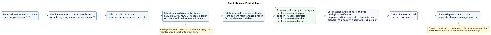

# GitLab CI

This directory is the checked-in GitLab CI implementation for `sok/splunk-operator`.
The top-level [`.gitlab-ci.yml`](../.gitlab-ci.yml) only decides which lane is allowed to run.
The actual lane behavior lives in the YAML modules and scripts under `gitlab-ci/`.

The operating model is:

- merge requests validate normal code changes
- `develop` re-runs the same validation after merge
- the nightly schedule runs broader runtime coverage on `develop`
- qualification is a manual compatibility decision lane
- release validation runs on `release/*` or `release-*` branches and on the matching MR to `main` or to another maintenance `release/*` branch
- normal releases publish from the validated `main` merge result
- patch releases publish intentionally from a protected maintenance `release/*` branch
- release publication never rebuilds the product; it promotes validated release-candidate outputs

## Trigger Map

[`gitlab-ci/includes/admin.yml`](includes/admin.yml) defines the one-off admin jobs and the daily scheduled GitHub intake backfill and GitHub mirror health-check jobs. The daily lane defaults to the public `splunk/splunk-operator` GitHub repository, so the schedule needs `SOK_PIPELINE_MODE=github_admin_daily`, `PIPELINE_GITHUB_INTAKE_TOKEN` for GitHub auto-discovery, and `PIPELINE_GITLAB_API_TOKEN` for GitLab issue or merge-request creation unless a different mirror target is required.

For a one-off manual intake run, trigger a pipeline with `SOK_PIPELINE_MODE=github_intake` and pass comma-separated GitHub numbers through `PIPELINE_GITHUB_INTAKE_ISSUES` and `PIPELINE_GITHUB_INTAKE_PRS`. Example: `PIPELINE_GITHUB_INTAKE_ISSUES=1234,1250` and `PIPELINE_GITHUB_INTAKE_PRS=812,815`. Set `PIPELINE_GITHUB_INTAKE_DRY_RUN=true` if you want the report artifacts without creating GitLab issues or merge requests. Manual runs that use only explicit issue or PR numbers do not require `PIPELINE_GITHUB_INTAKE_TOKEN`; auto-discovery does.

[`gitlab-ci/includes/release.yml`](includes/release.yml) defines the release-branch validation lane, the main-branch publish jobs, Red Hat preflight certification, and the operator-catalog submission-prep jobs.

[`gitlab-ci/github-intake-backfill.py`](github-intake-backfill.py) backfills selected GitHub issues and PRs into GitLab issue and MR records, and the daily admin lane can auto-discover recently updated GitHub items without manual number input.

[`gitlab-ci/mirror-health-check.sh`](mirror-health-check.sh) performs a read-only branch parity check against the configured GitHub mirror repository.

[`gitlab-ci/release-candidate-artifacts.sh`](release-candidate-artifacts.sh), [`gitlab-ci/fetch-release-candidate.sh`](fetch-release-candidate.sh), [`gitlab-ci/release-publish-images.sh`](release-publish-images.sh), [`gitlab-ci/release-publish-artifacts.sh`](release-publish-artifacts.sh), [`gitlab-ci/release-publish-bundle.sh`](release-publish-bundle.sh), and [`gitlab-ci/release-publish-charts.sh`](release-publish-charts.sh) implement the checked-in release path: package once on the release branch, then promote or publish those validated outputs either from `main` for a normal release or from a protected maintenance `release/*` branch for a patch release.

| Event | Pipeline behavior | What automation does | What the user needs to do |
| --- | --- | --- | --- |
| Feature branch push without an MR | No pipeline by design | Prevents duplicate or low-signal branch pipelines | Open or update the merge request |
| Merge request event | MR validation lane | Verify, test, build, scan, and smoke-test the commit | Fill the MR template, watch the MR pipeline, address findings |
| Push or merge to `develop` | Develop lane | Re-runs baseline validation and smoke fanout on the merged branch | Nothing unless the merged branch fails |
| Scheduled pipeline on `develop` | Nightly lane | Re-runs the baseline and then runs the full nightly integration fanout | Review nightly failures and fix the repo or infrastructure issue |
| Web, API, or downstream-triggered pipeline with `SOK_PIPELINE_MODE=qualification_lane` | Qualification lane | Tests the latest released SOK image and chart path against the qualification inputs, then writes the report and gate result | Trigger the lane intentionally and review the report/gate output |
| Push to `release/<version>` or `release-<version>` | Release validation lane | Builds the release candidate once, runs full release validation, then packages the candidate outputs | Fix the release branch until the branch pipeline is green |
| MR to `main` from `release/*`, or any MR targeting a maintenance `release/*` branch | Release validation lane again | Re-runs release validation on the reviewed release-target tip | Update changelog or release notes, open the MR, get review and approval |
| Push to `main` after merge | Main validation plus manual publish jobs | Re-validates the merged `main` tip and exposes the publish jobs | Start the manual publish jobs only when the release is approved |
| Web or API pipeline on `main` or a protected `release/*` branch with `SOK_PIPELINE_MODE=release_publish` | Publish-only release promotion | Re-fetches a retained release candidate and re-runs the publish or certification path | Use this on `main` for normal releases or on a maintenance `release/*` branch for a patch release |

Develop pipelines also publish prerelease Helm chart snapshots to fixed internal Artifactory Helm repositories once the staged operator image is built. Protected `main` and `develop` refs publish to `https://repo.splunkdev.net/artifactory/helm/sok/splunk-operator`; other stage refs publish to `https://repo.splunkdev.net/artifactory/helm-test/sok/splunk-operator`. Those snapshots use pipeline-derived prerelease chart versions so they do not collide with release chart versions, they keep `splunk-operator` and `splunk-enterprise` on the same version, they repackage `splunk-enterprise` with the matching `splunk-operator` dependency archive, and they default the operator chart to the exact staged internal image from the same pipeline.
This does not change the other lanes: qualification continues to validate the latest released chart path, and release publish continues to push only immutable validated release chart archives to the shared Artifactory Helm release repository.

Whenever the staged operator image is pushed to an internal Artifactory Docker registry, the same build job also generates a matching `splunk-operator-<image_tag>.tar.gz` deployment archive and publishes it to the generic `splunk-operator/` Artifactory path with the corresponding generic deployer role.

The important rule is that ordinary feature-branch pushes do not run their own GitLab pipeline.
Branch validation is MR-driven.
GitLab also suppresses duplicate push pipelines once a branch already has an open MR.

## Monitoring And Ownership

The regular monitoring split is:

- the MR author owns the MR pipeline until the merge request is green
- the integrating developer owns `develop` failures caused by their merge
- the team reviews the nightly schedule each workday and triages the first failed runtime job
- the person running qualification owns the qualification report, gate, and any missing inputs for that run
- the release driver owns the release branch and `main` publish path until the release is complete

The operational check is simple:

- start from the pipeline graph
- open the first failed job, not a skipped downstream job
- use the **Tests** tab plus `ci-output/` artifacts as the primary evidence
- treat repeated nightly failures as an operational item, not as something to rediscover ad hoc

## Merge Request Lane

The merge request lane is the normal branch-validation path.
It runs on `merge_request_event`, not on plain feature-branch pushes.
The same `merge_request_event` workflow rule supports GitLab merged results pipelines; GitLab creates a temporary merge-result commit and runs this lane against that commit instead of only the source branch tip.
The lane checks the MR description template and biased language, runs repository verification, runs unit, `kubectl-splunk`, and `helm-chart-tests` (lint and helm-unittest for all three charts), builds the staged operator image, scans that staged image with the prodsec `.container-scan` template, and runs the smoke fanout on disposable EKS clusters.

In practice this means:

- authors open or update the MR
- GitLab validates the temporary merge result of source plus target branch
- reviewers use the MR pipeline as the source of truth for normal code changes

Merged results pipeline guardrails:

- keep the top-level `.gitlab-ci.yml` `workflow: rules` entry for `CI_PIPELINE_SOURCE == "merge_request_event"` because include-only rules do not enable merge request pipelines by themselves
- do not add `rules:changes:compare_to` to the MR validation lane; merged results pipelines compare from a temporary merge commit and can make `compare_to` match target-branch changes unexpectedly

## Develop Lane

The `develop` lane is the same baseline validation path on the merged branch.
It exists so the branch that the team integrates against is continuously verified with the same build and smoke contract as the MR lane.

Automation on `develop` does this:

- runs `format-and-vet`
- runs `unit-tests` and `kubectl-splunk-tests`
- runs `helm-chart-tests` (lint and helm-unittest across all three charts: splunk-operator, splunk-enterprise, splunk-universalforwarder)
- runs advisory `oss-scan`
- builds the staged operator image
- scans the staged image
- runs the smoke fanout jobs

The user action is simply to watch the merged branch and fix `develop` quickly if this lane breaks.

## Nightly Lane

The nightly lane is the scheduled deep-runtime lane on `develop`.
It reuses the same baseline verification gates, builds the staged image once, scans it once, and then runs the full nightly integration fanout across separate EKS jobs.

What the nightly automation does:

- re-validates the repo baseline on the current `develop` tip
- reuses the staged image contract instead of rebuilding per suite
- runs the nightly integration suites in parallel, including `nightly-eks-integration-ufingest-validation` which deploys a `splunk-universalforwarder` Helm DaemonSet, forwards data to a Standalone CR, and asserts the standalone can index and search the forwarded events
- runs Azure validation and the GCP validation suite set against the staged nightly image
- writes per-suite `ci-output/` evidence for debugging and triage

What the user needs to do:

- keep the schedule enabled
- treat nightly failures as operational or product regressions to triage

## Qualification Lane

The qualification lane is the manual compatibility decision path.
It is intentionally separate from the normal `develop` and nightly flow because it answers a different question: whether the current released SOK baseline is compatible with the targeted release inputs.

What the qualification automation does:

- runs baseline repository verification and tests
- resolves the released-SOK contract
- scans the released operator image with the prodsec `.container-scan` template
- runs the qualification EKS integration validation
- runs qualification FIPS smoke and managersecret validation on the approved existing FIPS EKS cluster when `PIPELINE_FIPS_EKS_CLUSTER_NAME` is configured
- runs Azure validation against the released operator path
- runs the GCP validation suite set against the released operator path
- runs distroless runtime validation against the released distroless image
- runs the Graviton or arm64 runtime suite set from the existing `splunk-operator-cicd` arm64 matrix against the released multi-arch operator image when `PIPELINE_ENABLE_GRAVITON=true` or `PIPELINE_GRAVITON_ENTERPRISE_IMAGE` is configured
- runs Helm validation against the released chart path
- writes the qualification manifest, report, gate result, and compatibility publish plan

What the user needs to do:

1. Trigger a web, API, or downstream pipeline with `SOK_PIPELINE_MODE=qualification_lane`.
2. Review the report and gate output.
3. Decide whether the cycle stops at compatibility or needs to escalate into a product release.

Qualification inputs:

- required trigger: `SOK_PIPELINE_MODE=qualification_lane`
- required Splunk Enterprise runtime input: `PIPELINE_RUNTIME_ENTERPRISE_IMAGE=<repo:tag>`, for example `splunk/splunk:10.4.0`
- released SOK baseline: automatically resolved from the latest released `splunk-operator`
- supported pipeline sources: manual GitLab UI (`web`), direct API (`api`), trigger token (`trigger`), multi-project downstream (`pipeline`), or child pipeline (`parent_pipeline`)
- EKS runtime inputs: `PIPELINE_AWS_*`, `PIPELINE_EKS_VPC_PUBLIC_SUBNET_STRING`, `PIPELINE_EKS_VPC_PRIVATE_SUBNET_STRING`, `PIPELINE_TEST_BUCKET`, and `PIPELINE_TEST_INDEXES_S3_BUCKET`
- FIPS existing-cluster input: `PIPELINE_FIPS_EKS_CLUSTER_NAME` when FIPS qualification is part of the cycle
- Azure runtime inputs: either GitLab OIDC with `AZURE_CLIENT_ID`, `AZURE_TENANT_ID`, and `AZURE_SUBSCRIPTION_ID`, or `PIPELINE_AZURE_CREDENTIALS`, plus `PIPELINE_AZURE_ACR_LOGIN_SERVER`, `PIPELINE_AZURE_REGION`, `PIPELINE_AZURE_RESOURCE_GROUP_NAME`, `PIPELINE_AZURE_STORAGE_ACCOUNT`, `PIPELINE_AZURE_STORAGE_ACCOUNT_KEY`, `PIPELINE_AZURE_TEST_CONTAINER`, and `PIPELINE_AZURE_INDEXES_CONTAINER`
- GCP runtime inputs: either GitLab OIDC with `GCP_WORKLOAD_IDENTITY_PROVIDER` and `GCP_SERVICE_ACCOUNT_EMAIL`, or `PIPELINE_GCP_SERVICE_ACCOUNT_KEY`, plus `PIPELINE_GCP_ARTIFACT_REGISTRY`, `PIPELINE_GCP_PROJECT_ID`, `PIPELINE_GCP_REGION`, and `PIPELINE_GCP_ZONE`
- Graviton runtime input: set `PIPELINE_ENABLE_GRAVITON=true` to run the arm64 suites against the same `PIPELINE_RUNTIME_ENTERPRISE_IMAGE`; set `PIPELINE_GRAVITON_ENTERPRISE_IMAGE` only when arm64 needs a different repo:tag

Qualification runtime inventory:

- EKS full validation: one full released-SOK integration run in one EKS cluster
- FIPS existing-cluster validation: `tier:e2e-pr && feature:basic`, `tier:e2e-pr && variant:manager && feature:secret`
- Azure validation: `tier:e2e-full && cloud:azure`
- GCP validation: `tier:e2e-full && sva:s1 && cloud:gcp`, `tier:e2e-full && sva:c3 && cloud:gcp && variant:master`, `tier:e2e-full && sva:c3 && cloud:gcp && variant:manager`, `tier:e2e-full && sva:m4 && cloud:gcp && variant:master`, `tier:e2e-full && sva:m4 && cloud:gcp && variant:manager`
- Distroless validation: per-suite label-filters (`sva:s1 && feature:appframework`, `sva:c3 && variant:manager && feature:appframework`, `sva:m4 && variant:manager && feature:appframework`, `variant:manager && feature:secret`, `variant:manager && feature:smartstore`, `variant:manager && feature:monitoringconsole && suite:mc1`, `variant:manager && feature:monitoringconsole && suite:mc2`, `variant:manager && feature:crcrud`, `variant:manager && feature:licensemanager`, `variant:manager && feature:deletecr`, `feature:indingsep`)
- Graviton validation: `sva:s1 && feature:appframework`, `variant:manager && feature:secret`, `variant:manager && feature:smartstore`, `variant:manager && feature:monitoringconsole && suite:mc1`, `variant:manager && feature:monitoringconsole && suite:mc2`, `variant:manager && feature:crcrud`, `variant:manager && feature:licensemanager`, `variant:manager && feature:deletecr`, `feature:indingsep`
- Helm validation: full Helm chart path

## Release Validation Lane

The release validation lane is the product-release path for SOK itself.
It is triggered by a real `release/<version>` or `release-<version>` branch, and it also re-runs on reviewed MRs into the release targets: `release/*` to `main`, or any MR that targets a maintenance `release/*` branch.

What the release validation automation does:

- runs the baseline repository verification and tests
- builds the release candidate images once on the release branch
- builds both multi-arch and distroless staged images for the release path
- scans the staged release image
- runs the full release EKS integration fanout
- runs release FIPS smoke and managersecret validation on the approved existing FIPS EKS cluster when `PIPELINE_FIPS_EKS_CLUSTER_NAME` is configured
- runs Azure validation against the staged release candidate
- runs the GCP validation suite set against the staged release candidate
- runs distroless runtime validation against the staged distroless candidate image
- runs the Graviton or arm64 runtime suite set from the existing `splunk-operator-cicd` arm64 matrix against the staged multi-arch candidate image when `PIPELINE_ENABLE_GRAVITON=true` or `PIPELINE_GRAVITON_ENTERPRISE_IMAGE` is configured
- runs the release Helm validation job
- packages the release-candidate artifacts only after validation
- records the PSR qualification plan only; it does not dispatch PSR automatically

What it does not do:

- it does not publish GA images from the release branch
- it does not create the MR to `main`
- it does not auto-merge anything
- it does not push the bundle into the PSR repo or trigger downstream PSR automatically

Release runtime inventory:

- EKS integration fanout: `sva:s1 && feature:appframework`, `sva:c3 && variant:manager && feature:appframework`, `sva:m4 && variant:manager && feature:appframework`, `variant:manager && feature:secret`, `variant:manager && feature:smartstore`, `variant:manager && feature:monitoringconsole && suite:mc1`, `variant:manager && feature:monitoringconsole && suite:mc2`, `variant:manager && feature:crcrud`, `variant:manager && feature:licensemanager`, `variant:manager && feature:deletecr`, `feature:indingsep`
- FIPS existing-cluster validation: `tier:e2e-pr && feature:basic`, `tier:e2e-pr && variant:manager && feature:secret`
- Azure validation: `tier:e2e-full && cloud:azure`
- GCP validation: `tier:e2e-full && sva:s1 && cloud:gcp`, `tier:e2e-full && sva:c3 && cloud:gcp && variant:master`, `tier:e2e-full && sva:c3 && cloud:gcp && variant:manager`, `tier:e2e-full && sva:m4 && cloud:gcp && variant:master`, `tier:e2e-full && sva:m4 && cloud:gcp && variant:manager`
- Distroless validation: per-suite label-filters (`sva:s1 && feature:appframework`, `sva:c3 && variant:manager && feature:appframework`, `sva:m4 && variant:manager && feature:appframework`, `variant:manager && feature:secret`, `variant:manager && feature:smartstore`, `variant:manager && feature:monitoringconsole && suite:mc1`, `variant:manager && feature:monitoringconsole && suite:mc2`, `variant:manager && feature:crcrud`, `variant:manager && feature:licensemanager`, `variant:manager && feature:deletecr`, `feature:indingsep`)
- Graviton validation: `sva:s1 && feature:appframework`, `variant:manager && feature:secret`, `variant:manager && feature:smartstore`, `variant:manager && feature:monitoringconsole && suite:mc1`, `variant:manager && feature:monitoringconsole && suite:mc2`, `variant:manager && feature:crcrud`, `variant:manager && feature:licensemanager`, `variant:manager && feature:deletecr`, `feature:indingsep`
- Helm validation: full Helm chart path

## Main Release Publish Lane

After the release branch is reviewed and merged to `main`, GitLab creates a normal `main` push pipeline.
That `main` pipeline re-runs validation on the merged tip and exposes the release publish jobs as manual jobs.
For maintenance patch releases, the publish path runs intentionally from the protected `release/*` branch after that branch tip has already passed release validation.
The publish path can also be re-run later from a dedicated web or API pipeline with `SOK_PIPELINE_MODE=release_publish` on either `main` or the protected maintenance `release/*` branch.

What the publish automation does in the normal `main` release publish path:

- fetches the retained release-candidate artifacts from the validated release branch
- promotes the validated candidate operator and distroless images to GA tags
- prepares the validated deployment-artifact archive
- promotes the validated bundle and catalog images
- pushes the validated Helm charts to the approved Artifactory Helm release repository
- runs Red Hat preflight checks
- prepares the certified-operators and community-operators submission payloads
- creates the GitLab Release record and uploads stable release assets to the Generic Package Registry

The important guardrail is that `main` promotes validated outputs.
It does not rebuild the product from source for publication.
Helm publication also moves forward only from the validated chart archives into the shared Artifactory Helm release repository.
This lane publishes newly validated charts; it does not backfill historical chart versions into the release repository.
If the project `CI_JOB_TOKEN` is not allowed to create releases, set `PIPELINE_GITLAB_RELEASE_API_TOKEN` for the final release-record job.

## Patch Release Publish Lane

Patch releases keep the same release validation lane, but publication happens from the protected maintenance branch instead of from `main`.
The branch should already have passed release validation before the patch publish pipeline is started.

What the patch publish automation does:

- starts from the protected maintenance branch, for example `release/3.1`
- fetches the retained release-candidate artifacts from that branch first
- promotes the validated candidate operator and distroless images to the patch GA tags
- publishes the validated patch artifacts, bundle, catalog, and charts
- runs the same certification and submission-prep jobs as the normal publish path
- creates the GitLab Release record for the patch line

The important guardrails are:

- patch publication is still intentional and manual through `SOK_PIPELINE_MODE=release_publish`
- patch publication does not require merging the maintenance branch into `main` first
- the patch fix should still be forward-ported to `main` separately after the patch release is cut

## End-To-End Operator Process

### Normal code change

1. Push your feature branch.
2. Open or update the merge request.
3. Fill the MR template and let the MR lane run.
4. Address review and CI findings.
5. Merge to `develop`.
6. Watch the `develop` lane.
7. Let nightly continue to validate the integrated branch over time.

### Qualification cycle

1. Trigger the qualification lane intentionally with `SOK_PIPELINE_MODE=qualification_lane`, either manually or from the release-management orchestrator.
2. Review the qualification report and gate result.
3. If qualification says no new SOK release is needed, stop there.
4. If qualification says a new SOK release is required, cut a release branch and move into the release flow.

### Product release

1. Cut `release/<version>` or `release-<version>`.
2. Let the release validation pipeline run on that branch.
3. Fix the branch until release validation is green.
4. Update changelog or release notes on the release branch.
5. Open the MR from the release branch to `main`.
6. Let the MR pipeline re-run on the final release-branch tip.
7. Get review and approval.
8. Merge to `main`.
9. Start the manual publish jobs on `main`, or start a dedicated `release_publish` pipeline on `main` if the publish path must be re-run intentionally.
10. Run the final GitLab release-record job after the publish jobs finish.
11. Complete any external release steps that stay outside GitLab, such as the actual upstream PR submission or partner-portal approval.

### Patch release later

Keep the retained maintenance release branch, for example `release/3.1`.
When a patch is needed:

1. Make the patch change on that maintenance branch or merge a reviewed fix into it.
2. Let the same release validation lane run on the resulting `release/*` branch tip.
3. Update changelog or release notes for the new patch version.
4. If you need branch review before cutting the patch, open an MR that targets the maintenance `release/*` branch and let the release validation lane re-run there.
5. Start a dedicated web or API pipeline on that maintenance `release/*` branch with `SOK_PIPELINE_MODE=release_publish`.
6. Use a new `PIPELINE_RELEASE_VERSION` and `PIPELINE_RELEASE_CANDIDATE_NUMBER` if the patch line needs a new candidate identity.
7. Forward-port the patch back to `main` separately after the patch release is cut.

### End-to-end flow summary

1. Normal code change: MR lane -> merge to `develop` -> `develop` lane -> nightly lane
2. Qualification cycle: intentional `qualification_lane` -> review report and gate
3. New product release: `release/<version>` branch -> release validation -> MR to `main` -> `main` publish path
4. Patch release: retained maintenance `release/*` branch -> release validation on that branch -> intentional `release_publish` on that maintenance branch -> forward-port to `main`

## Inputs And Guardrails

The CI contract uses project or group variables under the `PIPELINE_*` prefix.
Lane-local defaults stay in YAML under the `JOB_*` prefix.
Runtime scripts always prefer `PIPELINE_*` so operators can override behavior without editing the repo code.

The most important operator-facing rules are:

- reuse existing `make` targets instead of writing bespoke CI build logic
- use the MR lane for normal branch validation
- use `qualification_lane` only for qualification
- use `release/*` or `release-*` branches for product-release validation
- treat `release_publish` as an intentional manual action: `main` for normal releases, protected `release/*` branches for patch releases
- never assume `main` publish should rebuild the product

The main variable families for the expanded runtime coverage are:

- `PIPELINE_AWS_*`, `PIPELINE_EKS_*`, `PIPELINE_TEST_BUCKET`, and `PIPELINE_TEST_INDEXES_S3_BUCKET` for EKS-based runtime jobs
- `PIPELINE_AZURE_*` for AKS and Azure storage validation
- `PIPELINE_GCP_*` for GKE, Artifact Registry, and GCS validation
- `PIPELINE_ENABLE_GRAVITON=true` to enable Graviton or arm64 runtime validation against the same runtime enterprise tag
- `PIPELINE_GRAVITON_ENTERPRISE_IMAGE` only when the arm64 runtime needs a different Splunk Enterprise repo:tag
- `PIPELINE_RUNTIME_ENTERPRISE_IMAGE` when a lane needs to override the default runtime enterprise image pin intentionally

For the cloud-runtime jobs:

- Azure validation jobs request a GitLab ID token automatically and use the platform-foundations Azure audience `api://AzureADTokenExchange`
- Azure supports GitLab OIDC when that token plus `AZURE_CLIENT_ID`, `AZURE_TENANT_ID`, and `AZURE_SUBSCRIPTION_ID` are present
- Azure also supports `PIPELINE_AZURE_CREDENTIALS` as the service-principal fallback and `PIPELINE_AKS_KUBECONFIG` for an existing-cluster path
- GCP validation jobs request a GitLab ID token automatically and use the platform-foundations GCP audience `https://cd.splunkdev.com`
- GCP supports GitLab OIDC when that token plus `GCP_WORKLOAD_IDENTITY_PROVIDER` and `GCP_SERVICE_ACCOUNT_EMAIL` are present
- GCP also supports `PIPELINE_GCP_SERVICE_ACCOUNT_KEY` as the service-account fallback and `PIPELINE_GKE_KUBECONFIG` for an existing-cluster path

## What GitLab Collects Automatically

The pipeline is designed to collect operator-facing evidence by default instead of making users reconstruct state from raw logs alone.

### Baseline jobs

- `unit-tests` publishes `unit_test.xml`, `coverage.out`, and `coverage-summary.txt`
- `kubectl-splunk-tests` publishes Cobertura coverage plus a text coverage summary
- `helm-chart-tests` publishes `helm-unittest-operator-junit.xml` and `helm-unittest-uf-junit.xml` for the splunk-operator and splunk-universalforwarder charts respectively; GitLab surfaces both under the pipeline **Tests** tab
- `oss-scan` publishes the shared scanner output in the job log

### Build and image scan jobs

- `build-stage-image` writes image-reference and digest files such as `ci-output/build-test-push-workflow-ecr-image-ref.txt`
- `build-stage-charts` packages prerelease `splunk-operator`, `splunk-enterprise`, and `splunk-universalforwarder` charts, pins the operator chart to the staged internal operator image from the same pipeline, publishes them to the internal Artifactory Helm test repository, and writes the published chart URLs plus summary under `ci-output/build-stage-charts-*`
- release-validation builds also write distroless reference and digest files
- most runtime and publish jobs write `ci-output/*-runtime-context.txt` so the exact inputs are recorded alongside the result

### Runtime integration and Helm jobs

- integration jobs write `ci-output/*-cluster.log`, `ci-output/*-cleanup.log`, copied pod logs, and `ci-output/*-inttest-junit.xml`
- Azure and GCP runtime jobs write the same runtime-context, cluster, cleanup, pod-log, and JUnit artifacts as the EKS jobs
- Helm jobs write `ci-output/*-cluster.log`, `ci-output/*-cleanup.log`, `ci-output/*-kuttl.log`, `ci-output/*-kuttl-artifacts/`, and `ci-output/*-kuttl-junit.xml`
- GitLab surfaces the JUnit XML through the pipeline **Tests** tab, so users do not need to parse XML manually first

### Qualification jobs

- `released-sok-contract` writes `ci-output/release-controller/released-sok-contract.env` and related contract data
- `qualification-manifest` writes `qualification-manifest.json`, `.env`, and `.md`
- `qualification-report` writes `qualification-report.md`
- `compatibility-publish` and `qualification-gate` write the compatibility decision artifacts under `ci-output/release-controller/`

### Release and publish jobs

- `release-candidate-packaging` writes the retained `release-candidate-contract.env`, chart archives, release archive, artifact manifest, and summary
- `fetch-release-candidate` writes a local copy of the retained candidate set plus a summary
- `publish-release-images` writes `release-image-contract.env`
- `publish-release-bundle` writes `bundle-contract.env`
- `publish-release-artifacts`, `publish-release-charts`, and `preflight-certification` write operator-facing summaries under their `ci-output/*-output/` directories
- the certified/community operator submission jobs write PR-ready plan files rather than opening external PRs automatically

## How To Read Results And Triage Failures

### Start here

1. Open the pipeline graph and identify the lane from the trigger and job names.
2. Open the first failed job, not a downstream job that was skipped or cascaded.
3. Check the GitLab **Tests** tab if the failing job publishes JUnit.
4. Open the failed job artifacts and browse the `ci-output/` directory.
5. Read the matching `*-runtime-context.txt` or `summary.txt` file before digging through the full cluster log.

### Fastest triage path by failure type

- `merge-request-description-check`: the MR template is incomplete or the wrong template was used
- `format-and-vet`, `unit-tests`, `kubectl-splunk-tests`: repository code, formatting, unit tests, or local toolchain assumptions are broken
- `helm-chart-tests`: a Helm lint error or failing helm-unittest case in the splunk-operator, splunk-enterprise, or splunk-universalforwarder chart; run `make helm-lint SPLUNK_GENERAL_TERMS="<required value>"` and `make helm-check-uf SPLUNK_GENERAL_TERMS="<required value>"` locally to reproduce; find the `<required value>` in the main [README](../docs/README.md#splunk-general-terms-acceptance)
- `nightly-eks-integration-ufingest-validation`: the UF DaemonSet did not become ready (check DaemonSet events and image pull), or no forwarded events reached the standalone (check TCP 9997 connectivity between UF and standalone pods, and the UF outputs.conf rendered by the Helm chart)
- `build-stage-image`: image build, registry auth, or staging-repository configuration is broken
- `scan-stage-image-container` or `scan-released-operator-image-container`: the prodsec scanner found an issue, could not read `ci-output/build-test-push-workflow-artifactory-image-ref.txt`, or could not scan the exported `CONTAINER_IMAGE`
- smoke, nightly, qualification, or release runtime jobs: the product behavior, cluster setup, or runtime environment is broken
- qualification report or gate jobs: one of the required upstream evidence jobs failed, is missing artifacts, or produced a failing decision
- release publish, preflight, or submission-prep jobs: the release contracts, publication targets, registry auth, or external release inputs are wrong

### Which files to open first

For verify and unit-test failures:

- the job log
- the GitLab **Tests** tab
- `unit_test.xml` or the `kubectl-splunk` coverage report if the failure is test-related

For image build and scan failures:

- `ci-output/*-runtime-context.txt`
- `ci-output/*-image-ref.txt`
- `ci-output/*-digest.txt`

For integration-test failures:

- `ci-output/*-runtime-context.txt`
- `ci-output/*-cluster.log`
- `ci-output/*-cleanup.log`
- `ci-output/*-pod-logs/`
- `ci-output/*-inttest-junit.xml`

For Helm failures:

- `ci-output/*-runtime-context.txt`
- `ci-output/*-cluster.log`
- `ci-output/*-kuttl.log`
- `ci-output/*-kuttl-artifacts/`
- `ci-output/*-kuttl-junit.xml`

For qualification failures:

- `ci-output/release-controller/released-sok-contract.env`
- `ci-output/release-controller/qualification-manifest.md`
- `ci-output/release-controller/qualification-report.md`

For release and publish failures:

- `release-candidate-contract.env`
- `release-image-contract.env`
- `bundle-contract.env`
- the relevant `summary.txt`
- `artifact-manifest.txt` for packaged release artifacts
- preflight logs and `preflight-commands.md` for certification failures

### What success means by lane

| Lane | Green means | End result | Next human action |
| --- | --- | --- | --- |
| Merge request | The reviewed commit passed verify, test, build, scan, and smoke validation | The MR is technically ready for review or merge | Finish review and merge when appropriate |
| `develop` | The merged branch tip still passes the normal validation contract | `develop` remains healthy for the next change set | Fix `develop` immediately if this lane turns red |
| Nightly | The current `develop` tip passed the broader nightly runtime suites | Deeper runtime evidence is available for the integrated branch | Triage the first failed nightly suite if it breaks |
| Qualification | The qualification evidence is complete and the gate script produced its decision | Compatibility report, publish plan, and gate result are available | Decide whether to stop at compatibility or open a release branch |
| Release validation | The release branch tip passed full release validation and produced retained candidate outputs | The branch is ready for changelog/release-note finalization and MR review to `main` | Open or finish the release MR to `main` |
| `main` after merge | The merged `main` tip re-validated successfully and publish jobs are available | Manual release publication can begin from a validated merge | Start the publish jobs only after release approval |
| `release_publish` | The retained candidate was promoted and the downstream certification/prep jobs finished | GA publication evidence and submission-prep artifacts exist | Complete any remaining external submission or portal steps |

## Merge Request Templates And Validation

The repo now carries GitLab MR templates under [`.gitlab/merge_request_templates/`](../.gitlab/merge_request_templates/).

- [`Default.md`](../.gitlab/merge_request_templates/Default.md) is the normal template for CI and code changes
- [`Release.md`](../.gitlab/merge_request_templates/Release.md) is the release-branch to `main` template

The MR pipeline also runs [`gitlab-ci/validate-merge-request-description.sh`](validate-merge-request-description.sh) through the `merge-request-description-check` job.
That validation fails fast if the required template headings are missing.

## Key Files

- [`gitlab-ci/includes/base.yml`](includes/base.yml): shared stages, rules, and variable contract
- [`gitlab-ci/includes/baseline.yml`](includes/baseline.yml): repository verification and unit-test jobs
- [`gitlab-ci/includes/runtime.yml`](includes/runtime.yml): staged-image build, scan, smoke, nightly, and Helm runtime jobs
- [`gitlab-ci/includes/qualification.yml`](includes/qualification.yml): qualification manifest, report, gate, and publish-plan jobs
- [`gitlab-ci/includes/release.yml`](includes/release.yml): release validation, `main` publish, certification, and submission-prep jobs
- [`gitlab-ci/lib/pipeline-common.sh`](lib/pipeline-common.sh): shared runtime helpers
- [`gitlab-ci/diagrams/`](diagrams): PlantUML source and rendered PNGs for the documented lanes
